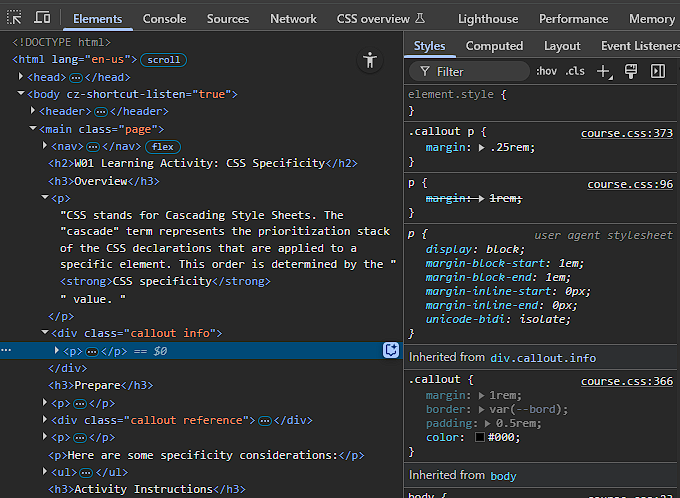

# Mi Diario de Aprendizaje: WDD 231 📝

¡Bienvenido a tu archivo de notas! Este es un archivo con extensión `.md` que utiliza un formato llamado **Markdown**. 

Markdown es la herramienta favorita de los desarrolladores para tomar notas porque permite dar estilo a textos de manera muy rápida usando caracteres sencillos. A continuación, tienes una guía rápida de cómo usarlo, seguida de un espacio listo para que agregues tus apuntes.

---

## 🚀 Guía Rápida de Markdown (¡Aprende en 2 minutos!)

### 1. Títulos
Para crear títulos, solo usa el símbolo de almohadilla o gato (`#`). Cuantos más uses, más pequeño será el título:
* `# Título Principal` (Equivale a un `<h1>` en HTML)
* `## Subtítulo` (Equivale a un `<h2>` en HTML)
* `### Sección` (Equivale a un `<h3>` en HTML)

### 2. Formato de Texto
* Para escribir en **negrita**, encierra el texto entre dos asteriscos: `**texto en negrita**`.
* Para escribir en *cursiva*, encierra el texto entre un asterisco: `*texto en cursiva*`.
* Para ~~tachar~~ un texto, usa dos virgulillas: `~~texto tachado~~`.

### 3. Listas
* **Listas no ordenadas:** Usa un asterisco o un guion seguido de un espacio:
  ```markdown
  * Elemento A
  * Elemento B
  ```
* **Listas ordenadas:** Usa números seguidos de un punto:
  ```markdown
  1. Primero
  2. Segundo
  ```

### 4. Bloques de Código (¡Muy útil para tus clases!)
Para mostrar código tal como se escribe sin que el navegador lo intente interpretar, puedes encerrarlo en "comillas invertidas" (`` ` ``):
* Código en la misma línea: Usa una comilla invertida simple: `` `const nombre = "Juan";` ``.
* Bloques de código completos: Usa tres comillas invertidas indicando el lenguaje:
  ```html
  <p>Esto es un párrafo en HTML</p>
  ```

---

# 📚 Mis Apuntes de Clase (WDD 231)

*Voy a pegar aqui la información de la clase y un promt para que puedas enseñarme desde 0*

# 🗓️ Week 01 – Introduction, Specificity, Testing

## Naming Conventions

W01 Learning Activity: Naming Conventions
Overview
When working on the web, there are many things that affect the operation of the files—the browser, the protocol(s), the operating system, the language(s), etc. While many of these are out of your control, there are steps you can take to help keep things consistent and manageable through standard file and folder naming conventions.

Prepare
The file and folder naming conventions will be considered 'best-practice' rules for this course. These rules should be applied to all files and folders created in your course work.

Note that most organizations have defined a standard convention for naming files and folders in addition to other workflows. These conventions may vary as each organization will have their own file management guidelines and best practices. Regardless of the choice, having consistency across an organization is very important.

Naming Conventions
You will be expected to follow these naming conventions throughout the course.

Use all lowercase syntax, for example, products.html
Platforms and systems handle case sensitivity differently. Case sensitivity is an important concept to understand when managing files and folders.

Do NOT use spaces in names. Use dashes instead, for example, design-document.html
Spaces are interpreted poorly by user agents. Do not use them. The Hypertext Transfer Protocol (HTTP) ignores spaces, except in file names. In file names, it replaces a space with a symbol—"%20." This makes URL's look confusing and can also lend itself to confusion in the mind of site visitors. So avoid using spaces. Instead, if you have to create a visual space, use hyphens/dashes.
Do NOT use special characters in names, for example, <,>, \, /, #, ?, !
Special characters often mean specific things to computers, so just avoid using them completely in the naming of files and folders.
Use names that are as short and as meaningful (semantic) as possible, for example, winter-scene-sm.png is better than image13-v123523brokenbranchlifeimagery w200x200.png
Short, meaningful names save you, other developers, and site visitors from having to remember long complicated names for files and folders. When meaningful, they also help predict the purpose or nature of the file or folder contents when working with those files or folders.
In this class, the standard folder names for the sites/subfolders are:
styles – Folders with this name contain the CSS files.
images – Folders with this name contain the images.
scripts – Folders with this name contain the JavaScript files.
Optional Resources
Dealing With Files – MDN


## CSS Normalization

W01 Learning Activity: CSS Normalization
Overview
Every browser and other user agents (such as bots or other programs) have default CSS properties for HTML elements. The goal with a normalize or reset CSS reference is to reduce browser inconsistencies in the default styling.

"Normalize.css makes browsers render all elements more consistently and in line with modern standards. It precisely targets only the styles that need normalizing." – Nicolas Gallagher, creator of Normalize.css
Prepare
Historically
CSS resets have been around for a long time. The first reset CSS file was created by Eric Meyer in 2007. It was a simple file that removed all default browser styling. Since then, many developers have created their own variations of reset CSS files. The most popular of these is normalize.css, created by Nicolas Gallagher in 2011. Normalize.css is a modern alternative to CSS resets that preserves useful default styles rather than just removing them.

Current State
Browsers have come a long way in adhering to web standards. Default styles are more consistent across modern browsers.

Normalize.css is still relevant as it doesn't completely wipe out default styles, but rather normalizes them across browsers, preserving useful defaults.

Many CSS frameworks like Bootstrap and Tailwind CSS use some form of normalize or reset styles.

Summary
The use of CSS normalization and reset is opinionated. This means its benefits and shortcomings can be debated among professionals. Depending upon the application, some level of using normalization or reset may be beneficial. You may need to support legacy browsers or you may have highly customized designs that need pixel-perfect control and cross-browser consistency.

Watch CSS Normalization and Reset
How does newsroom.churchofjesuschrist.org use CSS normalization/reset.

Activity Instructions
In this activity, you will create your own normalize CSS file and include it on your site.

Create a normalize.css file located in your wdd231 root styles folder.
Use the following code reference and copy the CSS into your file. Nicolas Gallagher's – normalize.css
Apply the CSS by including the link in the head of a page. For example, this line of code would be included before any other CSS link reference.
<link rel="stylesheet" href="styles/normalize.css">
IMPORTANT CONCEPT: Why should this CSS reference precede all the other CSS references?
An alternative to hosting your own normalize or reset CSS file is to use a content delivery network (CDN) reference.
This particular reference has minimized the "normalize.css" file as indicated by the .min in the file name.
<link rel="stylesheet" href="https://cdnjs.cloudflare.com/ajax/libs/normalize/8.0.1/normalize.min.css">
Take a look at the file and see how difficult it is to read for humans but completely usable by the browser.
What does minimizing mean when it comes to web file optimization?
Optional Resources
CSS Cascade and Inheritance – MDN
What is a CDN (Content Delivery Network)? - AWS


## CSS Specificity

W01 Learning Activity: CSS Specificity
Overview
CSS stands for Cascading Style Sheets. The term "cascade" represents the prioritization stack of the CSS rules that are applied to a specific element. The specific CSS rule that is applied to an element is determined by the CSS rule specificity value.

Prepare
Specificity is represented as a four-part numerical value that reflects the weight of a CSS rule based on the types of selectors used. The higher the specificity, the more precisely the rule targets an element, thereby determining which rule takes precedence when multiple rules apply.

This table maps the parts from highest specificity to the lowest.

Category	Example(s)	Specificity Value
Inline	style="color: red;"	1 0 0 0
ID	#currentDate	0 1 0 0
Classes, attributes, and pseudo-classes	.myClass, [type="text"], :hover	0 0 1 0
Elements and pseudo-elements	div, :before	0 0 0 1
The specificity value is calculated by counting the number of selectors in each category and assigning a value to each category. The values are then combined to form a four-part specificity value.

For example, the CSS rule selector #sub-menu .nav a:hover has a specificity value of 0 1 2 1 because it contains:

1 ID selector (#sub-menu) — 0 1 0 0
1 class selector (.nav) — 0 0 1 0
1 pseudo-class selector (:hover) — 0 0 1 0
1 element selector (a) — 0 0 0 1
Typically you do not spend time determining specificity values during design because you will become familiar with CSS assignment patterns. However, the learning the CSS application principles will help you troubleshoot why a rule is or is not being applied to a specific element.

Troubleshooting
Here are two recommendations to help you troubleshoot the application of CSS rules by selectors:

Use the browser's built-in DevTools Elements – Styles panel. As you inspect an element by clicking on the element name in the Elements panel, the applied CSS rules are displayed for you to analyze and toggle on and off to test.
DevTools Styles panel
DevTools Elements-Styles panel screenshot
Use a CSS specificity calculator to compare CSS selector's specificity.
Note that this calculator displays specificity as a three-part value (a b c), omitting the highest category used exclusively for inline styles. Inline styles have an implicit top-level specificity of (1 0 0 0), but since the calculator focuses on selectors written in stylesheets, this top-level value is not shown.

Here are some other specificity considerations:

The universal selector * has no specificity — 0 0 0 0.
CSS selector combinators such as descendent div p, child div > p, adjacent sibling selector div + p, and others have a specificity of 0 0 0 2 as expected.
properties with !important are applied even if the selector is less specific.
Using !important should be avoided because it can make debugging and maintaining CSS more difficult. It is better to use a more specific selector or to refactor the CSS.

Activity Instructions
Open this page in a new browser tab.
Open up the browser's DevTools.
In the Elements panel, select the first paragraph p.
Note in the Styles tab how many color declarations are applied to the paragraph. This is the CSS stack.
How many colors are declared and part of this stack and why are they in this order?



Use the online CSS Calculator to enter the selectors to verify the stack order.
For example, the selector .myClass has a specificity value of 0 1 0 because it is a class selector.

Optional Resources
Specificity – MDN
CSS Stats – Enter a URL and see an overview of the CSS stats for the page including the average specificity.


## JavaScript Review

W01 Learning Activity: JavaScript Review
Overview
This activity is a review of some basic JavaScript concepts, application, and DOM (Document Object Model) manipulation. JavaScript is a core web technology in web frontend design and development along with HTML and CSS. This course will require the application of JavaScript to meet functional and developmental outcomes.

Activity Instructions
As you work through this JavaScript Learning Activity assignment, you will be asked to make a copy (called a fork) of a partially completed CodePen. The JS tab of this CodePen has a series of comments starting around line 22 where you will add or alter JavaScript to finish steps 4 through 10 of this assignment.

What is the correct HTML markup to reference an external JavaScript file named app.js located in the scripts folder?
Check Your Understanding
Screenshot of Fork button in CodePen
Fork button in CodePen
If you haven't already, establish your own CodePen account at no cost. This will enable you to fork content and construct your own pens (code snippets) for personal reference.
Fork (copy) this CodePen JavaScript Review Exercise and complete the following:
Change the given date output to this format: mon dd, year (for example, "Apr 04, 2024")
Check Your Understanding
Replace this concatenated string using a template literal.
"<strong>Volume</strong>: " + volume + " liters"
Check Your Understanding
Declare a variable named quantity and assign it the value of the HTML input element with an id of q using the querySelector method.
Check Your Understanding
Output this string, "Welcome to <em>our</em> neighborhood!", to the first <aside> in the document.
Check Your Understanding
Output the returned value of a function named getCelsius to an HTML input element with an id of temp. Feed the getCelsius literal value of 33 (which represents 33°F). The getCelsius function is already included in the provided CodePen code.
Check Your Understanding
Select all the div elements in a document and assign the result to a const variable named divs using querySelectorAll. Output to the provided div element with an id of divs in the CodePen.
Check Your Understanding
Filter an array named citynames to return only city names in the array that start with the letter "C" and store the resulting array into a variable named filterC. Output to the provided div element with in the CodePen.
Check Your Understanding
Example Solution
Example Solutions CodePen: JavaScript Review Exercise Solutions


## Site Header

W01 Learning Activity: Site Header
Overview
The site header for the assignment this week will contain an svg logo which you will find or create. The header will also contain the site name, which will be your name, and a hamburger icon on small screens to show and hide the navigation.

You will use CSS Grid and grid-template-columns to create a header that is responsive to the page width.

Prepare
Logos
A logo is a graphic mark, emblem, or symbol used to aid and promote instant public recognition. Logos are used by commercial enterprises, organizations, and even individuals to promote their brand, identity, and products. A good logo is an important part of a website because it helps to create a strong first impression and establishes a brand identity. It also helps to create a sense of trust and credibility with users.

Here are some things to consider when building a good logo.

Timeless: A timeless logo remains effective and relevant even if trends change.
Simple: A great logo should be easy to understand and remember, which means using a simple design.
Memorable: A great logo should be unique and stand out.
Relevance: A logo should be relevant in order to create immediate recognition establishes a strong first and lasting impression of a brand.
There are many websites where you can find an icon or logo and download an svg file for free.

Bootstrap
Font Awesome
Flowbite Icons
For example, note how these popular websites icons meet the above criteria.

GitHub Site Icon 2025
GitHub
Microsoft Site Icon 2025
Microsoft
Apple Site Icon 2025
Apple
MDN Site Icon 2025
MDN
YouTube Site Icon 2025
YouTube
Navigation Icons
While there many kinds of small screen navigation patterns that are recognized, this course will use one that is very common. Small screen navigation links will stacked vertically using a ☰ entity to show the links and a × entity to hide the links. On large screens, the hamburger button will be hidden and the navigation links will be displayed horizontally.

For the navigation button on small screens, the <button> tag will be used and then use CSS to insert the correct entity. Note the CSS code for each entity that will be used in the activity:

Entity	Symbol	HTML	CSS
Hamburger Icon	☰	&#9776;	\2630
Close Icon	×	&#215;	\00D7
Since these are entities, they will look different depending on the font family used.
HTML Structure Example
As you look at this sample HTML below, you should notice there are three separate items in the header, the site logo, the site name, and a button.

<header>
  
  <span>The Site Name</span>
  <button id="nav-button" class="hamburger" aria-label="navigation"></button>
</header>
Notice that the  tag has a width and height of 1px. This is to ensure that the image does not take up any space in the header. The image will be controlled and displayed by the CSS.

CSS Layout Example
CSS Grid will be used to layout the header. In this example, the grid has three columns. The first column will be fixed at 24px wide for the logo, the second column will be auto width for the site name, and the third column will be 44px wide for the hamburger button.

header {
  display: grid;
  grid-template-columns: 24px auto 44px;
}
Design for Touch Devices
When designing for touch devices, it is important to consider the size of the touch targets. Touch targets are the areas that respond to user input, such as buttons and links. If the touch targets are too small, users may have difficulty tapping them accurately.

Touch targets include the area that responds to user input, in this case, the anchor tag. An icon may appear to be smaller but the clickable area needs to be large enough to touch easily.

The Apple Design Handbook recommends that touch item on mobile devices be at least 44px by 44px.
The Android Accessibility Guide suggests touch areas are at least 48dp by 48dp.
The Android Accessibility Guide uses the term dp, which stands for density-independent pixels.

Density-independent pixels are a unit of measurement that is used to ensure that touch targets are the same size on all devices, regardless of their screen resolution.

Touch Targets
Example header on a mobile device
JavaScript Example
Use the JavaScript querySelector method to grab a reference to the hamburger button element. Setup a click event listener for the button. When the button is touched, it will toggle the class attribute value of 'show' on the button.

const navButton = document.querySelector('#nav-button');

navButton.addEventListener('click', () => {
  navButton.classList.toggle('show');
});
Use CSS to display the entity
To change the entity for the button all you need to do is change the CSS when the class of 'show' is applied.

.hamburger::before {
  content: "\2630";
}
.hamburger.show::before {
  content: "\00D7";
}
In this example, the hamburger button will display the open icon when the class of 'show' is not applied and the close icon when the class of 'show' is applied using the principle of CSS specificity.

Activity Instructions
Follow along with the videos below and start to create a header for your site that contains a logo, site name, and a hamburger button. The header should be responsive to the page width and use CSS Grid to layout the items in the header.

Watch WDD231 Site Header 1
Finding and modifying an SVG logo

Watch WDD231 Site Header 2
Building the header using CSS Grid

Watch WDD231 Site Header 3
Adding JavaScript to change the entity icon and hiding the icon for larger screens.

Optional Resources
Apple Design Handbook
Android Accessibility Help


## Site Navigation

W01 Learning Activity: Site Navigation
Overview
Site navigation is a critical part of any website. It allows users to find their way around the site and discover content. In this activity, you will learn how to create a responsive navigation menu that works well on both small and large screens.

Prepare
Most sites use an unordered list with list items and anchors for the primary navigation site links. This is a common practice because:

Semantic Clarity: The links are grouped as related items and the order of those links does not really matter.
Accessibility: Screen readers and other assistive technology can predictable interpret this structure as a navigation list.
Flexibility: The unordered list can be styled with CSS to display the links in a variety of ways, such as horizontally or vertically.
Consistency: This structure is a widely adopted convention in modern tools and frameworks.
Activity Instructions
In this activity, you will create a responsive navigation menu that works well on both small and large screens. You will use HTML, CSS, and JavaScript to build the menu.

HTML
To start, we will create a nav tag that will contain our navigation links. Inside the nav tag, we will create an unordered list (ul) with list items (li) for each link. Each list item will contain an anchor tag (a) that links to the appropriate page.

Here is an example of what the HTML for the navigation menu might look like:

<nav id="nav-bar" class="navigation">
  <ul>
    <li class="current"><a href="#">News & Events</a></li>
    <li><a href="#">Dedicated Temples</a></li>
    <li><a href="#">Announced Temples</a></li>
  </ul>
</nav>
In this example, notice that the nav tag has an id. This is so that we can easily connect to it with JavaScript. It also has a class attribute that will be used as a CSS selector. In addition, one of the list items has a class of "current" assigned to it. This class name can be anything you want. It allows us to visually change this list item so we can implement Wayfinding.

Wayfinding is the usability design effort of helping users navigate a website or application. It supports user friendly navigation by providing a clear indication of the user's current location within a website. There are two important principles to keep in mind when implementing wayfinding:

The page name and the navigation link name should closely match. (see "Home" example below)
The current menu item should also look different than the remaining menu items. (In the example below, the background color of the home button is darker.)
wayfinding example
JavaScript
Write a line of code to select the nav element as given in the example above.
Check Your Understanding
Add a line of code to the navButton event listener in the previous learning activity to toggle (add or remove) the class of 'show' to the nav element selected in the previous step.
Check Your Understanding
CSS
Add a CSS rule to not display (hide) the nav element by default.
Check Your Understanding
Add a CSS rule to show the nav element when it has the class of 'show'.
Check Your Understanding
At this point you should successfully be showing and hiding the navigation links on small screens. As the screen gets wider, we need to display the nav tag even if it does not have the 'show' class added. To do this we need to add the following to the larger.css file.
.navigation {
    display: block;
  }
Write a modern CSS declaration to have the unordered list ul list items li display horizontally.
Check Your Understanding
At this point you will have a fully functional but very ugly set of navigation links. Use your existing knowledge of CSS to make sure the links meet the minium height requirements for touch screens and match your color scheme.

Video Demonstrations
Follow along with the following video tutorials to see an example of how to build the navigation menu step by step. The video is broken into two parts: one for small screens and one for larger screens.

Watch WDD231 Site Navigation 1
Build the small screen navigation

Watch WDD231 Site Navigation 2
Build the larger screen navigation


## Site Footer

W01 Learning Activity: Site Footer
Overview
The footer is a common location for contact information, site links, copyright information, and social media links.

The assignment footer this week requires linked, social media icons as well as some basic page and author information, and dynamic 'lastModified' date.

There are many websites where you can get social media svg icons. Some sites require attribution, some are free, and others require a monthly fee.

To help you prepare for this assignment, this activity will look at how to use SVG icons, how to modify them, and how to lay them out in a footer.

Activity Instructions
Understanding and Modifying SVG Icons
SVG Icons are not pixel based like a png or jpg file. Rather they are paths and shapes described using text. This means that they have code that can be opened in a text editor and manipulated.

Navigate to this MS Teams icon from Bootstrap.
Download the SVG and open it in VS Code.
<svg xmlns="http://www.w3.org/2000/svg" width="16" height="16" fill="currentColor" class="bi bi-microsoft-teams" viewBox="0 0 16 16">
  <path d="M9.186 4.797a2.42 2.42 0 1 0-2.86-2.448h1.178c.929 0 1.682.753 1.682 1.682zm-4.295 7.738h2.613c.929 0 1.682-.753 1.682-1.682V5.58h2.783a.7.7 0 0 1 .682.716v4.294a4.197 4.197 0 0 1-4.093 4.293c-1.618-.04-3-.99-3.667-2.35Zm10.737-9.372a1.674 1.674 0 1 1-3.349 0 1.674 1.674 0 0 1 3.349 0m-2.238 9.488-.12-.002a5.2 5.2 0 0 0 .381-2.07V6.306a1.7 1.7 0 0 0-.15-.725h1.792c.39 0 .707.317.707.707v3.765a2.6 2.6 0 0 1-2.598 2.598z"/>
  <path d="M.682 3.349h6.822c.377 0 .682.305.682.682v6.822a.68.68 0 0 1-.682.682H.682A.68.68 0 0 1 0 10.853V4.03c0-.377.305-.682.682-.682Zm5.206 2.596v-.72h-3.59v.72h1.357V9.66h.87V5.945z"/>
</svg>
Look at the SVG code and find the following:
The width of the icon. [❔hover for answer ]
The height of the icon. [❔hover for answer ]
The color of the icon. [❔hover for answer ]
How many shapes are used to create this icon? [❔hover for answer ]
Change the svg by doubling its size. 
Check Your Understanding
Change the fill color of the icon to a be purple. 
Check Your Understanding
Remove the people images behind the T portion of the icon. 
Check Your Understanding
Social Media Icon Layout
You will create a parent division for all the social media icons and then lay them out horizontally using flexbox. You can control the space between each icon using column-gap and center them on the page using justify-content.

Download a GitHub icon and LinkedIn icon and one or two others of your choosing.
Move them into the images folder of your site.
Create a parent division <div> just inside the footer tag and give it a class name.
Wrap each image inside an anchor tag and link each anchor to your personal social media accounts.
Video Demonstration
Watch WDD231-Site-Footer 1
Building a Social media icon set in the footer

## W01 Assignment: Course Home Page

Overview
This assignment demonstrates your prerequisite knowledge by applying HTML, CSS, and JavaScript to the design and development your course home page.

Task
Design and develop your page using the following example as a guide for the layout and content. The page must be meet course standards, be responsive, and pass accessibility, best practice, and SEO tests from DevTools Lighthouse audits.

Screenshots
Instructions
File and Folder Setup
In VS Code, open your wdd231 folder that you cloned from your GitHub account during the Setup: Hosting on GitHub activity.
Create a default home page for this repository so that when published to GitHub, will render at https://yourgithubusername.github.io/wdd231. What must this file be named?
Check Your Understanding
Create appropriately named, supporting folders for images, CSS, and JavaScript files.
These subfolders must be placed in the root directory, wdd231.
Check Your Understanding
Note that the words directory and folder have essentially the same meaning. Directory is the more accurate term for file systems while "folder" 📂 refers to the graphical metaphor that is generally accepted because it is highly related to the term "file" in the organized world.

Add CSS files as needed. You are required to write your own custom CSS in this course. Frameworks and libraries are not allowed. The assignment requires you to create a responsive layout for all screen widths from (320px) and up. For this class, you may use a normalize CSS file. The class requires you to use a small.css followed by a larger.css file. The larger css file must contain a media query.
Add multiple JavaScript files as needed. For example, create files to support the responsive navigation (navigation.js), dates (date.js), and course information cards (course.js). Reference these in the head using the defer attribute method. As you move through this course, you will need to add additional JS files. Only load the files for each page that are needed for that page.
HTML
Add the standard HTML document structure to the document.
Add the required elements to the <head> including the title, meta description, and the meta author.
Use semantic HTML to create the basic layout structure of the page.
Use a header, a nav, a main, and a footer element.
Add the content as shown in the example screenshots above.
Note that all images used on your pages must be optimized.
In this class, the image memory size threshold is 125 kB or less per image.

The <header> tag should contain a site logo (using an svg file) and your name rendered using a <span> tag, and a hamburger icon on small screens.
The responsive navigation <nav> menu contains three links:
Home – this current page.
Chamber – will link to the Chamber of Commerce website project (week 2).
Final – will link to the Final project (week 6).
The <main> element contains the following:
The heading "Home" rendered using an <h1> tag.
Three <section> tags with headings <h2> as shown in the example screenshots above.
The <footer> has three items.
The first item is a series of social media links including GitHub and Linked In and one or two others that you choose. These icons should link to your GitHub repository and your Linked In account.
The next item contains the following:
the copyright symbol and current year that are written dynamically using JavaScript
Check Your Understanding
your name
your state or country
The third item displays the date the page was last modified using JavaScript. This could be a paragraph that has an id of "lastModified".
CSS
As you style and layout your page, ensure that the following, required web design principles and best design practices are met.
Appropriate proximity, alignment, repetition, and contrast design principles are used.
There is no horizontal scrolling in views between 320px to 1200px wide.
Text does not touch the edge of the screen causing a visual tangent error.
Any text overlays on images, other elements, or other text/content is legible and does not overflow in smaller views.
That there is no twitching in the navigation on hover.
Images are not squished nor distorted as the page is resized.
Images are not oversized causing pixelation.
Use your own color scheme and typography choices.
Use the Google Fonts API to select one font family to use on this page. We covered this in week 1 of WDD131 if you need to review Google Fonts
Responsive navigation must support the following features:
Responsive design includes providing a positive user experience of readability, usability, accessibility, visual appeal that adapts to the user's device by size, orientation, and resolution.

small-screen hamburger like navigation
large-screen horizontal navigation using CSS Flex
wayfinding
hover effect for menu items
Your design cannot just be a simple one column layout (default flow layout) in all views in order to warrant full credit consideration.
JavaScript
Use external JavaScript files. (No inline/embedded JavaScript code is allowed in the HTML document.)
Place the js JavaScript files in the scripts subfolder.
Reference JavaScript files by using a <script> reference in the head of the HTML file and using the attribute defer. When you are using type="module", the defer attribute is not necessary.
Why is the defer boolean attribute important?

Use JavaScript to support the responsive menu.
Use JavaScript to dynamically output the following:
the copyright year (the current year) in the footer's first paragraph
Note this CodePen summary of the Date object.

the date the document was last modified in the second paragraph
You can use the lastModified property of the document object to get this date/time dynamically. An example of this is shown below:

document.getElementById("lastModified").innerHTML = document.lastModified;
Note that document.lastModified returns a simple string in JavaScript. Therefore, you do not need to manipulate its output for this assignment.

Copy this array of course objects into a JavaScript file: Course List Array
This array contains the course information for the required courses that are in the first certificate called Web and Computer Programming of the Software Development degree.

Modify the courses array content in your script file by changing the completed property to true if you have completed a course.
Dynamically display all the courses in the certificate section as shown in the example above. The courses that you have completed must be marked in a different way versus those that you have not completed. Use your page color scheme. The page should adjust automatically if the data source changes.
Using buttons that listen for the click event, allow the user to select to display All Courses, WDD Courses, or CSE Courses. Hint: Use the array filter method.

Demonstration of User Interface Filtering Course Output
Design the course cards to indicate those courses that you have completed personally in a complimentary, but different style than the rest, indicating course completion.
Provide a total number of credits required dynamically by using a reduce function (not shown on the screenshots). The number of credits shown should reflect just the courses currently being displayed.
Testing
Continuously check your work by having it loaded in your browser using Local Server.
Screenshot of console error icon in DevToolsUse the browser's DevTools to check for JavaScript runtime errors in the console or click the red, error icon in the upper right corner of DevTools.
"DevTools" is an abbreviation for the browser's "Developer Tools." It refers to a set of tools or utilities provided by web browsers to help developers debug, profile, and analyze web pages during the development process. The tools are typically accessed by pressing the F12 function key or selecting the menu option for the browser's developer tools.
Use DevTools CSS Overview to check your color contrast.
Generate the DevTools Lighthouse report and run diagnostics for Accessibility, Best Practices, and SEO in both the mobile and Desktop views.
Use the Private or Incognito mode to test your page when using Lighthouse. The standard is to reach a score of 95+ in each of these categories.

Submission and Audit
Commit and sync your local work to your a GitHub Pages enabled wdd231 repository
Use this ☑️ audit tool to self-check your work for some of the required HTML elements and CSS content. This audit tool is also used by the assessment team.
Return to Canvas and submit your GitHub Pages enabled URL for wdd231, e.g.,
https://username.github.io/wdd231
Do not need to include index.html in the URL reference because index.html is the default file retrieved with a folder request on GitHub Pages.

# Week 02 – Social Media, JSON, Async/Await, Fetch

## Favorite Icon

W02 Learning Activity: Favicon
Overview
Have you noticed that when you visit most websites they each have their own small image, or icon, next to the title in the browser tab? This is called a favicon and is a way that you can enhance the branding of your site and make it look and feel professional.

In this activity you will learn more about favicons and how to create and add one to your pages.

Prepare
Favicon stands for favorites icon. The purpose of the favicon is to provide enhancement to the branding of the site when listed in the browser's "favorites" or "bookmarks" lists.

For example, this learning activity page has the BYU-Idaho logo as a favicon, as you can see in the tab title:

Favicon example
What is the favicon for The Church's main website?
Where does a favicon appear?
The favicon image will appear in:

tabs
bookmarks or favorites lists
search results
URL address bar
browser's history page
How do you define the favicon for a page?
The favicon is defined in the <head> section of the page by using a link element that has the rel="icon" attribute like this:

<link rel="icon" href="favicon.ico">
Because the favicon is defined in the <head> section of a page, in order for it to be present on each page of your site, it must be defined on every single page.

What size and image format should you use for a favicon?
The favicon is a small image file that is square (the same width and height). It can be as small as 16 by 16 pixels, however Google development recommends multiples of 48 pixels square.

It is possible to define several favicons of different sizes so that when the icon is used for something small, such as a browser tab, a small version will be used, but if the icon is rendered on a homepage, a larger version can be used.

This course will keep things simple and only use a single, small image for the favicon.

Most web image file formats are supported for favicons, but the preferred approach is to use the .ico format, which is what you will use this course. The .ico format is designed to be small, efficient, and used for icons, rather than formats like .png which is a general purpose image format used for full-sized images. Interestingly, the .png format is actually the most commonly used format for favicons on the web today.

How do you create a favicon in the .ico format?
You can use any image editing program you like to create an .ico file. A free, online tool designed specifically for generating these .ico favicons is: https://favicon.cc. This is the tool that you will use in this course.

Activity Instructions
For this activity you will create a 16x16 favicon and add it to your course web site.

Navigate your browser to the free, online ICO generator application at https://favicon.cc
Select either Create New Favicon or, Import Image to create your own favicon.
Use the preview window to view your icon as it would appear in a tab or URL address bar.
When you are ready, click Download Favicon to download the favicon.ico file in the root of your wdd231 local repository folder.
Reference the favicon in your assignment portal home page in the <head>.
<link rel="icon" href="favicon.ico">
Test your page and verify that the favicon appears when your page is loaded in the browser.
Optional Resources
Favicon – wikipedia - learn about the history and possible security issues
What's in the <head>? – MDN – Adding custom icons to your site


## Social Media Meta

W02 Learning Activity: Social Media Meta
Overview
Social media sites, such as Facebook, crawl websites so they can provide a rich preview to their users that includes information such as the title, description, and a preview image. Without any additional information, they will attempt to guess the content of your page, however, you can provide this content to these social media platforms directly, so that your site will appear the way that you would like. This information is provided through social media meta tags.

In this activity, you will learn more about social meta tags and how to include them on your web pages.

Prepare
Social media meta tags are used to support a rich preview to social media crawlers, like Facebook, with relevant information including a title, description, preview image, and locality. Without social media meta tags, the social media platform will attempt to guess the content of your page. It is better to provide the information explicitly so that you can specify what you would like displayed.

Common Social Media Meta Tags
As you have learned previously, you can use meta tags in the <head> section of your page to specify information about the page, such as the author or a description of the page. If you use specific meta tags that align with the expectations of social media sites, it makes it easy for those sites to know and use the information you would like.

There is no official standard for social media properties that is defined as part of the HTML standards. Instead, there are certain properties that the large social media sites look for that you can provide on your page to inform them.

The most common meta tags for social media include the following:

Facebook
Facebook uses Open Graph meta tags to provide a rich preview of your page when it is shared on their platform.

The following are common Open Graph (og) properties that you may want include in your HTML pages:

<meta property="og:title" content=""> — The content contains the title of your page. The title should be descriptive and relevant to the content of your page.
<meta property="og:description" content=""> — The content is a short description or summary of the page. Do not reuse your title. The length is between 2 and 4 sentences with a maximum of 200 characters.
<meta property="og:image" content=""> — An absolute URL to an image that represents the content of your page. It should be at least 600x315 pixels with about a 2 to 1 aspect ratio.
<meta property="og:locale" content=""> — The canonical URL for your page with any variables or parameters.
Example
The following are the og meta tags on apple.com:

<meta property="og:title" content="Apple">
<meta property="og:description" content="Discover the innovative world of Apple and shop everything iPhone, iPad, Apple Watch, Mac, and Apple TV, plus explore accessories, entertainment, and expert device support.">
<meta property="og:url" content="https://www.apple.com/">
<meta property="og:locale" content="en_US">
<meta property="og:image" content="https://www.apple.com/ac/structured-data/images/open_graph_logo.png?202110180743">
<meta property="og:type" content="website">
<meta property="og:site_name" content="Apple">
X (Twitter)
The social media platform X, formerly known as Twitter, uses Twitter social media cards (or X Cards) to provide a rich preview of your page when it is shared on their platform.

The following are common Twitter Card properties that you may want include in your HTML pages:

twitter:card – The type of card to be displayed. The most common type is summary or summary_large_image.
summary – A title, description, and thumbnail image.
summary_large_image – A large image with a short description.
twitter:title – The title of your page. The title should be descriptive and relevant to the content of your page.
twitter:description – A short description or summary of the page. Do not reuse your title. The length is between 2 and 4 sentences with a maximum of 200 characters.
twitter:image – Specify the URL of the image you want to display in the X card. Use visually appealing and relevant images to capture the user's attention.
Example
The following are the Twitter meta tags on microsoft.com:

<meta name="twitter:url" content="https://www.microsoft.com/en-us">
<meta name="twitter:title" content="Microsoft – AI, Cloud, Productivity, Computing, Gaming &amp; Apps">
<meta name="twitter:description" content="Explore Microsoft products and services and support for your home or business. Shop Microsoft 365, Copilot, Teams, Xbox, Windows, Azure, Surface and more.">
<meta name="twitter:card" content="summary">
Decide what to include
As you can see, there are many different properties that can be defined for both Facebook and Twitter as well as for other social media sites. Because of all these options, it may be difficult to decide what to include.

If you want to explicitly define all of these values for all of these sites, you will need to include all of these meta tags even though they may seem redundant. On the other hand, you may decide that only the most basic properties are needed, and you are comfortable letting a social media site guess any other information it needs.

Most web sites include some, but not all of the properties that are available.

Check Your Understanding
What are the Social Media properties for the Church's main website at https://www.churchofjesuschrist.org?

You can view the meta properties by navigating to the site and viewing the source or inspecting the page content.

Note that this content can change at any time. If you are not seeing the same content, do not worry as the principle and application are the important part of this exercise.

Click for Answer
Activity Instructions
Add social media meta tags for Facebook to your course home page.

Open your course home page from the previous week's assignment. (index.html)
Add these Open Graph meta properties to the document:
title
description
image
url
Test and review your meta information by viewing the page source in the browser developer tools.
Optional Resources
A Guide to Sharing for Webmasters - developers.facebook.com


## JSON (JavaScript Object Notation)

W02 Learning Activity: JSON
Overview
Whenever information is passed from one program to another or saved to disk, the data needs to be formatted in a way that it can be understood. JSON is a very popular format for storing data and almost all websites use it in some form because it is simple, easy to use, and very flexible.

In this learning activity you will learn about the JSON format and how to create a JSON file to be used later.

JSON is an important topic that you will use throughout the Software Development program.

Prepare
JSON stands for JavaScript Object Notation and is a simple data interchange format. JSON is often used for transmitting data between a server and a client application and can be used for configuration files and data storage.

JSON is a text-based format that is easy for people and computers to read and understand, and it can be used by any program language.

In JSON, you store lists (or more precisely, dictionaries) of key-value pairs in the format key:value, such as "name": "John". When you want to store multiple key-value pairs, you enclose them in curly braces { } and separate them with commas like this:

{
  "firstName": "John",
  "lastName": "Taylor",
  "age": 34
}
Whitespace such as new lines and indentation is not required, but it is helpful for people that may look at the data.

Also, you may notice from this example that strings are specified with quotation marks " ", but quotation marks are not used for numbers, or for the boolean values true and false.

Square brackets [ ] are used to create an array or list of values, rather than key-value pairs.

In addition to the simple structure shown above, the values themselves can be dictionaries that form nested structures. The following shows a more complex example that includes a list of values for "courses" using square brackets [ ] and a nested structure for the "address":

{
  "name": "Sariah Lucias",
  "age": 27,
  "isCurrentStudent": true,
  "courses": ["WDD231", "CSE210", "REL340"],
  "address": {
    "street": "123 Bedford Road",
    "city": "Gweru",
    "state": "Midlands Province",
    "country": "Zimbabwe",
    "zip": "00000"
  }
}
Note that the example above is a valid JSON object with key-value pairs. The keys are enclosed in double quotes, and the key-value pairs are separated by commas. It contains a mix of data types, including strings ("Sariah Lucias"), numbers (27), Booleans (true), arrays (["WDD231", "CSE210", "REL340"]), and nested objects (address).

The following are some key points about JSON:

JSON is a lightweight, text-based, data interchange format that is easy for humans to read and write and easy for machines to parse and generate.
JSON is language-independent, meaning it can be used with any programming language that supports text-based data formats.
JSON is often used in web applications to exchange data between a client and a server.
JSON is closely aligned with the way JavaScript objects are stored, so it can easily be converted to a native JavaScript object.
JSON is written using basic key/value pairs in this format: key:value and supports data types of strings, numbers, arrays, Booleans, and other object literals. There are no methods.
JSON requires double quotes to be used around string and property names and follows strict adherence to comma or colon placement.
JSON does not contain nor allow comments.
JSON files are typically stored in a file that uses the .json file extension.
Using JSON data in JavaScript
Consuming and using JSON data in JavaScript is a fundamental skill, especially when working with APIs or storing structured data.

You can create a native JavaScript object directly, or you can load it from a JSON string. The following shows how to create an object directly (not using JSON):

const studentObject1 = {
  name: "John",
  age: 25,
  isStudent: true
};
Notice that this looks very similar to the JSON string format above, but it is slightly different. For example, the keys do not have quotation marks.

To create an object from a string of JSON data, use the built-in JSON.parse() method. This takes the JSON string and converts it into a JavaScript object. It is useful for parsing JSON data received from a server or local file.

const jsonString = '{"name": "John", "age": 25, "isStudent": true}';

const studentObject2 = JSON.parse(jsonString);
To convert a native JavaScript object into a JSON string, use the built-in JSON.stringify() method. This method takes a JavaScript object and converts it into a JSON string. It is useful for sending data to a server or saving it in a file.

const studentJsonString = JSON.stringify(studentObject1);
To load JSON string data from a server or a local file, you use the fetch() method. This will be explained in detail in another learning activity.

Activity Instructions
For this activity you will create a new JSON file and make sure that it is valid.

Identify the Structure
Open this example JSON file in a new tab. (Note that this file does not contain newlines and indentation, and yet, most browsers will format it nicely to make the data more readable.)
Identify some of the key-value pairs and data types used in this example.
Here are some example keys (property names) found in this JSON file.

key: "location", value: "Delphi", data type: string
key: "id", value: 89.99, data type: number
key: "inStock", value: true, data type: Boolean
key: "products", value: (there are three values), data type: an array of objects and each has five key-value pairs (properties)
Create a JSON File
Create a JSON file that will hold new ward member information.
Populate this new JSON file with valid syntax using the following data requirements:
family name
the date the family moved into the ward
the number of people in the family (number of records)
if visited by bishopric?
individual family member data
name
gender
birthdate
Test your JSON file in the browser and validate it using a tool like JSONLint or another JSON validator/formatter.
Check Your Understanding (example solution)
Optional Resources
JSON – MDN


## async/await

W02 Learning Activity: JavaScript async/await
Overview
Imagine you're ordering food online. You click "order," and then... you wait. You can't really do much else related to that order until the food arrives, right? That's kind of how traditional synchronous JavaScript code can feel when dealing with things that take time, like fetching data. You send a request, and then you just sit there waiting for a response. It's like waiting for your food to be delivered.

But what if you could keep doing other things while waiting for that food? That's where async/await comes in. It lets you write code that looks like it's synchronous (like you're waiting for your food), but under the hood, it's actually asynchronous (like you're multitasking while waiting).

In this learning activity you will learn about async and await, then in a separate learning activity on the Fetch API you will practice using them.

Prepare
Async/await is the modern way of handling asynchronous operations. It allows you to write asynchronous code that looks and behaves like synchronous code, which makes it easy to read and maintain.

In the past developers used callback functions and promises to handle asynchronous code, but the async/await approach is easier to maintain and is the preferred method, and it is the approach you should use in this course.

Promises
Async/await is built on top of promises, so you need to understand how promises work before diving into async/await. A promise is an object that represents the eventual completion (or failure) of an asynchronous operation and its resulting value. When you create a promise, you can attach callbacks to handle the success or failure of that operation.

Here's a simple example of a promise:

const myPromise = new Promise((resolve, reject) => {
  const success = true; // Simulate success or failure
  if (success) {
    resolve("Operation was successful!");
  } else {
    reject("Operation failed.");
  }
});
In this example, a new promise is created that simulates an asynchronous operation. If the operation is successful, the resolve function is called with a success message. If it fails, the reject function is called with an error message.

To handle the result of a promise, you can use the .then() and .catch() methods:

myPromise
  .then((result) => {
    console.log(result); // Output: "Operation was successful!"
  })
  .catch((error) => {
    console.error(error); // Output: "Operation failed."
  });
In this example, if the promise resolves successfully, the success message is logged to the console. If it fails, the error message is logged instead.

Async/Await
Now, let's see how async/await can simplify this process. The async keyword is used to define an asynchronous function, and the await keyword is used to pause the execution of that function until a promise is resolved or rejected.

Here's how you can rewrite the previous example using async/await:

const myAsyncFunction = async () => {
  try {
    const result = await myPromise; // Wait for the promise to resolve
    console.log(result); // Output: "Operation was successful!"
  } catch (error) {
    console.error(error); // Output: "Operation failed."
  }
};
In this example, the myAsyncFunction is defined as an asynchronous function using the async keyword. Inside the function, the await keyword is used to pause execution until the myPromise is resolved or rejected. If the promise resolves successfully, the result is logged to the console. If it fails, the error is caught and logged.

Async/await makes your code look more like synchronous code, which can be easier to read and understand. It also helps you avoid "callback infierno," where you have nested callbacks that can make your code messy and hard to follow.

Here's a simple example of using async/await to fetch data from an API:

const fetchData = async () => {
  try {
    const response = await fetch("https://jsonplaceholder.typicode.com/posts/1"); // Wait for the fetch to complete
    const data = await response.json(); // Wait for the response to be converted to JSON
    console.log(data); // Output the fetched data
  } catch (error) {
    console.error("Error fetching data:", error); // Handle any errors
  }
};
In this example, the fetchData function is defined as an asynchronous function. Inside the function, the await keyword is used to pause execution until the fetch request is completed and the response is converted to JSON. If any errors occur during this process, they are caught and logged.

Async/await is a powerful tool for handling asynchronous operations in JavaScript. It allows you to write cleaner and more readable code while still taking advantage of the benefits of asynchronous programming.

Learning Activity
You will have a chance to apply async/await in the next learning activity, Fetch API where you will fetch latter-day prophet data from a JSON file and process that data to build a page when it becomes available.

Optional Resources
Asynchronous JavaScript – MDN
async function – MDN
await – MDN
try...catch block – MDN


## The Fetch API

W02 Learning Activity: The Fetch API
Overview
Often a web site or application will need to get information from another website or service such as weather data, the latest news, or user data, or even an image. The Fetch API in JavaScript is like your web page's personal delivery service to make those requests.

Prepare
Fetch is a promise-based API that allows you to make network requests. The Fetch API is built into most modern browsers. The fetch() method takes one mandatory argument, the URL of the resource you want to fetch. This is often called the "endpoint". It can also take an optional second argument, which is an object that contains any custom settings you want to apply to the request such as the method (POST, GET, DELETE), headers, credentials and more.

Most web services required authentication credentials to make requests.

For example, the following code uses the fetch() method to make a GET request to an example URL at 'https://jsonplaceholder.typicode.com/todos/'.

jsonplaceholder.typicode.com is a test API that returns fake data for testing purposes. It along with many other free services are used to practice making requests and working with data.

const response = await fetch('https://jsonplaceholder.typicode.com/todos/');
In this example, the fetch() method returns a promise when attempting to call with the URL of the resource we want to fetch. The await keyword is used to wait for the promise to resolve before continuing with the code. This is important because the fetch() method is asynchronous, meaning that it does not block the execution of the code while it waits for the response. The means that this code will need to be inside an async function. The await keyword can only be used inside an async as shown in the next example.

You can then use the .json() method on the response object to parse the JSON data and use it in your application. The .json() method also returns a promise, so you can use the await keyword to wait for the data to be parsed before using it.

async function getData() {
  const response = await fetch('https://jsonplaceholder.typicode.com/todos/'); // request
  const data = await response.json(); // parse the JSON data
  console.log(data); // temp output test of data response 
}

getData();
Copy and paste the code above into the browser's DevTools console and run it. The response will be an array of 200 objects. After you run the code, expand the array in the console to view the individual objects.

Fetch API Example Output in Console
Example fetch output in the console
This data can now be used in your application. You can loop through the array and display the data in your HTML using JavaScript. The fetch() method is a powerful tool for making network requests and working with data in your web sites and applications.

Activity Instructions
In this activity you will use the modern Fetch API to make an asynchronous request for prophet data that is stored in JSON format and then you will create a page of content dynamically using that data.

Latter-day Prophets Card Layout Screenshot
Work with your group as you run into issues or have questions with learning activities. You should be receiving notifications of posts made in your group's Microsoft Teams channel.

Setup
In your wdd231 folder, create a new file named "prophets.html".
Add a file named "prophets.css" and a file name "prophets.js" into their appropriate folders.
HTML
In the prophets.html file, structure the page using valid html and meta information.
Link the stylesheet to your page.
Reference the script using defer.
Add the following HTML to your <body> element.
<header>
  <h1>Latter-day Prophets</h1>
</header>
<main>
  <div id="cards"></div>
</main>
<footer>
  [Enter Your Name Here] | Latter-day Prophets
</footer>
JavaScript
Mobile screenshot of the prophets.
Open this file in your browser to identify and reference the key/value pairs found in the JSON data. https://byui-cse.github.io/cse-ww-program/data/latter-day-prophets.json.
Declare a const variable named "url" that contains the URL string of the JSON resource provided.
const url = 'https://byui-cse.github.io/cse-ww-program/data/latter-day-prophets.json';
Declare a const variable name "cards" that selects the HTML div element from the document with an id value of "cards".
const cards = document.querySelector('#cards');
Create a async defined function named "getProphetData" to fetch data from the JSON source url using the await fetch() method.
Store the response from the fetch() method in a const variable named "response".
Convert the response to a JSON object using the .json method and store the results in a const variable named "data".
Add a console.table() expression method to check the data response at this point in the console window.
The console.table() method is a great way to view the data in a table format. You can also use the console.log() method to view the data in a more traditional format. The console.table() method is especially useful for viewing large amounts of data in a more organized way.

Call the function getProphetData() in the main line of your .js code to test the fetch and response.
Check Your Understanding – Example
If it all checks out, note that the data returns a single property, an array of objects named "prophets".
Comment out the console line and call a function named "displayProphets" and include the "data.prophets" argument. Why do you send data.prophets versus just the data variable? The displayProphets() function expects an array parameter.
Check Your Understanding – Example
Define a function expression named "displayProphets" that handles a single parameter named "prophets" somewhere in your js file. Use an arrow expression to contain statements that will process the parameter value and build a card for each prophet.
const displayProphets = (prophets) => {
  // card build code goes here
}
Remember that functions are hoisted and therefore, where ever you define the function in your main line of code does not matter as it is available to the rest of the scoped code.

Inside the function, use a forEach loop with the array parameter to process each "prophet" record one at a time, creating a new card each time.
const displayProphets = (prophets) => {
  prophets.forEach((prophet) => {
    // card build code goes here
  });
}
Inside the HTML card building loop, do the following:
create a section element and store it in a variable named card using createElement(),
create an h2 element and store it in a variable named "fullName",
create an img element and store it in a variable named "portrait",
populate the heading element with the prophet's full name using a template string to build the full name,
build the image element by setting the
src,
alt,
loading,
width, and
height attributes using setAttribute().
Using appendChild() on the section element named "card", add the heading and image elements one at a time.
Finally, add the section card to the "cards" div that was selected at the beginning of the script file.
Check Your Understanding – Example (With blanks to fill in)
Test and Style and Share
Test the output and then add the remaining information as shown in the screenshot examples.
Add page styling using the external CSS file by attempting to replicate, using your own colors and font choices, the layout shown in the example screenshots.
Using a CSS Grid, use the auto-fit value to ensure that the page is responsive.
Code Example: CSS Auto Columns - No Media Queries Using CSS Grid and auto-fit

Add the Date of Birth and Place of Birth as shown in the screenshot at the start of this activity.
Share your work and issues with on Microsoft Teams.
Optional Resources
fetch() – MDN
Promise – MDN
Responses – MDN
Using the Fetch API – MDN

## W02 Team Activity: Report

Team Meetings
Overview
Team meetings are an essential part of the course. This collaboration provides opportunities for you to work together, share ideas, and solve problems. This week, you will meet with your team live to discuss the Chamber of Commerce website project and work on the assigned page. In addition, you are expected to communicate and collaborate with your team asynchronously throughout the week.

Instructions
Prepare for your team meeting this week by reviewing, planning, designing, and developing as much of the assignment as possible before the team meeting.
Live attendance to the scheduled meeting is required.
Show respect to others by being on time to the meeting and share your camera during the meeting.
Start the meeting with a prayer.
Work together and discuss the requirements of the assignment.
Plan on meeting for at least one hour.
Support each other throughout the entire week and course with asynchronous communication through your Microsoft Teams channel.

## W02 Assignment: Chamber Directory Page

### Chamber of Commerce Project Introduction: Site Planning

The Chamber of Commerce Site Plan
Overview
Site and application planning is a critical step in successful software development projects. The website plan provides a blueprint from which to design and develop the project for a chamber of commerce site for a local town or region of your choice. DO NOT build a site for "Timbuktu Chamber of Commerce" this is just an example for you to look at. You should build a chamber of commerce for your city of residence.

The purpose of this activity is for you to become familiar with the chamber of commerce website project. You will work on this project as a group in weeks 2 through week 5 of the course, adding content and functionality as the course progresses. Each member of the group will develop their own site.

Instructions
Review prior coursework involving website planning and development.
WDD 131: Dynamic Web Fundamentals – Project Site Plan
Ask yourself, and others, about what planning section seemed to be the most helpful when developing the websites.
What items changed after addition information was given?
What kind of questions should be asked of the client in order to get a clearer purpose of the intent and goal of the website or web application?
Review the Chamber Project Description
Example Site Plan
Use this example site plan to guide your development work for the project. You will be required to build your pages using the layouts and content as illustrated. The wireframes provided here are for the landing page of the site which you will build in week 3 of this course.

Site Name
Timbuktu Chamber of Commerce

Site Purpose
This website will serve as a resource hub for businesses in the city of Timbuktu. The site will provide information on local events, host networking opportunities, create business directories, and encourage local shopping. It aims to promote local economic growth, support local businesses, and foster a sense of community between the businesses.

Target Market
Business owners and patrons in the city of Timbuktu and surrounding areas.

Site Goals
Improve member engagement by providing valuable resources and networking opportunities.
Attract new businesses and encourage economic development in the community.
Improve the visibility and reputation of the chamber as a trusted authority in local business matters.
User Personas
Small Business Owner: Maria is a 35-year-old entrepreneur who owns a small boutique shop in town. She is looking for networking opportunities, business resources, and marketing support to help grow her business.
Corporate Executive: Diego is a 47-year-old executive at a large company looking for growth opportunities. His company is interested in partnership opportunities, economic development resources, and networking with other business leaders in the area
The New Resident: Francisco recently moved into the community and is looking to learn more about services available in the area. He is interested in finding business directories, event calendars, and community service opportunities.
Scenarios
A local business owner is interested in joining the chamber of commerce to network with other business owners. They visit the website to find information on membership benefits, fees, and how to apply.
A community member is looking for upcoming events and workshops hosted by the chamber. They visit the website to browse the events calendar and register for interesting activities.
A visitor from out of town is considering relocating to the area and wants to learn more about the local business environment. They explore the chamber's website for information on existing businesses, availability of skilled labor, and quality of life in the area.
SEO Plan
Use relevant keywords in site descriptions, content, and blog posts.
Verify the site on Google's Business Profile.
Get inbound links or backlinks from all member business to improve rankings.
Embed Google Analytics in all site pages.
Design Brief
Primary Color: ______
Secondary Color: ______
Background Color: ______
Text Color: ______
Font Family: _____________________

You will be selecting your site's color scheme and typography.

Site Map
Chamber Site Map
Wireframes
Desktop
Chamber Desktop Wireframe
Mobile
Chamber Mobile Wireframe
Note that you will need to decide upon the some styling considerations such as the color scheme that you will use and the typography.


### Chamber of Commerce Directory Page | ☑️ Audit your work

W02 Assignment: Chamber Directory Page
The weekly chamber of commerce assignments are designed for group collaboration, however, each member of the group is responsible for their own chamber website.

Overview
Begin the Chamber of Commerce project by starting with the directory page. Last week you selected a city or region to base your project upon and were introduced to the chamber project's purpose and scope. This assignment has you work on the site layout and specific requirements for the content of the chamber of commerce directory page.

Instructions
Review the Project Scope
Review the chamber of commerce project description.
Review the chamber of commerce project site planning document.
File and Folder Setup
Add a new folder to your main wdd231 directory named "chamber".
The chamber folder will contain all of the project's pages and assets. This subfolder is like its own, independent website.

In the new chamber subfolder, add a new file named "directory.html".
Add the common subfolders to the chamber folder to store and organize the images, CSS, and JavaScript.
HTML
In your directory.html document, add the standard head and meta content with a valid title, description, and author.
Design and include a favicon for your chamber site.
Add FaceBook social media meta settings for the
title
description
image
url
Testing Social Media Meta Data
Use the site plan to create the required content and layout for the header, navigation, and footer. These items should be consistent between all the pages of the project. Do not include the body content from the example site plan for this assignment. It will be used when you create the landing page next week.
The footer is required to have contact information and some additional development information as shown in the site plan wireframes. Include your full name, WDD 231, and the last modification date of the page which is generated automatically using JavaScript.
The main content of the directory page will display a list of members as a grid of 'cards' or as a line item list, depending upon the user's selection.
CSS
Style your page using your planned color scheme. Remember that the style will be used on all the pages of your chamber project. It is normal for you to make adjustments as you work on the project throughout the course.
The directory page is the first page of the project. It is important to get the layout and design correct before moving on to the other pages. The directory page will be used as a template for the other pages in the project.

Use a normalize or reset CSS. Be sure to link it before any other CSS file in the head.
Next link a small.css followed by a larger.css file (We practiced this in week 1). Modify the small and larger css files as needed for each new page you add. Do NOT add additional CSS files for each new page!
Every page on the site must be responsive from 320px to wider views without any horizontal scrolling.
The responsive, main navigation menu must support the pages listed in the site plan.
You may NOT use a CSS framework like Bootstrap or Tailwind CSS for this project. All CSS must be your own creation.

JavaScript
Create a file named "members.json" and store it in a new folder named "data" in your existing chamber project folder.
Create an array of at least seven (7) companies where each entry includes the following fields
company name
company addresses
company phone number
company website URL
image file name with extension (you will need to have a different image for each business)
membership level (1=member, 2=silver, 3=gold)
other information you deem appropriate
The company information can be real or made up. The important thing is that you are able to create page information from a JSON data source.

Using the JSON data source, display the member information on the page using the fetch method and async/await functionality.
Let the user toggle between a "grid" type view of member cards or a simple, one-column list of members.
Code Example: User Layout View Selection
A JavaScript code demonstration of toggling between a grid and list view.

Illustrative Example: Screenshots of Directory Page

Using JavaScript, display the copyright year in the footer and the last modification date.
Testing
Continuously check your work by rendering locally in your browser using the Live Server tool in VS Code.
Use the browser's DevTools to check for JavaScript runtime errors in the console or click the red, error icon in the upper right corner of DevTools.
Use DevTools CSS Overview to check the color contrast accessibility.
Generate a DevTools Lighthouse report in the Accessibility, Best Practices, and SEO categories for both the mobile and Desktop views. Correct any issues found that are within your control.
It is best to test your page in a Private or Incognito browser window.

Audit and Submission
Commit your local repository and push or upload your work to your GitHub Pages enabled wdd231 repository on GitHub.
Use this ☑️ audit tool to check some your page against the standards and some requirements.
Share your URL to your group's channel and review your group member's submissions.
Return to Canvas and submit your GitHub Pages enabled URL.
https://username.github.io/wdd231/chamber/directory.html

# Week 03 – Accessibility, ES Modules, APIs

## Web Accessibility

Web Accessibility
Overview
Web accessibility is the practice of making websites usable by people of all abilities, for example, including those that have difficulty viewing a traditional screen or using a mouse. This learning activity focuses on the basics of web accessibility and the tools that are available to help create accessible websites.

Prepare
It is important to ensure that the user experience of your website works well for all of your users. This includes making sure that each image contains appropriate alt text and that there is enough contrast among the colors you use so the text can be easily read. You need to make sure the font sizes can be adjusted, interactive controls can be navigated using the keyboard, and that your page follows proper use of HTML tags such as the title, h1-h6 elements, header, nav, main, and so forth.

The DevTools Lighthouse report contains a number of checks in the Accessibility category to help you verify that your page is accessible. The following items are checked by the DevTools Lighthouse – Accessibility category:

Background and foreground colors have a sufficient contrast ratio.
The contrast ratio can be checked in detail using DevTools CSS Overview or via a online tool like Contrast Ratio. The contrast ratio is important because it helps ensure that text and other content is readable.
All images  have alt attribute content that accurately describes the image's purpose. The alt attribute is important because it provides a text alternative for images, which is essential for when screen readers are being used or when image loading has been turned off or is slow.
Heading elements (h1, h2, h3, etc.) are in sequentially-descending order. Headings give semantic structure to the document to make it easier to navigate and understand when using assistive technologies. This semantic structure is important for screen readers and other assistive technologies to help users navigate the page.
All interactive controls are keyboard focusable. When using a keyboard, the user should be able to navigate through all interactive elements on the page, such as links, buttons, and form fields. This is important for users not using a mouse or other pointing device.
The document has a logical tab order. The tab order is the order in which the focus moves when the user presses the Tab key. The tab order should follow a logical sequence that matches the visual layout of the page. This is important for users who rely on keyboard navigation to access content.
Simple landmark, such as header, aside, footer, nav, main, etc., elements are used instead of divs. Keep the landmark use basic and consistent.
Offscreen content is hidden with display: none or aria-hidden=true. Offscreen content is a way to provide additional information about content while not being visible on the screen. It is important for to include this information for screen readers and other assistive technologies to help users understand the content.
Text is resizable. All users should be able to resize text up to 200% without loss of content or functionality.
Document has a meaningful and relevant title. The title of the document should be descriptive and relevant to the content of the page to provide accurate information to users and search engines.
Page has a language lang attribute defined in the opening html tag. The lang attribute assignment is important for browsers and assistive technologies to understand the language of the content on the page.
Page has a favicon. The favicon provides a visual representation of the page and helps users quickly identify the page in their browser tabs or bookmarks.
All forms elements have labels that are tied to them. Form labels are essential to provide explicit context for form controls and to provide a clickable area for users to select the form control.
Tables have headers. Most tables that present data should use <th> elements to identify the header cells for assistive technologies users to understand the content of the table.
Video and audio have captions in order to support the text alternative for audio and video content for those users needing it. .
A lot of these items are technical aspects and developers need to remember that they are just tools to aid in the overall accessibility evaluation of a page or site. The Lighthouse accessibility tools will not evaluate the usability of a page with certain disabilities, nor if the content is understood, or what the user's experience is as they navigate and interact with the page and site. These aspects often require manual testing and feedback from users with disabilities to truly understand and improve accessibility.

Activity Instructions
Use DevTools Lighthouse to run an accessibility audit of all your pages. It will provide a list of accessibility issues and offer suggestions or improvement. You should already be familiar with using this tool as part of your normal testing and deployment workflow, so there is no additional activity to complete.

You should consistently be using tools like Lighthouse to analyze the pages you design and develop for areas of improvement including accessibility and performance. You are expected to do this and other testing on your individual website project(s) without being assigned to do so.

Optional Resources
Accessibility – MDN
The Web Content Accessibility Guidelines (WCAG) is the standard for web accessibility. The WCAG guidelines are organized into three levels of conformance: A, AA, and AAA.
The WCAG guidelines are also available in a Quick Reference format.
How To Do an Accessibility Review – Chrome for Developers

## Programming with Modules

Modular JavaScript with ES Modules
Overview
You may have seen or written JavaScript code that is long and difficult to read. This is often the result of developing code in one single file. This makes the code hard to maintain and understand, especially as the a project grows in size and complexity. To address this issue, JavaScript ES Modules were introduced to provide a way to organize code into smaller, reusable pieces called modules.

Prepare
ES Modules provide ways to help you write cleaner, more organized, and more manageable code by breaking it down into smaller, reusable parts. The following sections addresses the key concepts and reasons how and why to use modules.

Native Browser Support
In order to use ES Module features, the type="module" attribute is required in the <script> tag. This attribute tells the browser to treat the script as a module, enabling the use of import and export statements within the script.

For example, you would reference a module script named app like this:

<script type="module" src="scripts/app.mjs"></script>
Note that the script file uses the .mjs extension to indicate that it is a module. While not strictly required, using .mjs is considered a good practice for clarity and consistency when working with ES Modules.

Modules are loaded asynchronously by default, so they don't block the HTML parser during loading or execution. As a result, there is no need to add the defer attribute to module script references.

Better Code Organization
ES Modules allow you to split your code into separate files. This allows you to have better code organization as you keep related functionality together and separate unrelated code. For example, you can have one module for handling DOM manipulation and another module for managing data storage.

Modules can export and import functions, objects, or variables between different files. For example, you might have a module for rendering product cards and another module for managing data storage.

// in storage.mjs - handles data management
export function getData() { /* implementation */ }
export total;
export default class StorageManager { /* implementation */ }
// in output.mjs - handles UI rendering
export default function renderProductCard() { }
// in app.mjs - imports and uses both modules
import { getData, total } from './storage.mjs';
import StorageManager from './storage.mjs';
import renderProductCard from './output.mjs';
The import statement brings functionality from other modules into your current file. Each module can have multiple named exports (using curly braces when importing) and one default export (imported without curly braces). Default exports are useful for a module's primary function or class.

Modules can be imported in any order, and the module system ensures that dependencies are resolved correctly.

Modules are scoped to the module itself, meaning that variables and functions defined in a module are not accessible in the global scope unless explicitly exported. This helps to prevent naming conflicts and keeps the global scope clean.

Reusability
Modules can be reused across different parts of your application or even in different projects. This promotes code reuse and reduces duplication, making it easier to maintain and update your codebase.

For example, if you have a module that handles user authentication, you can use it in multiple applications without having to rewrite the code. This is especially useful for libraries or frameworks that provide common functionality that can be shared across different projects.

By using modules, you can create a library of reusable components that can be easily imported and used in other parts of your application. This not only saves time but also helps to keep your codebase clean and organized.

Activity Instructions
In this activity you will replace the existing application structure to one that uses modules.

Inspect
Open modules.html page and view/inspect the HTML and JavaScript.
Note that there is currently only one deferred, JavaScript file that is named modules.js.
Review the code. This code will be put into modules.
Note that a <form> element is not used to for the input. This is because a form will cause the page to refresh when the button is clicked. This is not desired behavior in this case. Instead, the button is used to trigger the function enrollStudent() and dropStudent() through event listeners. A form element could be used, but the default behavior of the form would need to be ignored using the event.preventDefault() method.

Setup and Structure
Inside your week3 folder create a new styles folder and a new scripts folder.
Inside the week3 folder, create your own modules.html file. Inside the styles folder, create a new modules.css file. Inside the scripts folder, create a modules.mjs file.
Then copy the HTML, CSS, and JavaScript from the example web page provided in step 1 into these files.
Create a new JavaScript file named course.mjs.
Create a new JavaScript file named sections.mjs.
Create a new JavaScript file named output.mjs
course.mjs file changes
This file will contain the course object section data and its methods that are used to enroll and drop students from the course.

Move the byuiCourse object into the course file from the modules.mjs file.
In this course.mjs file, export the byuiCourse object as the default. This line can be the last line of the file.
export default byuiCourse;
Finally, remove the renderSections(this.sections); line of code in the changeEnrollment method of the byuiCourse object. An run-time error will occur when an update is attempted given this function is no longer available to call within this new module file.
sections.mjs file changes
This file will contain the function that populates the section selection element on the page.

Move the setSectionSelection function from the modules file into the sections file.
export the setSectionSelection function as a named export.
export function setSectionSelection(sections) { ... }
Find the byuiCourse.sections.forEach((section) => { line of code and remove the byuiCourse. from the beginning of that line.
output.mjs file changes
This file will contain the functions that are used to render the course title and sections to the page.

Move the setTitle and renderSections functions into the output file.
export the setTitle and renderSections functions as named exports.
export function setTitle(course) { ... }
export function renderSections(sections) { ... }
modules.mjs file changes
The content of this script file has been reduced to event listeners and the function calls.

At the top of the file, import the byuiCourse object from the course module.
import byuiCourse from './course.mjs';
Next, import the setSectionSelection function from the sections module.
import { setSectionSelection } from './sections.mjs';
Note that the function is encased in squiggly brackets because it is a named export. The brackets are not required for a single import, but recommended for clarity. This function is not the default export of the module. It could be converted to a default export in the module, but it is not necessary.

Next, import the named function exports from the output file.
Check Your Understanding
Add renderSections(this.sections); to both event listeners in order to update the output after the enroll or drop button is clicked.
document.querySelector("#enrollStudent").addEventListener("click", function () {
  const sectionNum = Number(document.querySelector("#sectionNumber").value);
  byuiCourse.changeEnrollment(sectionNum);
  renderSections(byuiCourse.sections);
});
        
document.querySelector("#dropStudent").addEventListener("click", function () {
  const sectionNum = Number(document.querySelector("#sectionNumber").value);
  byuiCourse.changeEnrollment(sectionNum, false);
  renderSections(byuiCourse.sections);
});
HTML script
Change the script reference in the modules.html file to use the new module structure by removing the defer attribute and adding the type="module" attribute.
<script type="module" src="scripts/modules.mjs"></script>
Test and Share
Test your code to ensure that it works as expected. You should be able to select a section and increase or decrease the displayed total enrollment for that section.
Share your code and issues, if any, with your peers on Microsoft Teams for review.
Optional Resources
JavaScript Modules – MDN
Basic Modules – MDN Repository


## Consuming APIs

Consuming an API
Overview
The power of the internet is the ability to share information. The web is a collection of documents that are linked together through hyperlinks. The web is also a collection of APIs (Application Programming Interfaces) that allow you to access and use data from other applications and services.

The purpose of this activity is to introduce an external weather source which can be used to serve up live, weather information based on location and other parameters.

Prepare
This activity uses the third-party OpenWeatherMap API which will require you to obtain a free account in order to consume the data. You will only need to submit some basic information to obtain your free account. You do not need to use a credit card.

OpenWeatherMap
Navigate to OpenWeatherMap and find the "Search city" input box below the page's hero image.
Enter your city name in the input box provided and click Search.
Click on the appropriate search result for your city/location.
Review the weather data that is provided. You may want to switch to metric (C) or imperial (F) based results using the buttons in the upper-right corner of the search interface.
Now, navigate to the menu of provided APIs using OpenWeatherMap: Weather API.
Under the Current & Forecast weather data collection, the accounts that you will be using can freely use the
Current Weather Data collection, and the
5 Day / 3 Hour Forecast collection.
It is important that you understand that these are the collections that you can use with the Free Account. The others require a chargeable account. There are always limitations regardless of the account so that is why it is important to reference the documentation on any API that you are using.

Screenshot of OpenWeatherMap's Current Weather Data API
Current Weather Data API
Scroll down to the Current Weather Data API section, and click on the API doc button.
The Current Weather Data page explains how to call the current weather data for one location. Most APIs provide useful documentation to help you use the data. You will find how to make an API call documentation in this document along with examples of responses.

In the Current Weather Data API documentation, find the Call current weather data – How to make an API call section and study the API parameters and examples provided.
Bookmark this documentation for future reference.
Get an Account
Navigate to the OpenWeatherMap: Pricing page.
Scroll down to the Current weather and forecasts collection and find the Free account column. This account type will be sufficient.
This service is provided under Creative Commons Attribution-ShareAlike 4.0 International license (CC BY-SA 4.0). The data is open and licensed by the Open Data Commons Open Database License (ODbL).

Click on the Get API Key button under the Free column.
Proceed through the account sign up directions to get an API key which you will need to store and keep secure for your use only. This unique key is required in the data requests that you make to this service.
Do not use other people's API keys. Doing so is a sign that you may not be learning through proven patterns of digesting material and then producing original content, which is essential to your learning.

Record this API key (appid) in a safe place. You will need it for this activity and for your assignments.
Activity Instructions
In this practice activity, you will create a simple page that displays some current weather conditions for a particular location in the world, Trier, Germany.

Location
Porta Nigra Trier Germany
Trier, Germany – Porta Nigra
Using Google Maps, find the latitude and longitude coordinates of Trier, Germany.
First locate the city on the map.
On the map, right-click on the city name.
Click on the latitude and longitude coordinates given. This will copy the coordinates to your clipboard.
You will not need to be so specific with so many significant digits after the decimal on the coordinates to use the closest weather station. Use two (2) digits after the decimal.
Google maps location information example
Location Information
Check Your Coordinates
HTML
In VS Code, create a new HTML page in your wdd231 folder.
Use the following template for the body of your HTML document:
<h1>OpenWeatherMap.org API Test</h1>
<main>
  <p>The current temperature in Trier, Germany is <span id="current-temp"></span></p>
  <figure>
    
    <figcaption></figcaption>
  </figure>
</main>
<footer>
  [Enter Your Name Here] | OpenWeatherMap.org | CC BY-SA 4.0
</footer>
JavaScript
Create a new JavaScript file and source reference that file in your HTML file. Make sure you place this file in an appropriate location given the course file and folder standards.
In the JavaScript file, first select all of the HTML elements that will need to be manipulated and assign them to const variables.
Check Your Understanding – Example
Declare a const variable named "url" and assign it a valid URL string as given in the openweathermap api documentation that was presented above and bookmarked.
const url = 'https://api.openweathermap.org/data/2.5/___________';
Use the Current Weather API named 'weather'.
Start a query string with the "?" character as shown in the examples.
Use a & between each key/value pair in the query string in these next steps.
Specify the latitude and longitude of Trier, Germany using the information you have gathered and the examples provided.
Set the units to imperial: "units=imperial" or to metric: "units=metric"
Provide your API key: "appid=[enter your key here]"
Define an asynchronous function named "apiFetch()" that uses a try block to handle errors.
Store the results of the URL fetch into a variable named "response".
If the response is OK, then store the result of response.json() conversion in a variable named "data", and
Output the results to the console for testing.
Else, throw an Error using the response.text().
Finish off the catch block by outputting any try error to the console.
Remember to invoke the apiFetch() function with a call somewhere in your script.
Check Your Understanding
Run the page locally and view the console output. Find the current temperature (temp) and the weather event description (weather.description), and image icon reference (weather[0].icon – 3 characters) in the data.
The weather array indicates that there can be more than one current weather event. You only need to focus on the first weather event if there is more than one.

The icon is just a preset code name that corresponds to OpenWeatherMap's library of images which is found at the base addresses of:

https://openweathermap.org/img/w/
Example 10d.png: Rain Light Rain https://openweathermap.org/img/w/10d.png
https://openweathermap.org/img/wn (This version allows sizing using @.)
Example 10d@2x: Rain Light Rain https://openweathermap.org/img/wn/10d@2x.png
All these images are .png file types. Here is a link to the documentation about Weather icons.

Build the displayResults function to output to the given HTML document.
Check Your Understanding – The blanks are intentional
These steps are demonstrated in the following video series.

Current Weather Part 1
Overview

Current Weather Part 2
Fetching the data

Current Weather Part 3
Adding JSON to the web page

Current Weather Part 4
Adding some CSS

Test
Run this page locally and test the results making sure there are no JavaScript errors and that the current weather data is displayed accurately.
Debug your JavaScript as needed.
Share any issues that you have with your group on Microsoft Teams.
Optional Resources
What are third-party APIs? – MDN


## W03 Team Activity: Report Team Meeting

Team Meetings
Overview
Team meetings are an essential part of the course. This collaboration provides opportunities for you to work together, share ideas, and solve problems. This week, you will meet with your team live to discuss the Chamber of Commerce website project and work on the assigned page. In addition, you are expected to communicate and collaborate with your team asynchronously throughout the week.

Instructions
Prepare for your team meeting this week by reviewing, planning, designing, and developing as much of the assignment as possible before the team meeting.
Live attendance to the scheduled meeting is required.
Show respect to others by being on time to the meeting and share your camera during the meeting.
Start the meeting with a prayer.
Work together and discuss the requirements of the assignment.
Plan on meeting for at least one hour.
Support each other throughout the entire week and course with asynchronous communication through your Microsoft Teams channel.


## W03 Assignment - Chamber Home Page | ☑️ Audit your work

W03 Assignment: Chamber Home Page
Due May 23 by 5:59pm Points 30 Submitting a website url Attempts 0 Allowed Attempts 3 Available until May 30 at 5:59pm
Complete the W03: Chamber Home Page assignment. Then return here and submit your URL.

Example URL: https://your-github-username.github.io/wdd231/chamber
Rubric
W03 Assignment: Chamber Home Page
W03 Assignment: Chamber Home Page
Criteria	Ratings	Pts
This criterion is linked to a Learning Outcome1. Page Audit
10 pts
Complete
The page audit reported no errors.
5 pts
Developing
The page audit reported 1–5 errors.
0 pts
Incomplete
The page audit reported 6 or more errors or did not return a report.
10 pts
This criterion is linked to a Learning Outcome2. Web Design Principles
4 pts
Complete
The page layout and design is visually appealing and usable because it adheres to proximity, alignment, and repetition principles in mobile and desktop views. There is no horizontal scrolling.
2 pts
Developing
The page layout and design contains one or two issues in any view.
0 pts
Incomplete
The page layout and design contains more than two issues in any view.
4 pts
This criterion is linked to a Learning Outcome3. Lighthouse Test
2 pts
Complete
The DevTools Lighthouse report returns 95+ scores for Accessibility, Best Practices, and SEO in the mobile device setting.
0 pts
Incomplete
One or more of the categories have scores below 95.
2 pts
This criterion is linked to a Learning Outcome4. Color Contrast
1 pts
Complete
The page is free from color contrast errors at the AA level as reported by the CSS Overview took in DevTools.
0 pts
Incomplete
A color contrast error at the AA level was found.
1 pts
This criterion is linked to a Learning Outcome5. Navigation & Wayfinding
1 pts
Complete
The website navigation menu is responsive, and wayfinding is applied.
0 pts
Incomplete
The website navigation menu is not responsive or wayfinding is missing.
1 pts
This criterion is linked to a Learning Outcome6. Page Weight
1 pts
Complete
The overall page weight is 500 kB or less on initial load.
0 pts
Incomplete
The page weight exceeds 500 kB.
1 pts
This criterion is linked to a Learning Outcome7. Hero Image
1 pts
Complete
A hero image is found on the page and is responsive (scales without distortion).
0 pts
Incomplete
The hero image is not responsive, incomplete, or missing.
1 pts
This criterion is linked to a Learning Outcome8. Call to Action
1 pts
Complete
A call to action link is positioned over the hero image.
0 pts
Incomplete
A call to action link is incomplete or missing.
1 pts
This criterion is linked to a Learning Outcome9. Current Events
1 pts
Complete
A current event section is found on the page. Placeholder content is OK at this point.
0 pts
Incomplete
A current event section is incomplete or missing.
1 pts
This criterion is linked to a Learning Outcome10. Weather
4 pts
Complete
An API is used to dynamically generate and display the current temperature, weather description, and a three day forecast from the current date.
0 pts
Incomplete
The weather data is incomplete or missing.
4 pts
This criterion is linked to a Learning Outcome11. Company Spotlight
4 pts
Complete
The JSON data source is used to display 2–3 members with gold or silver membership levels and are randomly selected with each page render.
2 pts
Developing
Either the random member feature is missing or incomplete or the filter to only gold and silver membership is missing or incomplete.
0 pts
Incomplete
The company spotlight display is incomplete or missing.
4 pts
Total Points: 30

W03: Chamber Home Page
Remember, the weekly (weeks 2 through 5) chamber of commerce assignments are designed for group collaboration, however, each member of the group is responsible for their own chamber website.

Overview
Continue the multi-week Chamber of Commerce course project by building the chamber home or landing page. The home page welcomes the visitor with key information and invitations to engage with the organization.

Instructions
Setup
Add a new file named index.html to the chamber folder as the home (landing) page using the same CSS that you developed last week. The layout and design of the header, navigation, and footer will be consistent between all the pages of the website.
Hint: Use a copy of your directory.html page as a template to get started on this index.html page.

Add any supporting resource files including images and script as needed as you develop this page. Make sure they are stored in the appropriate locations.
HTML
Use the following chamber of commerce project references as you layout and build your page,
Project Description
Website Planning Document
The page must have a consistent header, navigation, and footer
Update the head content as needed for this chamber home page.
The main area will have content specific to the home page. The following items are required components.
hero image
A hero image is a large banner image, prominently placed on a web page, generally in the front and center. The hero image is often the first visual element a visitor encounters on the site; it is meant to capture attention and engage visitors with the purpose of the page and site.

call to action link to join the chamber of commerce (this join page is a future page to be built)
A call to action (CTA) is a prompt on a website that tells the user to take some desired action. Usually this appears as a button or link.

current event(s) section
weather section
section containing two or three company 'spotlights'
CSS
Do not worry if you feel like you need to make changes from your original plan. This is a normal part of the design process. You will be able to make changes as you go along.

Using any feedback from your prior submission, improve the CSS efficiency and application.
The layout of the page's main content must change between mobile and larger views.
JavaScript
In the weather section use actual weather data for the chamber location using a OpenWeatherMap API.
At the minimum, include:
the current temperature,
the current weather description, and
a three (3) day temperature forecast that is properly labeled.
Use your JSON data source of chamber members to display 'spotlight' advertisement cards using the fetch method and async/await functionality..
display two or three members
member must be gold or silver members
randomly load 'spotlights' each time the page is rendered
display their company name, logo, phone, address, website, and membership level.
Testing
Continue to improve the current pages of the chamber project.
Make sure the links are working between the pages.
Continuously check your work by rendering locally in your browser using the Live Server tool in VS Code.
Work to meet the Web Frontend Development Standards for the course.
Use the browser's DevTools to check for JavaScript runtime errors in the console or click the red, error icon in the upper right corner of DevTools.
Use DevTools CSS Overview to check your color contrast.
Generate a DevTools Lighthouse report in the Accessibility, Best Practices, and SEO categories for both the mobile and Desktop views.
Test your page in a Private or Incognito browser window when using LightHouse.

Audit and Submission
Commit your local repository and push or upload your work to your GitHub Pages enabled wdd231 repository on GitHub.
Use this ☑️ audit tool to check some your page against the standards and some requirements.
Share your URL to your group's channel and review your group member's submissions.
Return to Canvas and submit your GitHub Pages enabled URL.
https://username.github.io/wdd231/chamber/index.html


### W04 Project: Proposal

## Website Project Subject
Overview
The purpose of this assignment is to help you decide upon a subject for your website project and to begin planning and designing your project. The outline of project deliverables is as follows:

Week 4: Project Subject
Week 5: Project Site Plan and Build
Week 6: Project Build
The objective of the website project is to support the course learning outcomes:

Develop dynamic websites that use valid HTML and CSS that follow best practices of accessibility and compliance.
Create dynamic web sites that leverage browser APIs, JSON, and remote APIs.
Use industry tools to monitor performance and to optimize the user experience.
Demonstrate the traits of an effective team member (such as clear communication, collaboration, fulfilling assignments, and meeting deadlines).
Prepare
Review and consider the Project Description. 
(Individual Website Project Description
Overview
This NEW individual website project is a comprehensive assessment of each student's proficiency in achieving the course learning outcomes. Students are tasked with creating a three page website using a contemporary approach with HTML, CSS, and JavaScript. The goal is to develop a dynamic and responsive website that integrates data sources, while adhering to accessibility, usability, and development standards.

"The desire to create is one of the deepest yearnings of the human soul. No matter our talents, education, or backgrounds, you each have an inherent wish to create something that did not exist before. Everyone can create. You don't need money, position, or influence in order to create something of substance or beauty. Creation brings satisfaction and fulfillment. We develop ourselves and others when you take unorganized matter into our hands and mold it into something of beauty."
Happiness, Your Heritage – Dieter F. Uchtdorf

Project Requirements
This project will be of your own subject, design, and development. You may not expand upon nor submit the chamber of commerce, learning project. You may not consult nor work with any other individual. The content and subject is driven from your own proposed topic and the site should be complete without any placeholders.

This is a web course intended to help you learn how to construct dynamic and responsive websites using the core web technologies of contemporary HTML, CSS, and JavaScript. Third party templates, frameworks, and libraries are NOT allowed, like TailwindCSS, Bootstrap, Foundation, etc. Pages built from site builder software or drag-and-drop tools or that are based on existing sites are not allowed and will lead to no credit on the term project.

Location and Hosting
Your project must be stored in its own subfolder within your GitHub wdd231 repository. Something like "final" or "finalproject"
Update the "Final" link in the nav bar on your week 1 page to point to your week 6 final project.
File and Folder Naming
All files and folders adhere to the course naming conventions.
— lowercase, no spaces, standard, meaningful (semantic), etc.
HTML Standards
Structure the pages with valid, semantic HTML markup. This includes the proper use of header, nav, main, and footer elements.
Each page should meet the baseline development standards.
CSS Standards
Use valid CSS that does not contain unused and unnecessarily duplicated declarations and rules.
Design Principles and Layout
Design Principles: The design, in all views, must demonstrate a consistent look and feel and adhere to web design principles of proximity, alignment, repetition, contrast, and appropriate white-space.
Responsive Navigation: Small screen links expand when a hamburger icon is clicked and larger screens display links horizontally.
Wayfinding: Use wayfinding with the site's main navigation links.
Responsive Layout: The layout of each page must be responsive to mobile (320px) (portrait and landscape) and larger screen views with no horizontal scrolling.
Page Weight: Make sure each page size is below the 500kB of total data transfer from an empty cache.
Accessibility: The layout and design must support accessibility.
Usability: The site must be usable and supports a positive user experience.
Content
Page Requirement: Three (3) total pages are required. This includes the landing (home) page named "index.html".
Purpose: The content must be cohesive and must be relevant to the purpose of the site as outlined in your website plan.
Branding with Favicon: Integrate a favicon on each page that is consistent with the site's branding, logo, or overall design.
Semantic HTML Titles: Use distinct and descriptive title tags to accurately reflect each page's content.
SEO-Friendly Descriptions: Implement unique meta name="description" tags that are concise and relevant to each page, optimizing them for search engines.
Author Attribution: Include a meta name="author" tag on each page.
Social Sharing Optimization: Implement necessary social media metadata, such as Open Graph tags, to control how content is displayed when shared on social platforms.
Images
All images must be optimized for the web and use intrinsic aspect ratios.
Use a lazy loading technique to support progressive design and to increase page performance.
HTML Form
Use an HTML form that meets the standards presented in the course.
Display the form data on a form action page.
(This form action page does not count toward your site 3 page requirement.)
JavaScript Functionality and Components
Your website must incorporate dynamic features and content using JavaScript.

The following functionality and components are required:

Data Fetching: Retrieve data from an external source or a local JSON file.
Use the Fetch API to make asynchronous requests (demonstrated in the video).
Incorporate `try...catch` blocks for robust error handling of asynchronous operations (demonstrated in the video).
Handle the response appropriately (e.g., parsing JSON).
Dynamic Content Generation:
Dynamically generate and display at least fifteen (15) items from your data source.
For each item, display at least four (4) distinct data properties/values.
Local Storage: Implement local storage to persist data client-side (e.g., user preferences, application state).
Modal Dialogs:
Implement at least one modal dialog structure for user interaction (e.g., displaying detailed information, confirming actions).
Ensure the modal is accessible and follows best practices for user experience.
DOM Manipulation and Event Handling: Implement JavaScript to interact with the Document Object Model (DOM). This should include:
Selecting elements using appropriate methods (e.g., `querySelector`, `querySelectorAll`).
Modifying element properties, style, and/or content.
Attaching event listeners to elements and responding appropriately to events (e.g., `click`, `submit`, `change`).
Array Methods: Utilize at least one appropriate array method (e.g., `map`, `filter`, `reduce`, `forEach`) to process data efficiently.
Template Literals: Employ template literals for string construction, especially when dealing with dynamic content or multi-line strings.
ES Modules: Structure your JavaScript code using ES Modules to demonstrate proper code organization and modularity.
There are many public and free APIs that you can use for your project.
Check the Web Frontend Development Resources page for some examples.

Professionalism
Proofread Carefully: Fix all spelling and grammar mistakes.
Acknowledge Sources: If you used external content, add an "Attributions" link to your footer.
The images and verbiage may be referenced from other sources which will need to be cited in a resource attributions page, which must be linked from the footer of the landing (home) page. This attributions page does not need to be styled.

Video Demonstration and Reflection
Create a focused, brief video that captures your screen as you demonstrate how you met certain JavaScript requirements. You do not need to talk about anything else except to demonstrate where and how you met the following requirements.

Video Specifications Requirements
What to Capture: Use your camera showing your face as you record your screen.
Length: Record a 3-5 minute video. Focus on the required demonstrations and nothing else.
Location: Upload your completed video to Youtube, Loom, or an equivalent service. Make sure the video is public so that the graders can view it.
Recording Tools: Use the video capture and editing tool of your choice.
Some video recording tools that include free options are:
ClipChamp
Screencastify
Loom
OBS Studio
QuickTime Player (macOS)
Link your video in the footer of each page of your site so it can be easily found by the grading team.
Video Content Requirements
How you used your API/Data integration and demonstrate the output.
How you used an asynchronous functionality with a try block.
Testing
Use this page audit tool. Note that a complete URL is required. The audit will be used by the graders in your assessment.
Test your site in multiple browsers and devices.
Use the browser's DevTools to check for JavaScript runtime errors.
Use DevTools CSS Overview to check your color contrast.
Generate the DevTools Lighthouse report and run diagnostics for accessibility, best practices, and SEO (Search Engine Optimization) in both the mobile and desktop views.
Be sure that your site can be opened by the graders.
Make sure your video is available to the graders.
Submission
Return to Canvas and submit:

Your project's GitHub Pages (github.io) enabled URL
Insure that there is a link to the video in the site footer!)

Instructions
At this point you are only proposing a topic or entity to be the subject of your website.

⚠️ Your individual website project subject cannot be about the chamber of commerce project.

Decide on the subject of your website. Consider a project on a topic, organization, business, and that is of personal interest to you enough to create a three page information site.
Example: A site about an e-bike riding club. Briefly describe what kind of information and/or services will it provide?

Submission
Submit your website project topic, and describe, in general, the site content, and the reason you chose this subject in Canvas. The submission is a simple text entry.


## W04 Learning Activities

# HTML Modals

Modals
Overview
A modal is a user interface element in HTML that is used to display qualifying or prompting information. It often is used outside of the normal flow of a page or application, thus providing a critical tool to manage information. Modals are used to display content in a layer on top of the visible window.

In this module you discover how to use, program, and style an HTML modal.

Prepare
A modal dialog is built using the dialog element. The dialog element is an element that provides a way to create modal dialogs. It is a block-level element that can be styled with CSS and can be controlled with JavaScript.

To create a modal dialog, you need to use the dialog element and set its open attribute to true. This will make the dialog visible on the page. You can also use the show() and close() methods to control the visibility of the dialog.

The following is an example of how to create a modal dialog using the dialog element:

<dialog id="myModal">
  <h2>Modal Dialog</h2>
  <p>This is a modal dialog.</p>
  <button id="closeModal">Close</button>
</dialog>
In this example, the dialog element is used to create a modal dialog with a title and a close button. The id attribute is used to identify the dialog so that it can be controlled with JavaScript.

This dialog element will not be visible until the show() method is called in JavaScript so do not worry if you are building a test page and start with this HTML and nothing shows up.

To style the modal dialog, you can use CSS to set the width, height, background color, and other properties of the dialog element. You can also use the ::backdrop pseudo-element to style the background of the modal dialog.

The following is an example of how to style a modal dialog using CSS:

dialog {
  width: 400px;
  height: 300px;
  background-color: white;
  border: 1px solid black;
  border-radius: 5px;
  box-shadow: 0 0 10px rgb(0 0 0 / 50%);
  padding: 20px;
}
::backdrop {
  background-color: rgb(0 0 0 / 50%);
}
In this example, the dialog element is styled with a width and height, a white background color, a black border, and a box shadow. The ::backdrop pseudo-element is used to style the background of the modal dialog with a semi-transparent black color.

To control the modal dialog with JavaScript, you can use the show() and close() methods to display and hide the modal dialog. You can also use the addEventListener() method to add event listeners to the modal dialog and its elements.

The following is an example of how to control a modal dialog using JavaScript:

const modal = document.querySelector('#myModal');
const closeModal = document.querySelector('#closeModal');
modal.showModal(); // display the modal dialog right away.
// Usually you will want to wait for a user action to show the modal dialog
closeModal.addEventListener('click', () => {
  modal.close();
});
In this example, the showModal() method is used to display the modal dialog, and the close() method is used to hide the modal dialog when the close button is clicked. The addEventListener() method is used to add a click event listener to the close button.

The following CodePen project demonstrates two ways to employ modal dialogs

The first example uses the <dialog> element with accompanying JavaScript support as demonstrated in the code examples above.
The second example uses the <dialog popover feature as an alternative way to show overlays or 'popups' on a page. No JavaScript is needed on the second example by using HTML attributes of popovertarget on the "Sign Up" button to show the dialog and popovertargetaction="hide" on the ❌ button to close the dialog.

Code Example: Modals using dialog and ::backdrop
HTML
<h1>Modals</h1>
<p>This is an example of how to use classic modals with JavaScript supporting the user behavior.<br> Click the button below to open a modal newsletter signup form.</p>
<button class="button open-button">Sign Up</button>

<dialog id="signup">
  <h2>Newsletter</h2>
  <p>Stay updated with our latest news and promotions by signing up for our newsletter!</p>
  <button class="close-button">❌</button>
  <form class="form" method="dialog">
    <label>Name<input type="text"></label>
    <label>Email<input type="email"></label>
    <button class="button" type="submit">Sign Up</button>
  </form>
</dialog>
<hr>
<p>This is an example of using HTML only <code>popover</code> to support the dialog.<br> Click the button below to open a modal newsletter signup form.</p>
<button class="button open-button" popovertarget="newsletter">Sign Up</button>

<p>Note that the <code>popovertarget</code> attribute needs to point to the dialog element using its <code>id </code> attribute value to open and close the modal.</p>

<dialog class="modal" id="newsletter" popover>
  <button class="close-button" popovertarget="newsletter" popovertargetaction="hide">❌</button>
  <h2>Stake Trek</h2>
  <h3>Volunteer Signup</h3>
  <form class="form" method="dialog">
    <label>Name<input type="text" required></label>
    <label>Phone<input type="tel" pattern="^\+?\d{1,4}?\s?(\(?\d{3}\)?\s?-?\s?\d{3}\s?-?\s?\d{4})$" placeholder="+1 555-123-4567" required></label>
    <button class="button" type="submit">Sign Up</button>
  </form>

</dialog>

CSS
body {
  margin: 2rem;
  font-size: 1.25rem;
  line-height: 1.5;
}

h1,
h2 {
  margin: 0;
}

/* Styles for dialog elements with IDs #signup or #newsletter */
#signup,
#newsletter {
  padding: 1em;
  max-width: 40ch;
  border: 0;
  box-shadow: 0 0 1em rgb(0 0 0 / 30%);

  /* Style for the backdrop when the dialog is modal */
  &::backdrop {
    background: rgb(0 0 0 / 70%);
  }

  /* Styles for forms within these dialogs */
  form {
    display: grid;
    gap: 0.5em;

    /* Styles for input fields within the forms */
    input {
      width: 95%;
      padding: 0.5rem;
    }
  }

  /* Styles for the close button within these dialogs */
  .close-button {
    position: absolute;
    top: 10px;
    right: 10px;
    border: none;
    background: none;
    cursor: pointer; /* Added for better UX */
  }
}

/* General button styles */
.button {
  border: 0;
  border-radius: 0.5rem;
  cursor: pointer;
  background: #333;
  color: #eee;
  font-weight: 700;
  padding: 0.75rem 1rem;

  /* Hover and focus states for buttons */
  &:hover,
  &:focus {
    background: purple;
  }
}

/* Styles for any 'dialog' element when it's open */
dialog[open] {
  background-color: beige;
  border-radius: 10px;
  border: 1px solid rgb(0 0 0 / 0.1);
}

/* The :modal pseudo-class is not yet fully supported across all browsers and may cause errors in some environments. dialog[open] targets all dialog elements ... */

code {
  color: forestgreen;
}

JS
const modal = document.querySelector("#signup");
const openModal = document.querySelector(".open-button");
const closeModal = document.querySelector(".close-button");

openModal.addEventListener("click", () => {
  modal.showModal();
});

closeModal.addEventListener("click", () => {
  modal.close();
});

Example using an HTML dialog, :modal pseudo-class, and ::backdrop pseudo-element

Activity Instructions
Using your course home page, enable modal behavior by responding to users clicking on a course card/button and displaying details about the course.

The following animation is an example of the action and display effect.


HTML
Open your course home page.
Add an empty dialog element. In added it just before the closing main tag.
Check Your Understanding – Example
CSS
Use existing style patterns that you have developed and note that any additional CSS should support your design scheme overall.

Use dialog to style the modal container.
The CSS selector :modal will not work because :modal is not a supported CSS pseudo-class.
It is recommended that you style the dialog or you can assign an id or class to the dialog and use that selector.

Use ::backdrop on the modal to affect the background.
Style the dialog element's default close button.
Check Your Understanding – Example
JavaScript
Write a function to display the modal.
Add the following content to the modal display:
button that will close the modal.
event listener to close the modal when the user clicks outside of the modal.
subject and number
title
credits
description
certificate
technology stack
Check Your Understanding – Example
Add a 'click' event listener to the course container build (inside the loop building each course container). This trigger will call the new display function, passing the current course's information.
Check Your Understanding
Coding Demonstration Videos
For those who prefer to watch and learn, you have a video lab on modal dialogs. The first video covers building a single modal. The second video builds on the first and shows you how to reuse a dialog for multiple popups. The third video shows how to build modals from a JSON file and also included JavaScript Modules with import / export. This series should help you complete the Modal Dialog assignment for this week.

These labs are designed so that you can follow along and learn. You will need to pause the video instruction as you code your own project.

Download a start lab folder for the first video

Watch Modal Dialog Part 1
Single Dialog Example
Hello and welcome back to another web lab
to support the BYU -Idaho Worldwide block.
I am so glad that you're
able to join me today.
A modal dialog is a pop-up tag that
presents information while
partially hiding the screen behind it.
The modal dialog contains
three basic parts.
There's a button that you click to
display the modal, there is the modal that
gets popped up, and there's a button
inside the modal to close it. Notice
that each of these has an ID listed.
The script to make this work has a
reference to each of the three main parts.
The Open button,
the Modal, and the Close button.
We add an Event Listener so that when
the More Info button is clicked, the
modal is displayed using Show Modal.
We also add an Event Listener so
that when the Close button is
clicked, the modal dialog is closed.
We can use the pseudo-element for
backdrop to change the overlay color
that covers the page behind the modal.
In this example, I used an
RGBA color at 50% alpha.
You can also control the buttons
and the dialog by referencing
the ID we used in our HTML.
For this first example, we will have one
dialog box. In order to create this single
dialog, we need one HTML button, one HTML
modal, one close button inside the dialog,
three query selectors in our
JavaScript, and two event listeners.
Please grab a copy of the Start folder.
Open your code editor and let's build
one simple hard-coded dialog together.
On my desktop, I have a simple start folder
with a linked CSS and JavaScript files.
You should download this
folder and follow along.
Let's change the page name to reflect
the activity we're working on today.
Let's add a button with the
text, more information, and we'll
give it an ID of open button.
When the user clicks this button to
learn more, the dialog will open.
Next, let's add an opening
and closing dialogue element.
In order to control it with
JavaScript, we will give it an ID.
In this case, DialogBox
sounds descriptive enough.
Inside the dialogue, you can have
heading tags, images, paragraphs,
even web forms. Let's just add a
basic paragraph of text for now.
You can make this fancy on your own time.
Finally, we need a button that lets the
user know how to dismiss the dialog box.
When we click the More Information
button, nothing happens.
Before we jump to our script page, make a
note about the three IDs we will be using here,
and here, and here. Now let's jump to our
script page and add a query selector for each
one of these IDs on our page. I'm going to
give the variable the same name as the ID.
Now we're ready for our first event
listener. In this case, we are listening
for a click event on the Open button.
When we notice that the user has clicked
the More Information button, we will run
the ShowModal method on the modal element.
This should make it show. When we click our
button, the modal indeed shows. However,
clicking the Close
button does not work yet.
In our script, let's add a second
event listener for the Close button.
When it occurs, let's run the
Close method on the dialog box.
And that works beautifully.
Before we jump to some basic styling,
let's make a mental note of the
three pieces we are working with. You
should have the More Info button,
the dialog box, and the Close button.
You should also notice that there is a
darkening of the page behind the dialog.
Now let's look at some CSS.
We can use the IDs we already have on the
HTML page without adding additional classes.
I'm going to keep this super simple and
let you make it beautiful on your own time.
We can style the open button, we can
style the dialog box, and we can style
the close button. In addition, we can use
the pseudo-element for the backdrop.
I like to use RGBA because the
alpha value controls how much you
can see through to the background.
Hopefully you have a good understanding of
the functionality and purpose of a dialog.
As you can imagine, if we were to have
multiple dialogs on a single screen, using
this approach could become a real mess as
we multiply the HTML elements and multiply
the query selectors and event handlers.
So, is there a better way?

Watch Modal Dialog Part 2
Reusable Dialog
For this next example, we
will have three dialog boxes.
In order to create this reusable dialog,
we will need three HTML buttons,
one HTML dialog, which we
will reuse over and over,
one close button inside the dialog,
six query selectors in our JavaScript,
and four event listeners.
Let's jump into the code editor
and learn how to build
this reusable dialog.
Let's enhance the project
we have been working on.
I will change the page title to reflect
our new purpose for today's class.
Instead of just one dialog pop
-up, we will build three. So that
means we need three buttons.
I'm going to replace this
More Information button
with three fruit buttons. One for apples,
oranges, and bananas.
Update the IDs to 1, 2, and 3.
Below that we already have one dialog and
we're going to use it for all three fruits.
Let's replace this paragraph about
additional information with a generic
division tag which will be empty.
We will use JavaScript to fill the
details about each fruit pop-up.
Before we move on, please make a mental
note that we need to add a fourth query
selector to target this empty division.
That should do it for the HTML.
Now let's work on the modal script file.
Since we now have three buttons instead
of one, let's create three new selectors.
Let's update the button with an
ID of OpenButton by adding a 1
to reference the Apple button.
Do that again for the oranges
button using a 2, and again for
the bananas button using a 3.
These two references to the dialog box
and the close button are just fine.
We do need a reference to the division
inside the dialog box, so we can
add text using JavaScript. script.
To make this simple, let's copy
this line referencing the
dialog box and paste it below.
Let's change the variable name to dialog
box text and add a space with a div.
This means that we are targeting
an element with an ID of dialog box
that has a child division of div.
Perfect.
Down Down here on this open button
current event listener, let's add a
1 to target our HTML ID for apples.
I did some quick research and found
that an apple has 95 calories.
So let's target the dialog box text
division using innerHTML and set
the text to something like this.
Let's check our apples button.
It opens beautifully.
This closed button event listener
should work for all three dialog
boxes, so no change is necessary.
So what do we need to add to our script
to finish the two remaining fruit buttons?
Can you see it?
If you thought about duplicating this
script, then you would be correct.
Let's change these to number 2
for the orange button and to a
number 3 for the banana button.
Now we can change our dynamic message.
change the oranges to 45 calories,
change the bananas to 105 calories.
Now let's test all three buttons.
As you can see, this works
great with all three items.
That was a lot more efficient than our first
example. We were able to create three
dialogues with only a little bit more code. But
what happens if you have a dozen dialogues?
and you want to automate their
creation with a single script.
What would that look like?
Well, I'm glad you asked.


Download a start lab folder with the temple data

Watch Modal Dialog Part 3
Scripted Dialog with JSON Temple Data A

For this next example,
we will do a deep dive into dialogues.
We're going to incorporate
JavaScript modules with
import and export capabilities.
We're going to access data from
a local SN file that has
information about the first 30 temples
built in the latter days.
We're going to create
one division on the page
to display all 30 temple images.
As in the last example,
we are going to have only one dialog element
for all 30 temples.
But this time it will be a bit fancier.
We will have many event listeners,
but they will be dynamically
created by a loop in our script.
Our finished script will be so powerful that
by simply adding items to the JSON data file,
our page will dynamically adjust.
Please grab a copy of
the start folder for the temple.
It has a data file that we are going to need.
Open your code editor,
and let's get started.
Open the data folder
and look at the JSO file.
Between each set of
Kirti braces is
all the information for one temple.
There are 30 temples in this data set.
There is a sequence number,
the name of the temple,
the dedication month and year,
the person who dedicated it
and a partial path
to an image of that temple.
Now let's get started.
In a previous unit,
you learned about JavaScript modules.
They allow us to export and
import sections of code between scripts.
In order to enable modules,
the first thing we'll do is add type equals
module to our HTML script link like this.
Now, let's take a look
at the temple data that
comes with
the start folder for today's class.
We have a temples array that we want to
export to the main Java script file.
L et's export an unchangeable
variable called temples.
Remember that a constant
cannot be altered later.
You could say that a constant
is like Jesus Christ,
the same yesterday, today and forever.
Next, we need to import
that variable into our primary script using
import and a path to
the data folder and a path
to the temples JS file.
Let's log that to the console.
Wow, I worked.
You can see an array of 30 items.
One of the cool features
of using modules is that
a single script can
provide more than one exported value.
In our case, we want to export
the path to where all of
the temple images are stored.
Let's add a second export
called URL and set the value to a string.
Then we can take this path up here
and make it the value for URL.
Now let's go back to our script.
To make it really simple,
just copy and paste these two lines.
Change the word temples to reference
URL here and here.
Save your work, and let's see if it works,
and it does. Quick review.
First, we must set
up our script to handle modules.
Second, we export variables,
third, we import variables.
Now that you have it working, let's move on.
Since we've done
this part several times already,
I will just review the code.
In the HTML of your start file,
there's already a division with
an ID called Show here.
This is where our script will
put all of the temple pictures.
Here's a standard dialog tag with an ID.
Later, we will style
it to look something like this.
It's a bit fancier
than we used in the last video.
Let's talk about each part.
We're going to need a title
for the name of the temple.
We're going to need a button so
the user can close the dialogue.
We're going to need a tag
below to place the temple details.
I used a paragraph tag.
Finally, we need to wrap
the title and the close button in
a division so that we can display them side
by side using CSS grid.
In order to get our data into this format,
what are the query selectors
that we need to create in our script?
Pause the video and write them down.
Here's what I came up with.
We need a Query selector to
attach all the temple images.
We need a query selector
to the parent dialogue box.
We need a query selector
for the temple title.
In my case, I'm
using a child selector of H two.
We need a QRy selector for the closed button.
In my case, I'm using
a child selector of button.
We need a Query selector
for the temple information.
Once again, I'm using a child selector of
P. As we did in the last tutorial,
I will add a single event listener
to the Closed dialogue box.
This should be familiar because
we covered it in the last video.
Pause the video and add these to your script.
I have changed the order a bit,
but here is our script so far.
Now let's create a function that will
display all the temple
pictures on our web page.
It will have an incoming variable,
and I'm going to call it data.
This will be all 30 temples.
Now let's call the display
items function and send
the temple information that we imported
up here using our module import.
As I have talked about many times before.
The next step is to make sure that
it works using console log.
Now, what do we need to use in order to
loop through each one
of the items in our array,
no matter how many items are in the array.
If you said use
a four loop, you would be correct.
Each time through the loop,
let's take the current array item and put it
in a variable which I'm going to call x.
This could be any variable you want.
Let's display the value of x to the console.
Wow, I worked.
Did it work for you as well?
We can remove or
commend out these two console logs for now.
Remember that my goal for class today is to
display each temple photo on the page.
I need to create an image element
and give it a source and an ult.
Let's create a constant,
and let's call it photo.
That should be pretty descriptive.
Then let's set the source of
that photo using template literals.
The first part of the URL was
imported up here as URL,
and I can reference it as URL.
The second part of the path is
different for each temple.
If we open one of these items in the console,
we can see that the path is called path.
I would reference it as x path.
In order for our page to validate,
we must also add an A tech,
which item in the temple data would you use?
Yes, I agree.
The temple name would be the best.
The code for that would look like this.
Finally, let's append the child image
to our H TO page and see what happens.
If this worked for you, it's
a great time to celebrate.
Now it's time to get really
serious about our project.
I want to go slow so you can see
what's actually happening behind the scene.

Watch Modal Dialog Part 4
Scripted Dialog with JSON Temple Data B

Are you ready for some fun?
Each time we go through this loop,
we're going to add an event
listener to the photo.
That means there will be 30 event listeners
added with a single line of code.
Just before we add the photo to the web page,
let's add to the photo
an event listener that is
looking for a click event.
When someone does click the photo,
let's call a new function,
which we have not created yet,
called Show Stuff, and send
the value of x to this new function.
Now this is intense.
Let's look at what is
happening in the console.
Inspect an image.
Click on Event Listeners.
Notice there is a click event
attached to that image tag.
Click the triangle next to click.
You can see an image.
Click the triangle next to image,
you can see a handler.
Click the triangle next to handler.
You can see scopes,
click the triangle next to scopes?
You can see closure.
Click the triangle next to closure.
You can see the variable
x that we attached right here.
Click the triangle next to x.
There is all the information about
that temple stored with the image.
It's hidden to the end user,
but we can access
it right here in the console.
What's more important? We can
access it with Java script.
Can you see how this can be so powerful?
Let's return to our script and build
the show Stuff function
we are calling right here.
Let's set my title to
x dot name as we can see here on the console.
Then let's tell my dialogue
in the HTML to show model.
We did this in the previous video.
When we test our page,
the model should pop up.
It should also go away when the button is
clicked because of
this event listener up here.
Okay. Time for a second mile challenge.
Can you take the dedicated year,
the person and the temple number
and display it in
our modal pop up, so it looks like this.
We did this before,
so it should be a review.
While you're thinking about that,
let's look at some basic styling.
After the last two videos,
the CSS should be mostly a review?
Let me help you with a couple of
places that might be challenging.
The division inside the dialogue box
is displayed as a grid
with auto for the temple name
and 44 pixels for the button.
As you remember from a previous class,
44 pixels is
the smallest size for touch items.
Everything else here should be a review.
Once you get all the design set,
I have another second
mile challenge for you to complete.
O pen the JSN data file for all 30 temples,
and add your temple as
the 31st item in the data set.
If you do it correctly,
you should have 31 items without
changing a single line of your existing code.
Now, that is pretty cool.
Open this web page.
Search for the temple nearest.
The temple number is right here.
The dedication year and
the person can be seen here.
Now open this page,
search for the same temple.
Click Media Gallery.
Pick a photo you like. Preferably one that is
landscape oriented. Click Small.
Copy everything from the end of
photo galleries to the end of the URL.
With that information,
you should be able to add
one more temple to your
data set. Give it a try.
If you made it through all these videos and
also completed the second mile activities,
then you deserve a prize.
Thanks for joining me in class today.
This should help you complete
the assignment for this week.

Optional Resources
HTML dialog element – MDN
:modal CSS Pseudo-class

# CSS Animations & Transitions

CSS Animations and Transitions
Overview
The animation property in CSS enables developers to implement animations without the need for JavaScript. These animations are performance-efficient and are well-suited for creating subtle transitions between defined CSS style states over a specified duration.

The transition property in CSS allows for the smooth interpolation of style changes over a specified duration. By defining which properties should transition and the timing of the transition, developers can enhance user experience through subtle, visually appealing effects triggered by changes in an element's state.

Prepare
The following explains the CSS baseline properties to implement visual effects on web pages.

Keyframes
The @keyframes rule in CSS defines the steps of an animation, specifying how an element's styles should change over time.

You use @keyframes to create an animation by naming it and defining what should happen at different points (called keyframes) during the animation's timeline, such as at 0%, 50%, or 100%.

The following is an example of an animation for a fade in effect:

@keyframes fadeIn {
  0% {
    opacity: 0;
  }
  100% {
    opacity: 1;
  }
} 
And, the following example produces a fade color effect that fades from red to yellow:

@keyframes fadeColor {
  from {
    background-color: red;
  }
  to {
    background-color: yellow;
  }
}
Once defined, the new keyframes animation can be referenced in an animation rule as shown below.

Animations
The animation can be defined directly through the animation shorcut property, or by specifying any of its sub-properties directly:

animation-name: Specifies the name of the @keyframes animation to apply to the element.
animation-duration: Defines how long the animation takes to complete one cycle.
animation-timing-function: Controls the speed curve of the animation, such as linear or ease-in.
animation-delay: Sets how long to wait before the animation starts.
animation-iteration-count: Specifies how many times the animation should repeat.
animation-direction: Determines whether the animation should play forward, backward, or alternate directions.
animation-fill-mode: Defines how styles are applied before and after the animation runs.
animation: A shorthand property to specificy several animation sub-properties all at once:
Animation properties
Animation shorthand properties
The following applies the fadeIn animation defined above to a box class:

.box {
  animation-name: fadeIn;
  animation-duration: 2s;
}
And the next example applies the fadeColor animation:

.box {
  width: 150px;
  height: 150px;
  background-color: red;

  /* Use the shorthand animation property */
  animation: fadeColor 2s ease-in-out infinite alternate;
}
Transitions
Similar to the animation property, there are a number of rules for transitions that can be defined for each transition sub-property or all at once using the shorthand transition property.

The following transtition properties are available:

transition-property: Specifies the CSS property or properties that should transition when they change.
transition-duration: Defines how long the transition takes to complete.
transition-timing-function: Controls the speed curve of the transition, such as ease, linear, ease-in-out.
transition-delay: Sets how long to wait before starting the transition after a property change.
transition: A shorthand property for all the transition properties.
The following is an example that smoothly transitions from a white background to a light blue background over 0.5 seconds when the user hovers over the box:

.box {
  width: 200px;
  height: 200px;
  background-color: white;
  border: 1px solid #ccc;

  transition: background-color 0.5s ease;
}

.box:hover {
  background-color: lightblue;
}
In the next example, when the user hovers over the box it will grow in width and height after a slight delay with a smooth motion in and out:

.box {
  width: 100px;
  height: 100px;
  background-color: coral;
  transition: width 0.3s ease-in-out 0.2s, height 0.3s ease-in-out 0.2s;
}

.box:hover {
  width: 150px;
  height: 150px;
}
Transform
The CSS transform property allows you to apply 2D or 3D transformations to an element.

Common transform functions include:

translate(x, y): Moves the element left/right (x) and up/down (y).
rotate(angle): Rotates the element by a specified angle (for example, rotate(45deg)).
scale(x, y): Resizes the element (for example, scale(1.5) makes it 150% larger).
skew(x-angle, y-angle): Skews the element along the x or y axis.
The following is an example of a transform rule that will rotate the element 15 degrees, move it 20 pixels to the right, and enlarge it to 120% of its original size.

.box {
  transform: rotate(15deg) translateX(20px) scale(1.2);
}
Advantages
There are several advantages of using CSS for animations compared to JavaScript or some other means.

Performance: Leverages the browsers's hardware accelerations creating smoother animations and better performance.
Ease of Use: Relatively easy to implement.
Flexibility: Used to create a wide variety of animations.
Browser Compatibility: Well-supported and easily degrade on older browsers, hopefully not breaking the user experience.
Accessibility: Provides visual clues and feedback to users.
Any visual effect should have a clear purpose and developers must consider accessibility best practices, such as ensuring animations can be paused or disabled for users who may experience motion sensitivity or have cognitive disabilities.

Activity Instructions
Build each of the following CSS animations using CodePen or by creating a simple page.

Use the animation shorthand, @keyframes, and transform to create the following "loading ..." animation:
Check Your Understanding
This code assumes that there is a div with an id of loader

#loader {
  margin: 2rem;
  width: 50px;  /* width of the loader */
  height: 50px; /* height of the loader */
  border: 5px solid transparent; /* border width */
  border-color: #999 transparent #999 transparent; /* border colors (4 - 2 transparent) */
  border-radius: 50%; /* make it round */
  animation: spin 1.5s linear infinite; /* spin animation with duration and continuous */
  box-shadow: 0 0 1rem rgb(0 0 255 / 40%); /* blueish shadow effect on round div */
}

#loader::after {
  content: '⚙️';
  position: absolute;
  top: 50%;
  left: 50%;
  transform: translate(-50%, -50%);
  animation: pulse 1.5s ease-in-out infinite;
}

@keyframes spin {
  100% {transform: rotate(360deg);} /* spin 360 degrees */
}

@keyframes pulse { /* pulse the gear emoji */
  0%, 100% {transform: translate(-50%, -50%) scale(1);} /* scale to 1 */
  50% {transform: translate(-50%, -50%) scale(1.25);} /* scale to 1.25 */
}
Now use the transition property to create the following animation which activates when the user hovers over the image.
Check Your Understanding
This code assumes that there is a div with an id of loader-t

.loader-t {
  /* the only thing that changed was using transition versus animation */
  transition: spin 1.5s linear infinite;
}
        
.loader-t::after {
  /* the only thing that changed was using transition versus animation and the size and visibility at start */
  transform: translate(-50%, -50%) scale(0);
  transition: transform 1.5s ease-in-out;
  font-size: 2rem;
 }
        
.loader-t:hover {
  transform: rotate(360deg); /* Rotate on hover */
}
        
.loader-t:hover::after {
  transform: translate(-50%, -50%) scale(1.5); /* Scale on hover */
}
CSS transition cannot automatically loop like animation.

Test and Share
Test your updates and share your work with your peers on Microsoft Teams.

Optional Resources
Reference: Using CSS animations – MDN
Reference: Using CSS transitions – MDN
Watch: Browser DevTools: Animation &ndassh; A demonstration of working with animations by Web Dev Simplified.

# Advanced HTML Forms

Advanced HTML Forms
Overview
The focus of this learning activity is to capture and display HTML form data on a confirmation page using URL query parameters. URLSearchParams is a built-in JavaScript object that provides utility methods to easily access, manipulate, and iterate over the parameters in the URL query string.

You have already used URL query parameters many times and may not have known it as a user. For example, when you use google.com to search for something, you enter your search term (such as "Javascript Help") into the form input text field and select the Google Search. The resulting URL on the next page will look like this: https://www.google.com/search?q=JavaScript+Help. The q is the name of the parameter and JavaScript+Help is the value of the parameter.

Prepare
In previous learning activities, you have learned about the purpose of HTML forms and when to use the different form elements such as various input types (text, password, checkbox, date, etc.) to collect information and interact with the user.

The key HTML form concepts include:

HTML forms are used to collect user input and submit it to a server for processing.
There are over 30 form elements related to form input, layout, and behavior including text fields, labels, radio buttons, checkboxes, dropdowns, and buttons.
Form data can be sent using different methods (GET or POST) depending on the requirements.
Form elements can be grouped using the <fieldset> and <legend> elements.
Form validation can be done using HTML attributes (e.g., required, pattern) or JavaScript.
In this learning activity, you will learn how to use JavaScript to capture the information entered into the form and display it on a confirmation page using the URLSearchParams object to parse the URL and extract the query string parameters.

The key concepts are:

JavaScript can be used to manipulate form data and handle form submissions dynamically.
URLSearchParams is a built-in JavaScript object that provides utility methods for working with query string parameters.
URLSearchParams
The URLSearchParams interface provides utility methods to work with the query string of a URL. It allows you to easily access, manipulate, and iterate over the parameters in the query string.

For example, if you have a URL like this: https://example.com/?name=John&age=30

You can use URLSearchParams to extract the parameters:

const params = new URLSearchParams(window.location.search);
const name = params.get('name'); // "John"
const age = params.get('age'); // "30"
In this example, window.location.search returns the query string part of the URL (e.g., ?name=John&age=30). The URLSearchParams constructor takes this string and creates an object that allows you to access the individual parameters using the .get() method.

Additionally, you can use methods like .has(), .set(), and .delete() to check for the existence of parameters, update their values, or remove them from the query string.

For example, you can check if a parameter exists:

if (params.has('name')) {
  console.log('Name parameter exists!');
}
You can also update a parameter's value:

params.set('age', 31); // Update age to 31
And you can remove a parameter:

params.delete('name'); // Remove name parameter
Finally, you can convert the URLSearchParams object back to a query string using the .toString() method:

const queryString = params.toString(); // "age=31"
This allows you to easily manipulate the query string and update the URL without having to manually construct it.

Activity Instructions
In this activity, you will work with a form that has several different form elements. You will then create a page to display the form information entered by the user. You will use the URLSearchParams object to parse the URL and extract the query string parameters and display them on the confirmation page.

These activities are designed so that you can follow along and learn. Pause the video instruction as needed and code your own version.

Download Starting Files
Download the starting file to your computer's desktop

Overview of Form Methods
Watch and follow along: Form Data Part 1
Project Overview

Capturing Form Data
Watch and follow along: Form Data Part 2
A demonstration capturing information from URLSearchParams

Test and Share
Test your updates and share your work with your peers on Microsoft Teams.

Optional Resources
Review Learn Forms – MDN
Read: form methods for GET and POST
Read: URLSearchParams

## W04 Team Activity: Report

# Team Meeting
Team Meetings
Overview
Team meetings are an essential part of the course. This collaboration provides opportunities for you to work together, share ideas, and solve problems. This week, you will meet with your team live to discuss the Chamber of Commerce website project and work on the assigned page. In addition, you are expected to communicate and collaborate with your team asynchronously throughout the week.

Instructions
Prepare for your team meeting this week by reviewing, planning, designing, and developing as much of the assignment as possible before the team meeting.
Live attendance to the scheduled meeting is required.
Show respect to others by being on time to the meeting and share your camera during the meeting.
Start the meeting with a prayer.
Work together and discuss the requirements of the assignment.
Plan on meeting for at least one hour.
Support each other throughout the entire week and course with asynchronous communication through your Microsoft Teams channel.


## W04 Assignment
Chamber Join Page | ☑️ Audit your work

# W04 Project: Proposal
Due May 28 by 5:59pm Points 5 Submitting a text entry box or a file upload Attempts 0 Allowed Attempts 3 Available until Jun 4 at 5:59pm
Complete the website project subject proposalLinks to an external site..
Return here to submit:
The website project subject
A brief description of the planned site content
The reason you chose this subject
Rubric

W04 Project: Proposal
Criteria	Ratings	Pts
This criterion is linked to a Learning Outcome1. Project Subject
1 pts
Complete
A subject for the website is provided.
0 pts
Incomplete
The subject is incomplete or missing.
1 pts
This criterion is linked to a Learning Outcome2. Project Description
2 pts
Complete
A brief description of the content of the website is provided.
0 pts
Incomplete
The description is incomplete or missing.
2 pts
This criterion is linked to a Learning Outcome3. Project Reason and Purpose
2 pts
Complete
A reason and/or purpose for the project subject is provided.
0 pts
Incomplete
The reason and purpose is incomplete or missing.
2 pts
Total Points: 5

# Website Project Subject
Overview
The purpose of this assignment is to help you decide upon a subject for your website project and to begin planning and designing your project. The outline of project deliverables is as follows:

Week 4: Project Subject
Week 5: Project Site Plan and Build
Week 6: Project Build
The objective of the website project is to support the course learning outcomes:

Develop dynamic websites that use valid HTML and CSS that follow best practices of accessibility and compliance.
Create dynamic web sites that leverage browser APIs, JSON, and remote APIs.
Use industry tools to monitor performance and to optimize the user experience.
Demonstrate the traits of an effective team member (such as clear communication, collaboration, fulfilling assignments, and meeting deadlines).
Prepare
Review and consider the Project Description.
(Individual Website Project Description
Overview
This NEW individual website project is a comprehensive assessment of each student's proficiency in achieving the course learning outcomes. Students are tasked with creating a three page website using a contemporary approach with HTML, CSS, and JavaScript. The goal is to develop a dynamic and responsive website that integrates data sources, while adhering to accessibility, usability, and development standards.

"The desire to create is one of the deepest yearnings of the human soul. No matter our talents, education, or backgrounds, you each have an inherent wish to create something that did not exist before. Everyone can create. You don't need money, position, or influence in order to create something of substance or beauty. Creation brings satisfaction and fulfillment. We develop ourselves and others when you take unorganized matter into our hands and mold it into something of beauty."
Happiness, Your Heritage – Dieter F. Uchtdorf

Project Requirements
This project will be of your own subject, design, and development. You may not expand upon nor submit the chamber of commerce, learning project. You may not consult nor work with any other individual. The content and subject is driven from your own proposed topic and the site should be complete without any placeholders.

This is a web course intended to help you learn how to construct dynamic and responsive websites using the core web technologies of contemporary HTML, CSS, and JavaScript. Third party templates, frameworks, and libraries are NOT allowed, like TailwindCSS, Bootstrap, Foundation, etc. Pages built from site builder software or drag-and-drop tools or that are based on existing sites are not allowed and will lead to no credit on the term project.

Location and Hosting
Your project must be stored in its own subfolder within your GitHub wdd231 repository. Something like "final" or "finalproject"
Update the "Final" link in the nav bar on your week 1 page to point to your week 6 final project.
File and Folder Naming
All files and folders adhere to the course naming conventions.
— lowercase, no spaces, standard, meaningful (semantic), etc.
HTML Standards
Structure the pages with valid, semantic HTML markup. This includes the proper use of header, nav, main, and footer elements.
Each page should meet the baseline development standards.
CSS Standards
Use valid CSS that does not contain unused and unnecessarily duplicated declarations and rules.
Design Principles and Layout
Design Principles: The design, in all views, must demonstrate a consistent look and feel and adhere to web design principles of proximity, alignment, repetition, contrast, and appropriate white-space.
Responsive Navigation: Small screen links expand when a hamburger icon is clicked and larger screens display links horizontally.
Wayfinding: Use wayfinding with the site's main navigation links.
Responsive Layout: The layout of each page must be responsive to mobile (320px) (portrait and landscape) and larger screen views with no horizontal scrolling.
Page Weight: Make sure each page size is below the 500kB of total data transfer from an empty cache.
Accessibility: The layout and design must support accessibility.
Usability: The site must be usable and supports a positive user experience.
Content
Page Requirement: Three (3) total pages are required. This includes the landing (home) page named "index.html".
Purpose: The content must be cohesive and must be relevant to the purpose of the site as outlined in your website plan.
Branding with Favicon: Integrate a favicon on each page that is consistent with the site's branding, logo, or overall design.
Semantic HTML Titles: Use distinct and descriptive title tags to accurately reflect each page's content.
SEO-Friendly Descriptions: Implement unique meta name="description" tags that are concise and relevant to each page, optimizing them for search engines.
Author Attribution: Include a meta name="author" tag on each page.
Social Sharing Optimization: Implement necessary social media metadata, such as Open Graph tags, to control how content is displayed when shared on social platforms.
Images
All images must be optimized for the web and use intrinsic aspect ratios.
Use a lazy loading technique to support progressive design and to increase page performance.
HTML Form
Use an HTML form that meets the standards presented in the course.
Display the form data on a form action page.
(This form action page does not count toward your site 3 page requirement.)
JavaScript Functionality and Components
Your website must incorporate dynamic features and content using JavaScript.

The following functionality and components are required:

Data Fetching: Retrieve data from an external source or a local JSON file.
Use the Fetch API to make asynchronous requests (demonstrated in the video).
Incorporate `try...catch` blocks for robust error handling of asynchronous operations (demonstrated in the video).
Handle the response appropriately (e.g., parsing JSON).
Dynamic Content Generation:
Dynamically generate and display at least fifteen (15) items from your data source.
For each item, display at least four (4) distinct data properties/values.
Local Storage: Implement local storage to persist data client-side (e.g., user preferences, application state).
Modal Dialogs:
Implement at least one modal dialog structure for user interaction (e.g., displaying detailed information, confirming actions).
Ensure the modal is accessible and follows best practices for user experience.
DOM Manipulation and Event Handling: Implement JavaScript to interact with the Document Object Model (DOM). This should include:
Selecting elements using appropriate methods (e.g., `querySelector`, `querySelectorAll`).
Modifying element properties, style, and/or content.
Attaching event listeners to elements and responding appropriately to events (e.g., `click`, `submit`, `change`).
Array Methods: Utilize at least one appropriate array method (e.g., `map`, `filter`, `reduce`, `forEach`) to process data efficiently.
Template Literals: Employ template literals for string construction, especially when dealing with dynamic content or multi-line strings.
ES Modules: Structure your JavaScript code using ES Modules to demonstrate proper code organization and modularity.
There are many public and free APIs that you can use for your project.
Check the Web Frontend Development Resources page for some examples.

Professionalism
Proofread Carefully: Fix all spelling and grammar mistakes.
Acknowledge Sources: If you used external content, add an "Attributions" link to your footer.
The images and verbiage may be referenced from other sources which will need to be cited in a resource attributions page, which must be linked from the footer of the landing (home) page. This attributions page does not need to be styled.

Video Demonstration and Reflection
Create a focused, brief video that captures your screen as you demonstrate how you met certain JavaScript requirements. You do not need to talk about anything else except to demonstrate where and how you met the following requirements.

Video Specifications Requirements
What to Capture: Use your camera showing your face as you record your screen.
Length: Record a 3-5 minute video. Focus on the required demonstrations and nothing else.
Location: Upload your completed video to Youtube, Loom, or an equivalent service. Make sure the video is public so that the graders can view it.
Recording Tools: Use the video capture and editing tool of your choice.
Some video recording tools that include free options are:
ClipChamp
Screencastify
Loom
OBS Studio
QuickTime Player (macOS)
Link your video in the footer of each page of your site so it can be easily found by the grading team.
Video Content Requirements
How you used your API/Data integration and demonstrate the output.
How you used an asynchronous functionality with a try block.
Testing
Use this page audit tool. Note that a complete URL is required. The audit will be used by the graders in your assessment.
Test your site in multiple browsers and devices.
Use the browser's DevTools to check for JavaScript runtime errors.
Use DevTools CSS Overview to check your color contrast.
Generate the DevTools Lighthouse report and run diagnostics for accessibility, best practices, and SEO (Search Engine Optimization) in both the mobile and desktop views.
Be sure that your site can be opened by the graders.
Make sure your video is available to the graders.
Submission
Return to Canvas and submit:

Your project's GitHub Pages (github.io) enabled URL
Insure that there is a link to the video in the site footer!)
Instructions
At this point you are only proposing a topic or entity to be the subject of your website.

⚠️ Your individual website project subject cannot be about the chamber of commerce project.

Decide on the subject of your website. Consider a project on a topic, organization, business, and that is of personal interest to you enough to create a three page information site.
Example: A site about an e-bike riding club. Briefly describe what kind of information and/or services will it provide?

Submission
Submit your website project topic, and describe, in general, the site content, and the reason you chose this subject in Canvas. The submission is a simple text entry.

## W04 Project: Proposal
Due May 28 by 5:59pm Points 5 Submitting a text entry box or a file upload Attempts 0 Allowed Attempts 3 Available until Jun 4 at 5:59pm
Complete the website project subject proposalLinks to an external site..
Return here to submit:
The website project subject
A brief description of the planned site content
The reason you chose this subject
Rubric
W04 Project: Proposal
W04 Project: Proposal
Criteria	Ratings	Pts
This criterion is linked to a Learning Outcome1. Project Subject
1 pts
Complete
A subject for the website is provided.
0 pts
Incomplete
The subject is incomplete or missing.
1 pts
This criterion is linked to a Learning Outcome2. Project Description
2 pts
Complete
A brief description of the content of the website is provided.
0 pts
Incomplete
The description is incomplete or missing.
2 pts
This criterion is linked to a Learning Outcome3. Project Reason and Purpose
2 pts
Complete
A reason and/or purpose for the project subject is provided.
0 pts
Incomplete
The reason and purpose is incomplete or missing.
2 pts
Total Points: 5

## W04: Chamber Membership Join Page
Remember, the weekly (weeks 2 through 5) chamber of commerce assignments are designed for group collaboration, however, each member of the group is responsible for their own chamber website.

Overview
The purpose of this page is for a prospective member to apply to join the chamber of commerce through a membership application form. The instructions provide the specific form input and functional requirements.

Instructions
Chamber Project References
Project Description
(The Chamber of Commerce Project Description
Overview
The website project is an opportunity to apply the concepts presented in the learning activities. The goal is to meet the course objectives through development specifications. You will select the town, city, municipality, or region, such as your home town, to be the location subject of the site. The project provides opportunities to apply the concepts presented in the course.

A chamber of commerce is a local organization of businesses that work together to strengthen the business interests of the group. The intent of a chamber of commerce is to foster networking and to advocate on the behalf of the community.

What is a Chamber of Commerce?
The goal of the chamber of commerce site is to promote the business interests of its members. You may need to add fictitious content to meet project development requirements.

What is a Chamber of Commerce? – Indeed
Live Example: Carlsbad Chamber of Commerce – carlsbad.org
Project Specifications
General Design
The site is built with valid, semantic, and contemporary HTML, CSS, and JavaScript.
The design is consistent on all pages by providing ease of navigation and positive user experiences.
The site is responsive to mobile and larger width clients.
Page Specifications
📄 Home – The home page will contain some attention grabbing information along with community information, weather, calls to action, and business spotlights.
📄 Discover – The discover page locale history, current demographics, and current events. An image montage will orient visitors to the area and interesting area sites, etc.
📄 Directory – This page provides a list of local business and other organizations that belong to the chamber of commerce.
📄 Join – This page contains information about the benefit of joining the chamber and a membership application form. There are three membership level options of non-profit, silver, and gold. The different levels have different perks including directory listings, publications, trainings, social media work, luncheons, sponsorships, advertising, etc.
Developmental Specifications
The learning outcomes of the course drive the site specifications.

The course's development standards are met.
The site is structured with valid, standards-based, semantic markup that is responsive.
The site is styled and presented with valid, standards-based CSS that supports responsive views using media queries and other modern methods.
The site meets functional, content, and behavior specifications that are listed.
The design ensures that the site meets user expectations by providing a positive experience through adhering to standard design principles and utilizing easy-to-use user interfaces.
The published site meets the intent as an applied-learning, assessment interface for the course learning outcomes.)

Project Site Plan
(The Chamber of Commerce Site Plan
Overview
Site and application planning is a critical step in successful software development projects. The website plan provides a blueprint from which to design and develop the project for a chamber of commerce site for a local town or region of your choice. DO NOT build a site for "Timbuktu Chamber of Commerce" this is just an example for you to look at. You should build a chamber of commerce for your city of residence.

The purpose of this activity is for you to become familiar with the chamber of commerce website project. You will work on this project as a group in weeks 2 through week 5 of the course, adding content and functionality as the course progresses. Each member of the group will develop their own site.

Instructions
Review prior coursework involving website planning and development.
WDD 131: Dynamic Web Fundamentals – Project Site Plan
Ask yourself, and others, about what planning section seemed to be the most helpful when developing the websites.
What items changed after addition information was given?
What kind of questions should be asked of the client in order to get a clearer purpose of the intent and goal of the website or web application?
Review the Chamber Project Description
Example Site Plan
Use this example site plan to guide your development work for the project. You will be required to build your pages using the layouts and content as illustrated. The wireframes provided here are for the landing page of the site which you will build in week 3 of this course.

Site Name
Timbuktu Chamber of Commerce

Site Purpose
This website will serve as a resource hub for businesses in the city of Timbuktu. The site will provide information on local events, host networking opportunities, create business directories, and encourage local shopping. It aims to promote local economic growth, support local businesses, and foster a sense of community between the businesses.

Target Market
Business owners and patrons in the city of Timbuktu and surrounding areas.

Site Goals
Improve member engagement by providing valuable resources and networking opportunities.
Attract new businesses and encourage economic development in the community.
Improve the visibility and reputation of the chamber as a trusted authority in local business matters.
User Personas
Small Business Owner: Maria is a 35-year-old entrepreneur who owns a small boutique shop in town. She is looking for networking opportunities, business resources, and marketing support to help grow her business.
Corporate Executive: Diego is a 47-year-old executive at a large company looking for growth opportunities. His company is interested in partnership opportunities, economic development resources, and networking with other business leaders in the area
The New Resident: Francisco recently moved into the community and is looking to learn more about services available in the area. He is interested in finding business directories, event calendars, and community service opportunities.
Scenarios
A local business owner is interested in joining the chamber of commerce to network with other business owners. They visit the website to find information on membership benefits, fees, and how to apply.
A community member is looking for upcoming events and workshops hosted by the chamber. They visit the website to browse the events calendar and register for interesting activities.
A visitor from out of town is considering relocating to the area and wants to learn more about the local business environment. They explore the chamber's website for information on existing businesses, availability of skilled labor, and quality of life in the area.
SEO Plan
Use relevant keywords in site descriptions, content, and blog posts.
Verify the site on Google's Business Profile.
Get inbound links or backlinks from all member business to improve rankings.
Embed Google Analytics in all site pages.
Design Brief
Primary Color: ______
Secondary Color: ______
Background Color: ______
Text Color: ______
Font Family: _____________________

You will be selecting your site's color scheme and typography.

Site Map
Chamber Site Map
Wireframes
Desktop
Chamber Desktop Wireframe
Mobile
Chamber Mobile Wireframe
Note that you will need to decide upon the some styling considerations such as the color scheme that you will use and the typography.)


Setup
Create a new file named join.html in your chamber folder that uses your chamber template. The header, navigation, and footer will be common to all pages of the site.
Requirements
The form page must contain the following form elements, types, and attributes. Both the "title" and "label" attributes are helpful for assistive technology.

Use a form with a get method and action that points to a confirmation page named "thankyou.html".
Form fields:
applicant's first name, text type, required, name, title, and correct autocomplete value so this field autofills with the first name
applicant's last name, text type, required, name, title, and correct autocomplete value so this field autofills with the last name
applicant's organizational title within their organization, text type, name, title, autocomplete value of "organization-title", and pattern to only accept alpha characters, hyphens, and spaces with a minimum of seven (7) characters using a regular expression
an email address, email type, required, name, title, correct autocomplete value, and placeholder which contains an example email input.
a mobile phone number, telephone type, required, name, title, and correct autocomplete value
the business/organization's name, text type, required, name, title, and correct autocomplete value of "organization".
a membership level selection using an appropriate form field of your choosing to allow the user to select a membership level. There are four membership levels. The required option values are provided after each in parentheses:
NP Membership is for non profit organizations and there is no fee (np)
Bronze Membership (bronze)
Silver Membership (silver)
Gold Membership (gold)
a business/organization's description, text area, title, and name
the timestamp, hidden type, name, and id. This field contains the current date and time that the form was loaded by the user.
A form submission button using input of type submit that is properly labeled in the text node of the button.
Each field element, including the textarea, should be encased in a label tag to support accessibility.
Build 4 different cards to display the membership level titles and a link to get additional information. On small screens these are displayed below the form and on larger screens these are displayed to the right of the form.
Use four HTML modals to display the benefits of each membership level. The modals should display when the user clicks the link on each card (example small screen – example large screen).
These membership levels have increasing costs as well as increased benefits per level. Benefits might include special events, training, advertising (like spotlight positions on the home page), event discounts, etc.
Ensure that the design meets standards such as favorable eye tracking and proper keyboard progression (tabs) for accessibility. 📃 Designing more Efficient Forms
Incorporate animation/transition into the initial display of 4 different membership level cards or buttons. (This is different than using a transition on mouse hover.) For example, you could change the color over time, change the opacity, change the margin, etc. Try to draw attention to these membership cards without being overly distracting. Example of animation on initial page load
Create a new page named "thankyou.html" that expresses gratitude for filling out the form. This page should load when the user has successfully submitted the form. The design should follow your site pattern.
On the "thankyou.html" page, you will display the form information entered by the user for all "required" form fields (first name, last name, email, mobile number, business name, and current date timestamp from the hidden field). Style and display the information as you practiced when you completed the "Advanced Forms" learning activity.

Testing

1. Continue to improve each page of the chamber site project that you have worked on so far in the course by fixing development standard issues.
2. Make sure all the links are working between the existing pages.
3. Continuously check your work by rendering locally in your browser using the Live Server tool in VS Code.
4. Work to meet the Web Frontend Development Standards for the course.
(WDD Frontend Development Standards
Overview
Web frontend development standards ensure that web applications are built with consistency, quality, and best practices in mind. Adhering to these standards helps create a cohesive user experience, improves maintainability, and enhances performance across different browsers and devices. By following established guidelines for HTML, CSS, and JavaScript, developers can ensure that their code is clean, efficient, and accessible to all users. These standards also promote collaboration among development teams, making it easier to work together on projects and share codebases.

Many of these development standards are modeled after The Front-End Checklist by David Dias.
Most supplemental references are to MDN Web Docs sources.
✅ Checklist
All folders and files follow the naming convention rules which include lowercase only, no spaces, and are semantically meaningful (check with the specific course guidelines).
The Document Type declaration <!doctype html> is located at the top of the HTML document.
The html element lang attribute <html lang="en-US"> is provided.
Head
Meta Charset Attribute is used. <meta charset="utf-8">
Meta Viewport Element <meta name="viewport" content="width=device-width, initial-scale=1">
The viewport of the browser is the viewable area. The content of rendered web document most likely is not the same size, therefore, scroll bars are provided by the browser. The viewport meta element considers the device width and scales the content the best it can for a given viewport. Setting the viewport to consider the device or user agent supports responsive design.

width=device-width sets the width of the viewport to the width of the device.
initial-scale=1 sets the initial zoom level when the user visits the page.
Title Element
Meta Description Element
Meta Author Element
Eternal CSS file references are used and in the proper order
HTML
HTML is W3C compliant. W3C validator
Semantic Elements are used. Why? is this important
No broken links are found on the page. W3C Link Checker
CSS
CSS is W3C compliant – W3C validator
Unique ID selectors – if an ID selector is used, it is unique to a page (the planned use of class selector is preferred)
JavaScript
No errors nor references to unused JavaScript functions.
No output to the console in the published version of the page.
Other
Images are optimized to fit the design needs of the site.
Image aspect ratios are not changed for any images.
Every image has an alt attribute assigned and it is relevant in describing the non-decorative image.
A heading <h1> is required and there is only one instance on a document.
The <h1> heading should accurately represents the main topic or purpose of the page and match very closely with the content of the document's <title> It should succinctly summarize the content and provide a clear indication of what the page is about. While <h1> headings can be styled using CSS for visual hierarchy, their primary purpose is to provide semantic meaning to the content.

Headings <h1>-<h6> are used in the proper order to outline the page.
Use heading elements (<h2> to <h6>) to create a logical hierarchy of content. Headings should be nested appropriately to reflect the structure and relationship between different sections of the page. – Heading Levels Deque University

No color contrast violations at the AA level. Use the browser's development tool (DevTools) CSS Overview, or use a tool like siegemedia's Contrast Checker to check color contrast.
Ensure that the page's weight remains under 500KB as measured by the DevTools network transfer load indicator.
Adhere to design principles such as alignment, proximity, contrast, repetition, and usable typography.
Maintain an appealing visual appearance across all pages, ensuring responsiveness, uniformity, and consistency.
Guarantee the absence of spelling and grammatical errors throughout the site.
Test all pages for responsive web design, ensuring appropriately sized text and links, with no horizontal scrolling nor dead space.
Verify that the page functions correctly and delivers content as expected.
Accessibility test errors and warnings are reviewed
Do not use third-party CSS frameworks or libraries unless directed that they are allowed.)

5. Use the browser's DevTools to check for JavaScript runtime errors in the console or click the red, error icon in the upper right corner of DevTools.
6. Use DevTools CSS Overview to check your color contrast.
7. Generate a DevTools Lighthouse report in the Accessibility, Best Practices, and SEO categories for both the mobile and Desktop views.
Audit and Submission
Commit your local repository and push or upload your work to your GitHub Pages enabled wdd231 repository on GitHub.
Use this ☑️ audit tool to check some your page against the standards and some requirements.
Share your URL to your group's channel and review your group member's submissions.
Return to Canvas and submit your GitHub Pages enabled URL.
https://username.github.io/wdd231/chamber/join.html


### Week 05

## W05 Project: Site Plan

# Project Site Plan
Individual Project Site Plan
Overview
Site and application planning is a critical step in successful design and development of web projects. The website plan provides a blueprint from which to design and develop your individual website project. The purpose of this assignment is for you to organize your plans for your proposed project.

The site plan is a living document that will change as the project progresses. It is a document that will be used to communicate with the client and the development team, which in this case is just you.

Instructions
The assignment is to build a basic website plan HTML document. The required content is outlined below.

Remember that this is just a plan and you may adjust some items as you complete your project in the next week.

Setup
Refer to the project description, which provides overall site specifications.
((Individual Website Project Description
Overview
This NEW individual website project is a comprehensive assessment of each student's proficiency in achieving the course learning outcomes. Students are tasked with creating a three page website using a contemporary approach with HTML, CSS, and JavaScript. The goal is to develop a dynamic and responsive website that integrates data sources, while adhering to accessibility, usability, and development standards.

"The desire to create is one of the deepest yearnings of the human soul. No matter our talents, education, or backgrounds, you each have an inherent wish to create something that did not exist before. Everyone can create. You don't need money, position, or influence in order to create something of substance or beauty. Creation brings satisfaction and fulfillment. We develop ourselves and others when you take unorganized matter into our hands and mold it into something of beauty."
Happiness, Your Heritage – Dieter F. Uchtdorf

Project Requirements
This project will be of your own subject, design, and development. You may not expand upon nor submit the chamber of commerce, learning project. You may not consult nor work with any other individual. The content and subject is driven from your own proposed topic and the site should be complete without any placeholders.

This is a web course intended to help you learn how to construct dynamic and responsive websites using the core web technologies of contemporary HTML, CSS, and JavaScript. Third party templates, frameworks, and libraries are NOT allowed, like TailwindCSS, Bootstrap, Foundation, etc. Pages built from site builder software or drag-and-drop tools or that are based on existing sites are not allowed and will lead to no credit on the term project.

Location and Hosting
Your project must be stored in its own subfolder within your GitHub wdd231 repository. Something like "final" or "finalproject"
Update the "Final" link in the nav bar on your week 1 page to point to your week 6 final project.
File and Folder Naming
All files and folders adhere to the course naming conventions.
— lowercase, no spaces, standard, meaningful (semantic), etc.
HTML Standards
Structure the pages with valid, semantic HTML markup. This includes the proper use of header, nav, main, and footer elements.
Each page should meet the baseline development standards.
CSS Standards
Use valid CSS that does not contain unused and unnecessarily duplicated declarations and rules.
Design Principles and Layout
Design Principles: The design, in all views, must demonstrate a consistent look and feel and adhere to web design principles of proximity, alignment, repetition, contrast, and appropriate white-space.
Responsive Navigation: Small screen links expand when a hamburger icon is clicked and larger screens display links horizontally.
Wayfinding: Use wayfinding with the site's main navigation links.
Responsive Layout: The layout of each page must be responsive to mobile (320px) (portrait and landscape) and larger screen views with no horizontal scrolling.
Page Weight: Make sure each page size is below the 500kB of total data transfer from an empty cache.
Accessibility: The layout and design must support accessibility.
Usability: The site must be usable and supports a positive user experience.
Content
Page Requirement: Three (3) total pages are required. This includes the landing (home) page named "index.html".
Purpose: The content must be cohesive and must be relevant to the purpose of the site as outlined in your website plan.
Branding with Favicon: Integrate a favicon on each page that is consistent with the site's branding, logo, or overall design.
Semantic HTML Titles: Use distinct and descriptive title tags to accurately reflect each page's content.
SEO-Friendly Descriptions: Implement unique meta name="description" tags that are concise and relevant to each page, optimizing them for search engines.
Author Attribution: Include a meta name="author" tag on each page.
Social Sharing Optimization: Implement necessary social media metadata, such as Open Graph tags, to control how content is displayed when shared on social platforms.
Images
All images must be optimized for the web and use intrinsic aspect ratios.
Use a lazy loading technique to support progressive design and to increase page performance.
HTML Form
Use an HTML form that meets the standards presented in the course.
Display the form data on a form action page.
(This form action page does not count toward your site 3 page requirement.)
JavaScript Functionality and Components
Your website must incorporate dynamic features and content using JavaScript.

The following functionality and components are required:

Data Fetching: Retrieve data from an external source or a local JSON file.
Use the Fetch API to make asynchronous requests (demonstrated in the video).
Incorporate `try...catch` blocks for robust error handling of asynchronous operations (demonstrated in the video).
Handle the response appropriately (e.g., parsing JSON).
Dynamic Content Generation:
Dynamically generate and display at least fifteen (15) items from your data source.
For each item, display at least four (4) distinct data properties/values.
Local Storage: Implement local storage to persist data client-side (e.g., user preferences, application state).
Modal Dialogs:
Implement at least one modal dialog structure for user interaction (e.g., displaying detailed information, confirming actions).
Ensure the modal is accessible and follows best practices for user experience.
DOM Manipulation and Event Handling: Implement JavaScript to interact with the Document Object Model (DOM). This should include:
Selecting elements using appropriate methods (e.g., `querySelector`, `querySelectorAll`).
Modifying element properties, style, and/or content.
Attaching event listeners to elements and responding appropriately to events (e.g., `click`, `submit`, `change`).
Array Methods: Utilize at least one appropriate array method (e.g., `map`, `filter`, `reduce`, `forEach`) to process data efficiently.
Template Literals: Employ template literals for string construction, especially when dealing with dynamic content or multi-line strings.
ES Modules: Structure your JavaScript code using ES Modules to demonstrate proper code organization and modularity.
There are many public and free APIs that you can use for your project.
Check the Web Frontend Development Resources page for some examples.

Professionalism
Proofread Carefully: Fix all spelling and grammar mistakes.
Acknowledge Sources: If you used external content, add an "Attributions" link to your footer.
The images and verbiage may be referenced from other sources which will need to be cited in a resource attributions page, which must be linked from the footer of the landing (home) page. This attributions page does not need to be styled.

Video Demonstration and Reflection
Create a focused, brief video that captures your screen as you demonstrate how you met certain JavaScript requirements. You do not need to talk about anything else except to demonstrate where and how you met the following requirements.

Video Specifications Requirements
What to Capture: Use your camera showing your face as you record your screen.
Length: Record a 3-5 minute video. Focus on the required demonstrations and nothing else.
Location: Upload your completed video to Youtube, Loom, or an equivalent service. Make sure the video is public so that the graders can view it.
Recording Tools: Use the video capture and editing tool of your choice.
Some video recording tools that include free options are:
ClipChamp
Screencastify
Loom
OBS Studio
QuickTime Player (macOS)
Link your video in the footer of each page of your site so it can be easily found by the grading team.
Video Content Requirements
How you used your API/Data integration and demonstrate the output.
How you used an asynchronous functionality with a try block.
Testing
Use this page audit tool. Note that a complete URL is required. The audit will be used by the graders in your assessment.
Test your site in multiple browsers and devices.
Use the browser's DevTools to check for JavaScript runtime errors.
Use DevTools CSS Overview to check your color contrast.
Generate the DevTools Lighthouse report and run diagnostics for accessibility, best practices, and SEO (Search Engine Optimization) in both the mobile and desktop views.
Be sure that your site can be opened by the graders.
Make sure your video is available to the graders.
Submission
Return to Canvas and submit:

Your project's GitHub Pages (github.io) enabled URL
Insure that there is a link to the video in the site footer!))


Create a single HTML document.
Content
Include the following content and use appropriate HTML elements to outline these sections with descriptions in the site plan document:

Site Name: The site or domain name is the primary identifier and is critical for branding, visibility, and recognition, often coupled with a logo or logo version. A representative domain that is available to purchase would be normally important but not required in this class. Provide a valid site name that is relevant to your project and a short reason why the site name was selected.
Example: Bay Area eBiking Club
• This name represents a club that is focused on electric biking in the San Francisco Bay Area.
Optional domain availability: bay-ebike.org

Site Purpose: The site purpose should attempt to provide scope to the website content in describing what services and information will be provided.
Example: for the Bay Area eBiking Club
• The site provides a hub for regional e-biking by listing providing trail and e-bike recommendation information along with a membership information form.

Scenarios: Scenarios are questions that are asked by a site visitor who represents the target audience of the organization or company. The questions will help you drive the content of the website as it provides answers to the questions. Again, much of the content specifications will actually be provided but start thinking about the target audience of the site. Include at least two scenarios.
Example: for the Bay Area eBiking Club
• What is the best e-bike to get for mountainous areas?
• Where can I find contact information for the club's directors?

Color Scheme: The color scheme refers to the carefully selected site colors. Define at least two colors and show where each color selected will be used, such as headings, paragraphs, background colors, accents, and so on.
! Use your selected color scheme on this HTML document exclusively.
How to Choose Good Website Color Schemes – websitebuilderexpert.com

((How To Choose An Eye-Catching Website Color Palette
We may receive a commission from our partners if you click on a link and purchase a product or service on their website. Learn more

jac
Written by
Jacqueline Renouard
Updated on
 May 11, 2023
Sign up to our weekly newsletter
Smartphone sits on an open laptop, with the Website Builder Expert newlsetter open on both screens
Your expert advice is here!

Grow your website with help from our FREE, weekly newsletter – sign up today!

SUBSCRIBE
icon comments svg Comments: 167

On this page
Why Colors are Important
How to Choose a Color Scheme
Choose Your Additional Colors
Choose a Background Color
Choose a Typeface Color
Color Palette Tools
Website Color Tips
Summary
Visuals do matter with website design, whether you’re building your site from scratch, or are rethinking the palette of your website, this guide will help you choose a color for your website.

After all, color is a massive aspect of branding. Ever noticed that almost every fast food restaurant uses red and yellow in their logos? That’s because together, these encourage hunger and friendliness. But picking a color palette for your website means understanding one thing:

What do you want your brand to say?

Get More Expert Advice and Industry News Sent To Your Inbox

Stay informed with extra tips and insights on industry trends delivered to you in our weekly newsletter.

Name
Email Address
By signing up to receive our newsletter, you agree to our Privacy Policy. You can unsubscribe at any time.

Why Website Colors are Important
Colors are integral to web design and can trigger certain feelings on sight. There is a lot behind color psychology – you might be surprised to hear that 85% of people claimed that color has a major influence on what they buy.

When some companies experimented with their button colors, they noticed a sharp uptick or decline in their conversions. For example, Beamax, a company who makes projection screens, noticed a gargantuan 53.1% increase in clicks on links that were red vs links that were blue.

And that’s not just clicks – a study run on the mental impact of colors found that colors boosted brand recognition by an average of 80%. For example, think of Coca-Cola, and you’ll likely picture their vibrant red cans.

Don’t take this to mean that red is king! If your site is mainly red, a red call to action won’t stand out. So you’ll want to create a cohesive color palette and find a combination that works for your brand. With that being said, it is important to understand the concept behind asymmetrical balance, and how to contrast pieces of your site.

Graphic of statistics with little images of people next to them
Sources: Truelist, Business Insider, Reboot Online
How to Choose a Color Palette for Your Website
So how do you find one that works for you? You first need to get a good understanding of what you’re selling/providing. If you’re trying to achieve a more premium, high-end image, then black represents elegance, as people associate it with high quality, and intrigue.

However it really depends on what you’re selling or marketing, black may be elegant but might not express the fun and joy of orange. If you’re a tech company you might want blues in your palette as they represent security – just think about some of the big bank or tech companies like Facebook. Website colors really do say a lot about what you have to offer, so let’s take a look at each color more in-depth:

Graphic of different colors and logos for businesses with that color
Colors highlight what a brand represents to consumers.
It’s an idea to think of your consumers and how your logo and marketing will affect them. Colors have environmental, psychological, and sociological representation. Whether for example, that’s nature’s emerald greens or societies money connotations. These will have subtle influences on those that visit your website or browse your social media.

Learn more about Website Color Theory and how to apply it yourself, in our separate guide to help you understand the principals behind your color palette.

Choose a Primary Color: Understanding What Colors Represent
The best way to decide on one or two main primary colors is to think about the vibe of your product or service, and discover colors that fit your brand vibe to find one you like. Here’s a look at what colors represent and how they might fit your business:

Red
Think brands like Coca-Cola or Nintendo.
Emotionally represents urgency, lust, excitement, energy, and love.
Digitally creates a sense of urgency, or draws attention to areas of a website.
Branding works with energy drinks, food, sports, marketing, and emergency services.
Yellow
Denny’s or McDonalds.
It psychologically represents happiness, the sun, laughter, optimism, creativity, playfulness.
Digitally yellow can create a sense of energized happiness if a bright yellow is chosen, otherwise softer yellows have a more calming sense.
Branding color works with “junk food”, creative portfolios, game companies, cartoon networks, kid’s products, and Swedish furniture companies (IKEA).
Green
Whole Foods or Animal Planet.
Green gives the psychological impression of freshness, nature, money, relaxation and sustainability.
For websites and branding green offers a sense of new beginnings, wealth, and trustworthiness.
It does particularly well for travel websites, tourism, medicine, organic produce, environment sites, and even store builders like Shopify.
Orange
Businesses like Nickelodeon or Fanta.
Orange is the color of psychological warmth, ambition, and infectious enthusiasm.
Websites and branding that incorporate orange tend to display entertainment media or share a warmth or excitement about the products they sell.
Orange excels in the soft drinks area, but also does well for cartoon networks, chocolates, phone networks, and the likes of FireFox web browser and Amazon delivery.
Blue
Walmart or American Express.
Blue implies psychological dependability, wisdom, loyalty, and reassurance.
What that translates to in the digital sphere is a website that is good in security and inspires trust.
The sites and brands that tend to use them are information sites (like us!), high-tech, banks, social media brands, and even toothpaste.
Purple
Hallmark or Cadbury.
Psychologically purple is a royal color, one steeped in sophistication, mystical wisdom, and spirituality.
It implies a distinguished brand that has a history of quality.
Brands that have been known to use it are postal services, spiritual gurus or blogs, chocolate businesses, and even Twitch streaming.
Brown
Nespresso or M&M’s.
Brown psychologically represents earth, roots, down-to-earth, honest, friendship, and comfort.
In the digital world, it represents a reliable product that can be used by anyone.
It’s usually adopted by brands of cholocate, coffee, or parcel delivery. It can also work well for organic or nature-centered businesses too.
Black
Chanel or Adidas.
Psychologically black is sturdy, timeless, classic, powerful, authoritative, and can even represent death.
Black is usually associated with luxury items or elegance, think your really big brands that sell high-ticket items, cars, phones, and clothing.
White
Apple or Nike.
The color represents in the mind; purity, clinical, spaciousness, simplicity, and virtue.
White is sleek and usually has user-friendliness in mind. Think doctors’ websites, high tech, cars, and high fashion.
Find Out More:

Stretch your artistic muscles with our Best Website Builders for Artists
Choose Your Additional Colors
Once you have a primary color in mind, it’s time to choose the other colors that will compliment those colors. Every color has a counterpart that makes it “pop,” and these are known as color compliments.

For example, a red circle on a green background pops a bit more than a blue circle on a green background. But a blue circle will look a lot better and more obvious on an orange background.

So if you’re using a predominantly green website, it’s a good idea to implement red calls to action, or use red to highlight important features that you want to catch the eye of any readers.

Try to only have one or two colors on top of your primary color. More than that, and your website could become messy. The known max is four to five colors. Nothing will stand out well if you inundate visitors with loads of different stimuli. However, bare in mind, when it comes to promotional materials or extras like icons, you may need those extra colors to help convey different icons meanings. 

Eargo Color
A good example of using additional colors is from the hearing aid brand Eargo. It has a main color of orange, so it’s used this duller blue to highlight this important section of its website. From what we know about color compliments, we can see how this blue and bright orange contrast against each other. The orange also makes important elements pop, like the “add to cart” button and the logo.

Using a color wheel will help you find color that work together. Complementary colors are located directly opposite from each other, and the three primary colors are on the triangle points.


Do You Like Our Graphics?
Want to use any of the graphics on this page? Be our guest! You can access our graphics, plus a handy infographic summary, on this Google Drive. Just be sure to credit us by linking back to this article. Enjoy!

Choose a Background Color
Choosing good colors for a background is an important choice, as the background of your website is theoretically going to take up the most space. It may seem simple to make it white, but you really need to think about your branding and the feeling you want to convey.

You can go for a more muted version of your primary color in order to solidify your branding. This will require a white or grey overlay on the background in order for text to show up.

Alternatively, you could just have the whole website be an off-white color, or beige color, which is the more common choice. It’s inoffensive, and won’t stop text, images, or links – from jumping off the page.

WBE Background
Look no further than our own website to see what a blank, gray background can highlight.

Choose a Typeface Color
The final stop on your colorful journey is to nail down a font color. Once you’ve decided on the best font for your website, the color of your text is key. You might go for the easy choice and choose black, but have a browse around the internet, and you’ll find that purely black typefaces aren’t as common as you’d think.

A black typeface on a white background can lead to eye strain, as there’s a 100% contrast – and people will be more likely to click away if your website is difficult to read.

While explicitly colored typefaces should be reserved for links and important bits of information, you can use gray or gray-tinted color to give your website a softer, more inviting look.

There hasn’t been a ton of experimentation in using colored font on websites other than in promotional pop-ups or logos, but that doesn’t mean you can’t! We would just recommend proceeding with caution as it might make it harder to read.

Website template with a pink background and red text
This Squarespace template for creative field careers uses bold red font.
Here’s an example of a Squarespace template that uses colored font in an appealing way. We’d say if you work in a creative career, experimenting with bold colors will come across as more natural than if it were a tech company website for example.

Tools To Help You Pick a Color Palette
If you want a quick and free tool to help you choose your palette we cannot recommend coolors enough really. You go to the website and you can add the hex code of a color you like, and then hit the space bar and this nifty tool will show you colors that compliment it. Or it shows you entirely new color palettes if you don’t click the padlock on any color!

blocks of color next to each other one has a padlock above it
This tool shows you different color combinations that work well together.
We recommend finding one or two color that really represents your brand, and then using this tool to find any additional colors. Also remember to write down or save your hex codes, which are the numbers associated with color as that will help you create promotional materials and your website.

There’s also Color Safe, another website that lets you generate and browse colors by type, allowing you to find that perfect red or green.

Color Safe
Once you’ve formulated a palette, you can also input individual colors on Color Space to analyze whether there are more effective color schemes out there. What’s great about this tool is the ability to also check color gradients by adding two colors and selecting different arrows to see what a gradient design looks like.

Tips for Choosing Website Colors
By now, you’ll have a sense of what kind of color your website will be using. Here are a few additional tips for when you’re considering colors.

Use Consistent Saturation
One thing you can do to strengthen your brand is to use various colors with a similar saturation. Saturation is another way of saying a color’s brightness. Have a look at drink company Innocent’s usage of color:

Innocent Color
Here they have six different colors, but none of them feel out of place or jarring. That’s because their saturation is muted to the same level, making it feel consistent.

Vary Saturation of the Same Color
When a brand has a strong connection with a certain color, they might not want to branch too far from it. However, everything being a single color can become a bit stale, so it can be fun to take your primary color and play with the saturation a bit. Have a look at the social media options in the bottom left of this TechCrunch article.

TechCrunch Colors
All five of them are a similar green, but have varying levels of brightness. These vary up the visuals of the page, while also reinforcing the idea that a lighter green is synonymous with TechCrunch.

How to Choose a Color for Your Website: Summary
Whether you’re choosing color for a new website or for website re-design, here are the steps you’ll want to take when picking colors for your website:

Choose a primary color: Pick a color that suits the energy of your product or service.
Choose your additional colors: Pick one or two additional colors that complement your primary color, ideally colors that make your primary color “pop.”
Choose a background color: Choose a color for the background of your website – possibly less “aggressive” than your primary color.
Choose a typeface color: Choose a color for the text that is going to be on your website – remember that a solid black typeface is rare and not recommended.
And don’t be afraid to use different resources online to find your perfect color combo – there are plenty around to sink your teeth into!

Certain colors work better depending on what your site is trying to achieve. For specific branding tips, you can check out some inspirational brand strategy ideas. Or see our article for how to design your site to get started on website design.

))

Typography: The typography section of the planning document provides examples of the fonts to be used and where they are to be applied. No less than one font and no more than three fonts selections need to be selected. Indicate where each selected font will be used (such as headings, body, and so on). Other fonts can be used for special circumstances or sections as needed.
Choosing Web Fonts Beginners Guide – Google Design

((Choosing Web Fonts: A Beginner’s Guide
Take the mystery out of font selection with our step-by-step guidance

By Google Fonts

If you get it right, typography can be incredibly powerful. Turn to the writings of Robert Bringhurst, whose Elements of Typographic Style has served as a sage reference text for decades, and you’ll find a high-minded articulation of the craft. Typography “exists to honor content,” according to Bringhurst, and when it’s done well it “reveals every element, every relationship between elements, and every logical nuance of the text.”

Whether you find these words inspiring or intimidating, the plain fact is that the right typographic choice always reflects the specific needs of the project itself. These needs are not only aesthetic, but also technical and functional—and there’s only so much you can tell from snippets of text as you scroll through a dropdown menu from Alegreya to Zapf Dingbats. Certain fonts work best in headlines, while others read well in paragraphs. Some font families are large enough to include international scripts and special characters. And if the font comes in a range of different styles (like italics or small caps) and weights (from hairline to ultra-black), it’ll offer more tools to fine-tune the design as the project comes together.

There’s a lot to think about, sure, but some of the most important considerations are the practical and functional features of the project. By starting with what you already know, then thinking through the following considerations, you’ll find a font that meets your needs.

Start with your project’s scope
Are you starting something that could go on for a few months or even years, like a magazine, or is it a one-off project, like a slide deck, logo, or presentation?

Chances are that a large, long-term project (like a periodical or newsletter) will have a variety of different typographic needs over time. Your best bet for covering those different needs is to choose a large type family that includes a variety of weights, styles, and variants like small caps and ligatures. Large families make branding easier because sticking to a single font over time ensures that you'll be able to handle different situations without having to add another font into the mix. Try these examples: Alegreya, Alegreya SC, Merriweather, Merriweather Sans, Roboto, Roboto Condensed, Work Sans

But if this is a short-term project (like a poster, album cover, or logo) you might not need extra weights, or the condensed and extended versions of a font. You could even choose a font with a single weight if you think it’s right for this particular task. Just bear in mind that the versatility of a large type family could still be useful as you make fine adjustments to the text in a short-run project. Try these examples: Bubblegum Sans, Graduate, Scope One, Space Mono

What do you want your font to say?
While the scope of your project could narrow your search by ruling out fonts that don’t have the range you need, or guiding you toward those that do, remember that there are no hard and fast rules to determine the font with the right aesthetic. That’s a matter of the font’s personality, but to some extent personality depends on familiarity.

Many apps and websites still use a small selection of the most common fonts—a holdover from a time when this was the most practical approach to digital typography. It was once the case that using system fonts would be the safest choice because you could count on them to be in working order and available across most devices. Today, there’s no need to compromise by selecting a commonplace “workhorse” font. Web fonts tend to be just as reliable as system fonts, but with a greater variety to choose from. Try these examples: Proxima Nova, Helvetica, Museo, Futura, Brandon Grotesque (popular); Arial, Times New Roman, Courier New, Helvetica, Times, Courier, Verdana, Georgia (system); Gibson, Gotham, Classic Grotesque, Montserrat (web fonts)

But if you’re still keen on finding an uncommon font to help your project stand out, there are dozens of commercial type foundries that sell proprietary fonts for either a flat fee or monthly rate. If you want a totally unique, bespoke typeface—and who wouldn’t—it can be expensive and time consuming, so start by reaching out to foundries for quotes. On the bright side, whomever you hire will probably handle many of the concerns listed in this guide. Among your free options, you could always look for a less commonly used web font. As a general rule, choosing a newer release means it won’t be in widespread use—at least not yet. We’re of course partial to Google Fonts. Take a spin through the directory to get a sense of just how many free web fonts are out there, and use the family specimen pages to view each font’s usage across the web.

How much text are you typesetting?
“Designers provide ways into—and out of—the flood of words,” writes design critic Ellen Lupton, “by breaking up text into pieces and offering shortcuts and alternate routes through masses of information.” Beyond the personality of your font choice, well-designed layouts also use visual cues, regularity, and variation to guide readers naturally. And choosing type according to the length of the text can give readers lots of cues and shortcuts to help with navigation.

For headlines and subheads, you can choose an expressive, unique, even idiosyncratic font—including Display, Decorative, Handwritten, and Script styles. These unconventional, high-contrast designs tend to work well in this context because their details and visual complexity help to attract the eye. If you’d like to use a sans serif font for short bits of text, especially in large sizes, the regular weight tends to look a little out of place. Consider using the bold and compressed styles instead. If you prefer serifs, hairline serif fonts like Playfair Display or Rufina tend to work well in short lines because their high stroke contrast tends to grab the reader’s attention.

Medium-length text, defined loosely as three to four paragraphs, is actually pretty flexible, which means you’ve got options. If you’re leaning toward a serif font, opt for something in the old style like Quattrocento, a transitional style like Libre Baskerville, or a slab serif like Arvo. Prefer a sans serif? Then the best choice would be something in the Humanist or Grotesque style like Cabin or Raleway, but even some geometric styles like Montserrat will work. Experiment by trying out a few of these and see what works best in layout.

When typesetting longer sections of text—exceeding five paragraphs—a serif typeface is recommended. This is the traditional choice for book typography, but it also works well on-screen. Old Style or Transitional serif fonts, like EB Garamond or Libre Baskerville, tend to be easy on the eyes for longer reading like news and magazine articles. While it’s possible to use a Humanist sans serif font for long stretches of body text, the safer bet is a familiar serif design that readers can process quickly.

What matters when it comes to point size?
When choosing web fonts, you often have to weigh several considerations together. While the length of your text helps determine which font you select, the size at which you’re setting type is another important factor. At relatively small sizes, up to 16pt, try sans serif options like Roboto, Montserrat and Raleway. Compared to serif designs, those without (or sans) serifs tend to have a taller “x-height,” defined as the distance between the baseline and midline of an alphabet and the height of the letter “x,” which makes a design more legible at small sizes. Sans serifs also tend to have relatively low stroke contrast and a more even stroke weight, which gives them an even “color” when scaled down and packed into a small space.

Dark letters spell "a good dog" on a gold background.
“For a paragraph, which needs to be highly legible, you shouldn’t use something with ambiguous shapes,” says type designer Octavio Pardo. Decorative fonts like Comfortaa (shown above) can be difficult to read at length, so for long texts stick to highly legible “workhorse“ fonts like Alegreya or Bellefair.

You can also get a sense of the overall quality of a font by examining the letters that tend to demand more time from a type designer—or just fall lower on their priority list. “Look at the shapes of the ‘a’, ‘g’ and the numerals,” says type designer Octavio Pardo. “Risky font choices reveal themselves in those glyphs. They should be daring but also legible. You can allow extravagant designs in low frequency glyphs like ‘v’ ‘w’ ‘x’ ‘y’ and ‘z’ as well as italics.”

At medium sizes—such as subheads, pull quotes, or smaller titles ranging from 16pt to 24pt—consider using a sans serif font in the Geometric, Grotesque, or Humanist style. Montserrat, Lato, and Quattrocento Sans are good examples. Avoid extreme weights, neither too thick nor too thin, to keep text easy to read at a glance. If instead you’d like a serif font that’s contemporary and not too bookish, look for something without too much stroke contrast, like the slab serif fonts Arvo, Sanchez, and Slabo.

Fonts designed to be used at large sizes, greater than 24pt, are called Display fonts. These tend to have striking features that stand out at higher point sizes, whereas at smaller sizes these same features tend to hinder legibility. Still, nearly any typographic genre is fair game for large text, just as long as the feelings evoked by the typeface are appropriate for the context. This is the ideal time to use a decorative or handwritten font with swashes and very high-stroke contrast, like Lobster or Berkshire Swash. Try something highly geometric, retro, or even grungy if it strikes the right tone. Just avoid fonts with large counters (the enclosed, interior spaces of letters like B or q) and tall x-heights, since these features are meant to aid the eye with smaller text and tend to look out of place when they’re scaled up.

Who’s your audience and what languages do they speak?
Remember that your app or website will probably reach users all over the world. Even if you’re providing content in a single language, many people use a translate feature in browser so that content appears in their native language.

"The quick brown fox" in white text on a lavender background in Czech and English.
“Auto-translation as a service makes the chances of someone seeing your content in another language a near certainty,” says type designer Eben Sorkin, whose Merriweather (shown above) has been expanded in recent years to support more European languages, as well as those using the Cyrillic script. “Having the glyphs needed for their language available will help make the user feel catered to,” says Sorkin. “The more global your customers, the more you will probably care about this.”

In other words, if the font you’ve chosen has only basic Latin letters, auto-translate takes the typography of your project out of your hands—shifting your layout into some other font for those letters, giving it a “ransom note effect” where individual, accented letters change and stick out. Choosing a font that includes characters for other languages, guarantees that the design of your site will remain consistent for a broader swath of your readership. This may sound like a losing battle, but there are plenty of font families that include multiscript support.

"The quick brown fox" on a pale green background in a dozen languages.
If your principle concern is for a font to remain consistent across the greatest number of scripts possible, consider using the Noto font family (shown above).

Even with basic Latin fonts, you’ll want to check whether the font includes the “Extended Latin” characters used in specific European languages. Consider characters accented with diacritic marks like the circumflex (â), grave (á), umlaut (ä), overring (å), or ogonek (ą). There are many more, but choosing a font with an Extended Latin character set will ensure that accented letters don’t mistakenly default to the unaccented version.

A type family should appear consistent, even harmonious across different scripts—which is no small feat. Designers matching two or more scripts for a font must balance separate histories and writing traditions. If you expect to use two different scripts side-by-side, test a few sets of sample text to see if you think the two scripts sit comfortably together.

Web fonts like Alegreya, Merriweather, Nunito, Roboto, and Quattrocento include a large range of characters, weights, and styles that qualify them as “superfamilies,” and these five superfamilies now support Cyrillic characters as well. One caveat: just like Latin, there are certain Cyrillic characters used only in a few languages, such as Serbian and Bulgarian. To provide for these languages, make sure the font has “Extended Cyrillic” support.

Other web fonts support a wider range of writing systems. Depending on the project, it might be a priority for your font to have matching Arabic, Greek, or Hebrew characters. You can also find web fonts to support a range of South Asian scripts like Bengali, Devanagari, Gujarati, and Tamil, as well as Southeast Asian languages like Thai. To see your options in Google Fonts, filter by language with the dropdown menu.

How do you weigh a font’s functionality versus its design features?
The stylistic range of a type family breaks down into two parts: its functionality and design features. Functionality refers to the range of styles available to modify the overall appearance of the font. A functional font should have italics and a range of weights from thin to black. Try these examples: Barlow, Poppins, Libre Franklin

A font’s design features are narrowly tailored variations on specific characters. These include small caps, contextual alternates, and different numbering styles. Small caps can be useful for titles and headers in certain contexts. They can lend sophistication to the text by adding variety and creating a sense of visual hierarchy. Try these examples: Carrois Gothic SC, Cormorant SC, Patrick Hand SC

And while it’s uncommon for contextual alternates to be considered essential for a font to work well, they can add variety in several ways that might be very desirable for your project (see Montserrat Alternates). If you’re using a cursive or script font, its alternates could make the text appear more “natural” by adding the variety that would appear in actual handwriting (Caveat, Sriracha). On the other hand, the alternate characters in a serif or sans font may add a touch of distinction that stands out from normal text.

Tabular figures: 0123456789. Each numeral has the same width, creating a uniform appearance.
Depending on what’s needed for your project, remember to compare the styles of your font’s figures. The difference between Oldstyle and Tabular styling (shown above), will affect your layout and formatting choices. Tabular figures are often used in tables because each number has the same character width, while Oldstyle figures read more comfortably in paragraphs.

If you expect to use a lot of numbers, bear in mind that they come in several different styles intended for different contexts. Oldstyle figures are preferable for blocks of text like paragraphs. If you look closely, you will notice that some numbers are aligned below the baseline that orients the rest of the text. This helps with the readability of numbers within long strings of text. Tabular figures are vertically centered and monospaced horizontally. This helps them to appear more regular and consistent in tables, hence the name. Also bear in mind that only some fonts include proper fraction signs. Ditto the hundred-odd currency symbols used all over the world. Try these examples: Alegreya, Exo, Montserrat, Roboto, Spectral, Google Fonts with OpenType features

What if you want to use more than one font?
With the basics out of the way, you can safely move on to more complicated decisions like font pairing. Pairing can be a fairly nuanced and complicated matter, even for type experts, but that doesn’t mean it should be avoided altogether. “There are endless combinations, and finding the right pairing can take a long time,” says designer Yuin Chen, who led last year’s Google Fonts update. There’s pleasure in trying out different combinations, so embrace the process and test as many options as you can—what works best might surprise you.

Some pairings work well due to their contrast, while other pairings thrive on similarity. Stark differences can make a layout appear more dynamic, while using different styles from a superfamily adds visual cohesion. If you’ve chosen a unique and striking display font for titling, try something toned-down and familiar for the body text. A classic choice would be to use the sans serif style for titling and the serif style for body text. Try these examples: Alegreya and Alegreya Sans (similar), Libre Franklin and Libre Baskerville (contrast)

Pro tip: When browsing family specimen pages in the Google Fonts directory, you can try out and customize popular pairings.

Still undecided?
It’s worth making a short list and getting to know the fonts you’re considering. Review the full range of characters and styles for each option. Check out how they look in Cyrillic or Thai. Find a bio for the designer, and see how this font has been used in the past. Above all, you don’t want to underestimate your typographic needs or the needs of your readers. The more styles, characters, and scripts a font supports, the better prepared you’ll be.

Typography is a subtle art, but less elusive than its reputation might suggest. If you’ve already given some thought to the organization of your project, its scope, and its audience, you’re primed to make smart typographic choices.

Several designers lent their expertise to the construction of this guide: Yuin Chien, Joana Correia, Dave Crossland, Natanael Gama, Octavio Pardo, Eben Sorkin, and Eduardo Tunni.))

Wireframe: Design a wireframe of your project's home page layout. Wireframe diagrams can be simple and do not need to have actual content, just representations of content and their layout relationship. Provide a sketch for the mobile view and for a larger viewport (desktop/tablet) view for the home page.
What is a Wireframe? – evolve

((Hi, I'm Kiersten Bonifant, a web designer here at Evolve Creative Group and today we're
0:23
going to be learning about wireframes and why they're a crucial part of the web design
0:27
process.
0:28
To get started, we need to understand what is a wireframe?
0:31
Basically, to simplify it, a wireframe is a sketch of your website, before any kind
0:37
of design elements or development even takes place.
Summary
0:40
So, to sum it up, it's basically a visual representation of elements on a website.
0:46
To give you an idea of what that might look like, without any colors, shading, fonts,
0:50
or other design elements, you basically have your webpage and then the most important pieces
0:58
outlined in boxes, shapes, colors, but only in gray-scale to keep it really simple.
1:04
For example, maybe we have a logo in the top left corner, our navigation can come after
1:10
that.
1:12
Perhaps we have a sign up box for people to log in.
1:18
Maybe there's an image rotator for important news updates and bulletins, and maybe there's
1:25
a donate button for a call to action on this website.
1:29
So, you can see that it's very simple.
1:33
It's a dumbed down version of what the website's going to grow to be in time.
1:37
So, now that we know what a wireframe is and what it looks like, we need to talk about
Hierarchy of Information
1:43
why it's a really important part of the web design process.
1:46
You should always be sure to do it before you start designing or developing.
1:50
The first and most important reason that you should always wireframe is it lets you establish
1:55
hierarchy of information on the page or website.
1:58
What that means is that it lets you map out where the most important elements are going
2:02
to go.
2:03
That could be a call to action, like a donate button, or maybe it's a sign-up form, or important
2:07
information.
2:09
To show you how users view a page whenever they arrive at it, it's basically an F-shape
2:14
pattern, which has been proven through research and eye tracking software over the years.
2:19
So, when somebody arrives on a page, they start at the upper left and work their way
2:24
across the webpage, going almost the full width.
2:27
After that, they'll start to work their way down the page, and then across again a little
2:33
bit lower, but not as far over.
2:35
So, you can see how we start to develop an F-shaped pattern.
2:39
So, your most important elements, your calls to action, are going to want to be located
2:43
somewhere in the upper left.
2:45
Historically, that's where users are looking first.
2:49
Another thing it allows you to do when you're establishing this hierarchy of information
2:53
is it's basically an outline of your website, a really simplified version of where that
2:59
information is going to go.
Simplify Communication
3:04
So the next most important aspect of wireframing is it allows you to simplify communication.
3:09
What I'm talking about here is communication between you and your client.
3:13
So since we basically have a stripped down, bare bones version of what your website is
3:17
going to become, you don't have to worry about your client being distracted by design elements
3:22
like colors, fonts, things like that that might get in the way of seeing the functionality
3:27
of the site and how a user is going to work their way through it.
3:31
You don't have to worry about that with a wireframe.
3:33
There's nothing to focus on, other than where things are located and how prominent they
3:36
are on the page.
Wireframing as a Blueprint
3:40
Now the last point I want to touch on today about wireframing is that it can kind of act
3:44
as a blueprint for you when you get to the design process of your project.
3:48
What I mean by that is, really, if you look at this, it's an outline.
3:53
It's similar to a blueprint that an architect might use for their new building.
3:56
So, you can even, if you want to, underlay that below a Photoshop document or something
4:01
like that as a point of reference for where your main objects are going to be located.
4:05
Then, the styles and aesthetic of the site are up to you to decide from then on.
4:11
So I think what we've establish here today is that wireframing is a really important
4:15
part of the process.
4:16
It's going to be a basic visual representation of all the elements on your web site.
4:21
It's important, because it allows you to establish hierarchy of information.
4:25
You want to follow that F-shape pattern that we know users are looking for information
4:30
in.
4:31
And, it lets you understand what are the most important parts of your web site.
4:34
What do you need people to click on first?
4:36
It simplifies communication between you and your client, which is always good for everyone
4:40
involved, and it acts as a visual blueprint when you start the design portion of your
4:45
process.
4:46
So basically, in short, it's going to save you a lot of time, money, and headaches to
4:51
start off every design project with a wireframe.))

Remember that in an earlier course you worked with a given wireframe. Country/Place Page

CSS
Add supporting CSS files as needed. The styling can be basic.
Be sure to use your selected color scheme and typography listed in this plan on your site plan document.
Testing
Self check and evaluate your own work on this page using the following tools:
HTML Validation: W3C Markup Validator
Accessibility: WAVE Web Accessibility Evaluation Tool
Best Practices, SEO, & Performance: Google PageSpeed Insights or Chrome DevTools Lighthouse
Color Contrast: WebAIM Contrast Checker
Submission
Commit and push your document to your wdd231 repository.
Return to Canvas and submit the URL of this document.
Be sure to test your own submission to make sure it renders in a browser.


## W05 Learning Activities
# User Experience: Page Performance

UX: Page Performance
Overview
As a web developer, creating beautiful, standards-based pages is just the beginning. To be effective, your site must also perform well and offer a great user experience (UX).

This learning activity introduces the key questions and metrics you should consider as you design your site to optimize for better performance. Focusing on this performance data will equip you to enhance the overall user experience and engagement.

Prepare
When users visit a page, their experience can be broken down into four core questions:

Is it happening?
Did the navigation start successfully? Has the server responded?
At this stage, users want to know something is happening. They have clicked a link and landed on the page and want to see that it is responding. A delay here can feel like the site is broken.
Is it useful?
Has enough content rendered that users can see and engage with the content?
Moving beyond simply knowing that the page has started loaded, users want to be able to see meaningful content quickly. If they can't, they may get frustrated and leave the page.
Is it usable?
Can users interact with the page, or is it still busy or unresponsive?
If the page has visually loaded, it might look ready, but if buttons don't work or the page freezes, it's not usable.
Is it delightful?
Are interactions smooth and natural and free of lag?
This stage is about polish. Smooth animations and responsive interactions make the experience feel high-quality and enjoyable. Whereas if content is jumping around or contains lag, it can feel unprofessional.
Performance Metrics
To answer the above questions in a measurable way, web developers use web performance metrics. Here are three core metrics:

First Contentful Paint (FCP)
What it is: Time from page load to when any content first appears (including text or images).
Why it matters: Gives the user confidence that something is happening.
Largest Contentful Paint (LCP)
What it is: Time until the largest visible content element (usually an image or a big text block) appears.
Why it matters: Helps determine when the main content is visible and usable.
Cumulative Layout Shift (CLS)
What it is: A score that represents how much the layout unexpectedly shifts while loading.
Why it matters: Shifts can cause users to click the wrong thing or feel disoriented.
There are additional metrics that are important to consider if you want to dig deeper into this field, such as interaction latency, runtime responsiveness, smoothness, total blocking time, and time to first byte. These metrics may also be useful in seeking to evaluate and improve page performance.

User Perception
In addition to the metrics above, it is important to consider the perception of the user as well. A fast page that feels awkward can still create frustration, and a slightly slower page that feels smooth might result in a better experience. With this in mind, it is important consider both:

The objective data (such as the metrics mentioned above)
The subjective experience (smoothness, flow, and user feedback).
The following are some tips to improve the overall user experience and performance.

Use lazy loading for images below the fold.
Minimize JavaScript and CSS blocking the main thread.
Use efficient caching and content delivery networks CDNs.
Avoid unexpected layout changes by setting size attributes on images and embeds.
Test on a variety of real devices and network conditions.
Lighthouse Tools
Throughout this course and previous courses, you have used the Google Lighthouse tool, that is integrated into DevTools. This tool generates reports on performance metrics, as well as accessibility, best practices, and Search Engine Optimization (SEO). You have already been running this tool and it is used in many of the assignment rubrics.

Another comparable tool that is geared towards analyzing the performance of live web pages and providing optimization suggestions is the online PageSpeed Insights application on web.dev.

The following are some of the principles and specific diagnostic methods you have been using throughout this and previous courses to consider performance:

Optimize images, properly size images, and consider next generation image formats
Set an explicit width and height on image elements to reduce layout shifts and improve CLS.
Defer offscreen images and content including using lazy loading and other methods.
Use a Content Delivery Network (CDN)
Avoid excessive DOM sizes
Reduce unused CSS and unused JavaScript.
Reduce the scope and complexity of style calculations
Activity Instructions
In this activity you will evaluate the performance of The Church's website using the Lighthouse tools.

In your browser, start an incognito window or private browsing session.
Navigate to the old Church url of: https://lds.org. Why does this URL redirect to a new domain?
Note the domain name forwarding service changes the URL to https://churchofjesuschrist.org.
(In addition, your preferred language parameter may be part of the URL's querystring with a name-value pair, e.g., ?lang=es)

How long did the page take to render the actionable Sign In button from your end-user perspective?
Open the browser's DevTools on this page to check the performance using metrics.
Run a audit on the page by using the Performance tab and clicking the reload button.

Screenshot of Performance Tab

Screenshot of Performance Audit Reload Button
Use the screenshot timeline to find out how long it took to finally render the Sign In button. You can do this visually.

Screenshot of Timeline Paint
Using the Lighthouse tool, select the Mobile device and turn on the Performance category and then click Analyze page load.
Review the Performance metrics and the diagnostics.
Is there anything that you might suggest as low hanging fruit to have fixed?
Post a comment or respond to a post in Microsoft Teams.
Evaluate your own work for page load using these page performance tools.
Optional Resources
Web Performance Working Group
"The mission of the Web Performance Working Group is to provide methods to measure aspects of application performance of user agent features and APIs."

## W05 Team Activity: Report
# Team Meeting

Team Meetings
Overview
Team meetings are an essential part of the course. This collaboration provides opportunities for you to work together, share ideas, and solve problems. This week, you will meet with your team live to discuss the Chamber of Commerce website project and work on the assigned page. In addition, you are expected to communicate and collaborate with your team asynchronously throughout the week.

Instructions
Prepare for your team meeting this week by reviewing, planning, designing, and developing as much of the assignment as possible before the team meeting.
Live attendance to the scheduled meeting is required.
Show respect to others by being on time to the meeting and share your camera during the meeting.
Start the meeting with a prayer.
Work together and discuss the requirements of the assignment.
Plan on meeting for at least one hour.
Support each other throughout the entire week and course with asynchronous communication through your Microsoft Teams channel.

## W05 Assignment
# Chamber Discover Page | ☑️ Audit your work

W05: Chamber Discover Page
The chamber of commerce website assignments are designed for group collaboration and each member of the group is responsible for their own chamber website.

Overview
This is the final week of the chamber of commerce project. Finish the website by designing and developing the chamber discover page which promotes the area in which your chamber of commerce is located. The purpose of the page is to provide factual and representative information about the area including demographics and features that appeals to prospective chamber members and visitors.

Instructions
For this assignment you will use grid-template-area to build a responsive layout for small, medium and large screens.

((grid-template-areas CSS property
Baseline Widely available
The grid-template-areas CSS property specifies named grid areas, establishing the cells in the grid and assigning them names.

In this article
Try it
Syntax
Formal definition
Formal syntax
Examples
Specifications
Browser compatibility
See also
Mozilla Data Collective
Get open datasets
The language datasets you've been missing
Join Now
Ad
Try it
CSS Demo: grid-template-areas

Reset
grid-template-areas:
  "a a a"
  "b c c"
  "b c c";
grid-template-areas:
  "b b a"
  "b b c"
  "b b c";
grid-template-areas:
  "a a ."
  "a a ."
  ". b c";

Those areas are not associated with any particular grid item, but can be referenced from the grid-placement properties grid-row-start, grid-row-end, grid-column-start, grid-column-end, and their shorthands grid-row, grid-column, and grid-area.

Syntax
css

Copy
/* Keyword value */
grid-template-areas: none;

/* <string> values */
grid-template-areas: "a b";
grid-template-areas:
  "a b ."
  "a c d";

/* Global values */
grid-template-areas: inherit;
grid-template-areas: initial;
grid-template-areas: revert;
grid-template-areas: revert-layer;
grid-template-areas: unset;
Values
none
The grid container doesn't define any named grid areas.

<string>
A row is created for every separate string listed, and a column is created for each cell in the string. Multiple cell tokens with the same name within and between rows create a single named grid area that spans the corresponding grid cells. Unless those cells form a rectangle, the declaration is invalid.

All the remaining unnamed areas in a grid can be referred using null cell tokens. A null cell token is a sequence of one or more . (U+002E FULL STOP) characters, e.g., ., ..., or ..... etc. A null cell token can be used to create empty spaces in the grid.

Formal definition
Initial value	none
Applies to	grid containers
Inherited	no
Computed value	as specified
Animation type	discrete
Formal syntax
grid-template-areas = 
  none       |
  <string>+  
This syntax reflects the latest standard as per CSS Grid Layout Module Level 2. Not all browsers may have implemented every part. See Browser compatibility for support information.
Examples
Specifying named grid areas
HTML
html

Copy
Play
<div id="page">
  <header>Header</header>
  <nav>Navigation</nav>
  <main>Main area</main>
  <footer>Footer</footer>
</div>
CSS
css

Copy
Play
#page {
  display: grid;
  width: 100%;
  height: 250px;
  grid-template-areas:
    "head head"
    "nav  main"
    ".  foot";
  grid-template-rows: 50px 1fr 30px;
  grid-template-columns: 150px 1fr;
}

#page > header {
  grid-area: head;
  background-color: #8ca0ff;
}

#page > nav {
  grid-area: nav;
  background-color: #ffa08c;
}

#page > main {
  grid-area: main;
  background-color: #ffff64;
}

#page > footer {
  grid-area: foot;
  background-color: #8cffa0;
}
In the above code, a null token (.) was used to create an unnamed area in the grid container, which we used to create an empty space at the bottom left corner of the grid.

Result
Play

Specifications))

Use your site page template to create a new page named "discover.html" in the chamber folder.
As always, preserve the header, navigation, and footer content.
Use your existing CSS and then add or modify rules and declarations as needed. Some of you will choose to add a medium.css file with a media query.
Choose 8 items of interest in your area.
Locate and resize a photo for each item of interest. Photos should be around 300px wide by 200px tall and saved using the webp format
Create or find a name, address, and description for each of the 8 items of interest in your area.
Store this information in a JSON formatted file with a .mjs extension in the "data" folder of your site. Remember to include an export statement.
In the head of your page when you link to your script, remember to add type="module" so you can import the information for the 8 items of interest.
Build 8 cards using an h2 for the title, a figure tag for the image, an address tag for the address, a paragraph for the description, and a button titled "learn more".
Use named grid areas to layout the cards differently for small screens (320px to 640px wide), medium screens (641px to 1024px) and large screens (1025px and above). This is NOT the same as simply creating multiple columns as the screen gets wider.
Watch: Using Grid Areas Part 1
Using AI to generate JSON

In this web lab, we will explore using
named grid areas to build
a responsive layout for
your chamber Discover page.
We will start by getting help from
an AI generator to create JSN data for us.
We'll then modify that data
to use as a module in our assignment.
We will then implement named grid areas
to build a responsive layout.
If you have not used named grid areas before,
you are going to love them.
For small screens, we
will stack all the items
so they display well on
a small mobile device.
For medium screens, we'll
change the layout to something like this.
For large screens, we'll change up
the layout again to get two columns.
Let's give it a try. Our end goal
today is to get Chat GPT or
some other AI to generate information
about fun place to see in
whatever town you're doing
your Chamber of Commerce in.
Let me ask. What are
ten fun things to do in Lima Peru?
And there they are. Ten of them.
Now this data isn't very useful.
Let's modify our prompt to
see if we can get better information.
Please include the address,
cost description, and a photo URL.
There it is. The address, the cost,
the description, and photo URL.
Once again, very impressive information,
but not quite what we need.
We need something that will work
as a module in our project.
Let's ask some additional questions.
Can you please give me this information
as a JSN format,
and there it's generating it live.
Click on Copy of the code.
Come over here to our empty
places module JS file, paste it.
Let's come up to the top.
We're going to export this data.
It'll be a constant, so it's unchangeable.
Then we can make up
any variable name we want.
I'm going to use places
and set it equal to this array.
As we review this, you can
see for each one, there's a name,
address, cost description and photo URL.
Uh, Look at this one.
This one's a little weird. Evidently, there's
two locations for this particular restaurant.
We're going to modify this to
a single address so our data is consistent.
Notice it has an address set equal to,
in this case, an array.
Well, I don't want the array,
so I'm going to get rid of that.
And I'm just going to choose
this first one just to
keep life really simple.
Cut paste.
Don't forget the comma.
Then we can get rid of these three lines.
Now we're back to a consistent one name,
one address, one cost, one description.
Let's go into our scripts file.
It's completely empty.
We want to do is import.
We're going to come back to the module JS
and grab this variable.
I like to copy and paste so I have no typos.
We're going to get it from,
and now we need a path.
Since we are inside the Java script folder,
we need to do to get back to the root,
and then open the data folder
and then open the places.
Now, test it, console dot log.
Let's take places. Let's spit it out.
Let's come back here and we have an error.
It says we cannot use an
import statement outside of a module.
If you remember from a previous lesson,
in our Java script link,
we have to add another parameter.
Type equals module.
With that change,
look at what we've got here.
We have ten places
generated by Chat GPT for us,
saved us tons and tons of work.
Each one has an address, a cost,
a description, a name,
and a photo URL.
Now, we're going to need to
modify the pho URLs.
It's actually going to become
the name of a file.
I'm going to take this part
off and the photo ura
will just become a file name.
Remember, we use web P not JPEG because
they're a smaller file and
therefore much faster to download.
I'm also going to have to actually go get
photographs for each one of these places,
and going to have to crop them,
resize them to a consistent size,
save them all as web ps.
Let me take about a 30 minute break.
Let me do all that work
and we'll come back together.

Watch: Using Grid Areas Part 2
Implementing Grid Areas

In Week four of this class,
you learned how to take the data from
a JSN Formata java script file and
import it and then
display the results onto a web page.
I will not be covering that in this video.
The image name in the JSON file was
modified to a file name
with a web p extension.
I have located a photo for
each of the places to visit.
The images were then cropped to
the same size for a consistent look and feel.
I saved each image as a web p format.
I have used what I've learned from Week four
and built cards for each place to discover.
Now it's time to use
named grid areas to
create a responsive layout.
The basic styling of this card that you see,
I'm assuming that you already know how to do.
So I'm not going to waste time
repeating stuff that you've learned before.
What I do want you to pay
attention to is that
the current layout starts with the photo.
Next, has the place name
followed by the address,
followed by the description.
Well, that's not at all what I want.
We're going to use name grid areas
to switch that stuff around.
Our first selector is
all the places and the div,
which represents the card.
If you'll notice up here on
the left and the top right corners,
the image is actually sticking
out past the corner radius.
The first thing I'm going to do
is set the overflow to hidden.
To rearrange the pieces of the card,
I need to start by displaying as a grid.
Then this is where the magic happens.
I'm going to use grid template areas.
Each line, I'm going to do a set of
quotes for each element on the card.
There's four elements, so
I've got four sets of quotes.
Well, the first thing I want
on my card is the name of the place to visit,
and I will just use the word name.
This is not a reserved word,
it's my word. I just made it up.
The next thing that I want to display
below the name is the photograph.
Below that, I want
to display the description,
and below that will
be the location or the address.
Now, that in and of itself makes no change.
This is where the power comes in.
Down here, I'm referencing
the idea of all places,
the card di, and the heading two,
which is the name.
I'm going to assign that to grid area,
and I will use the same word I made up above.
Watch that. It immediately jump
to the first position on the card.
Now the image is grid area.
It's going to go into the photograph spot,
and of course, it was already there,
so it automatically stays the same place.
Now the paragraph, which is
the description down here needs to move up.
It's going to become grid area.
Description. See how it switched.
Pretty cool.
Finally, grid area location.
By simply using CSS.
We have completely rearranged
our card into a different layout,
and we could just move
these words here around,
for example, I could take
the description and by
simply putting it below the name,
I could rearrange all
of the cards on the page.
Now, I don't want to do that,
but you can see how easy it is.
Now let's take a look at
a slightly wider layout.
Let's open our large.
Actually, I want three different layouts.
I want a small for phone,
a medium for tablet,
and a large for desktops.
I'm going to come into my large CSS,
and I'm going to file save as,
and I'm going to change the name to medium.
Now you could do a separate media query,
but I don't like to do
that because it gets messy.
I'm going to introduce a new file.
I'm going to come to my index
and after my small,
because these have to go in order,
I'm going to load the medium.
And then the large.
The medium breakpoint is 38 REMs.
The large breakpoint,
I want to be much larger.
If I bring up a calculator and I want
my breakpoint to be at 10:24 pixels,
I will divide that by 16 that
gives me 64 RAM for my breakpoint.
For the large, I'm going to choose 64.
Back to medium, what
changes do I want to make here?
For the medium screens,
I'm going to have two columns instead
of one column. This is what it looks like.
I'm going to copy this entire section
just so I don't have any typos.
In between my media query here.
I'm going to paste it and
remove everything that's redundant.
Now, currently, the grid template areas have
one word on each line.
It's a single column.
If I take photograph, copy it,
put it in front of name,
I now have a photograph column
and a name column.
If I take the description,
Put it next to the photograph,
I have two columns.
Then if I take the photograph
and put it in front of the location,
get rid of this extra one, save it.
I now have a photograph taking up
the full left side with the name above it,
the description next, and the location after.
Here's the small version,
and there we cross
over to the medium version.
It's that simple. You just
rearrange stuff here.
Now want you to notice, each of
these images is slightly different size.
So we're just a little smaller than other.
I'm going to add another statement in here,
which is going to talk to
the images and I'm going to
force their width to a consistent width,
in this case, 300.
Now they're all exactly the same.
That's really good design consistency.
As I make this page wider,
at some point it gets a little bit id.
Now we're going to move to our large layout.
This one starts at 64
m. L et's talk to pound all places,
which is the parent, and
we'll tell it to display as a grid.
And then we will set
the grid template columns
to one fraction and one fraction.
That's going to be two even columns.
Boom. There we go.
There's one and one,
one and one, one and one.
We take this from a small version,
stacked side by side,
two columns, very nicely
done with grid template areas.

Using localStorage to store the last visit date by the client, display one of three possible messages about the time between page visits in the content area.
There are many options for the placement of visitor information on the page. Consider the purpose and user experience in your selection. Some options include an overlay or message area that can be closed, inline into the content area, or the footer.

If this is the user's first visit, display "Welcome! Let us know if you have any questions.".
If the amount of time between visits is less than a day, display "Back so soon! Awesome!".
Otherwise, display the number of days in a message like this: "You last visited n days ago.", where n is the actual, whole number of days between visits. If the number of days is 1, then change the language to "day" not "days".
Consider using the localStorage object to store the date of the last visit to the page. This will allow you to compare the current date to the last visit date. In addition, storing the current date usingDate.now() allows the date to be stored in milliseconds.

Example Code: Date Math
Demonstration code to calculate and display the days until Christmas

((<main>
	<h1>📅 Date Math (Days Between Dates)</h1>
	<p>See the ⚙️<a href="https://codepen.io/blazzard-jason/pen/ExeBjab" target="_blank">Date.now() TimeStamp</a> &nbsp; pen for Date.now() information.</p>
	<hr>
	<p><span class="label">Date.now(): </span> <span id="today"></span> &nbsp;<span class="smaller">(milliseconds)</span></p>
	<p><span class="label">Next Christmas: </span> <span id="christmas"></span> &nbsp; <span class="smaller">(milliseconds)</span></p>
	<p><span class="label">🎄Christmas - Date: </span> <span id="christmasDate"></span></p>
	<hr>
	<p><span class="label">Days until Christmas: </span> <span id="daysleft"></span></p>

</main>

@import url("https://fonts.googleapis.com/css2?family=Roboto:wght@400&display=swap");
* {
	margin: 0;
	padding: 0;
	box-sizing: border-box;
}

body {
	height: 100vh;
	display: flex;
	place-items: center;
	justify-content: center;
	font-family: Roboto, sans-serif;
}

main {
	margin: 0;
	border: 1px solid rgba(0, 0, 0, 0.1);
	padding: 1rem;
	width: 760px;
	background-color: rgba(225, 225, 255, 0.2);
}

p {
	margin: 1rem;
	display: flex;
}

.label {
	display: block;
	width: 175px;
	font-weight: 700;
	color: navy;
	text-align: right;
	margin-right: 10px;
}

.smaller {
	font-size: smaller;
}


// milliseconds to days constant = 1000 ms/s * 60 s/m * 60 m/h * 24 h/day
const msToDays = 86400000;
// today's date
const theDateToday = new Date();

// initialize display elements
const todayElement = document.querySelector("#today");
const christmasElement = document.querySelector("#christmas");
const christmasDateElement = document.querySelector("#christmasDate");
const daysElement = document.querySelector("#daysleft");

// processing
const today = Date.now();
const christmasDate = new Date(Date.UTC(theDateToday.getFullYear(), 11, 25));
// check if is the waing days of December, if so ... change to next year.
if (theDateToday.getMonth() == 11 && theDateToday.getDate() > 25) {
	christmasDate.setFullYear(christmasDate.getFullYear() + 1);
}
// find difference between epoch times in ms and convert to days
let daysleft = (christmasDate.getTime() - Date.now()) / msToDays;

todayElement.textContent = today;
christmasElement.textContent = christmasDate.getTime();
christmasDateElement.textContent = christmasDate;
daysElement.textContent = `${daysleft.toFixed(0)} days`;

))

Use a CSS property effect whenever a user hovers over the images in the gallery with their mouse. This effect design is your choice. Do not apply this effect to the images in the mobile view.
Example Code: CSS Image Effects
Effects such as blends, shadows, opacity, filters, etc.

((<h1>Grid Auto Columns and Image Effects</h1>
<section>
	<h2 class="stdlf">Barranquilla Columbia Temple</h2>
	<div class="container stdlf">
		<figure>
			
			<figcaption>:hover pseudo-class | box-shadow</figcaption>
		</figure>
		<figure>
			<figcaption>border-radius (15px 150px)</figcaption>
		</figure>
		<figure>
			<figcaption>opacity (.5)</figcaption>
		</figure>
		<figure>
			<figcaption>filter: blur at 4px</figcaption>
		</figure>
		<figure>
			<figcaption>filter: blur (1px) and grayscale (50%)</figcaption>
		</figure>
		<figure>
			<figcaption>object-fit<br><br>⚙️ <a href="https://youtu.be/5CZyxnCdXuk" target="_blank">More on Object Fit from Layout Land</a></figcaption>
		</figure>
		<figure>
			<figcaption>filter: contrast (50%)</figcaption>
		</figure>
		<figure>
			<figcaption>filter: saturate(50%)</figcaption>
		</figure>
		<figure>
			<figcaption>Shape-Outside (shape-outside: circle();) is applied with a border-radius and a reduced width. The shape-outside property may not be supported in your browser. Consult <a href="https://caniuse.com/#search=shape-outside" target="_blank">CanIUse</a> to check the support status of this css property.
			</figcaption>
		</figure>
		<figure>
			<figcaption>mix-blend-mode: difference</figcaption>
		</figure>
		<figure>
			<figcaption>mix-blend-mode: hard-light</figcaption>
		</figure>
		<figure>
			
			<figcaption>Flip Horizontally</figcaption>
		</figure>
		<figure>
			
			<figcaption>Turn Unit</figcaption>
		</figure>
	</div>

</section>

.stdlf {
	font-weight: 700;
	border-bottom: 1px solid #777;
	margin-bottom: 1rem;
}

body {
	font-family: Roboto, sans-serif;
}
h1 {
	font-size: 2.5rem;
	padding: 1rem;
	background-color: #333;
	text-align: center;
	font-family: "Acme", Arial, sans-serif;
	color: #fff;
}
h2 {
	font-size: 2rem;
}
h3 {
	font-size: 1.5rem;
	color: darkgreen;
}
section {
	margin: 1rem auto;
	max-width: 960px;
	padding: 0.5rem;
}
.container {
	display: grid;
	grid-template-columns: repeat(auto-fit, minmax(200px, 1fr));
	grid-gap: 25px;
	place-items: center;
}

figure {
	background-color: #fff;
}
img {
	width: 100%;
	height: auto;
	margin: 0.5rem;
}
figcaption {
	font-size: smaller;
}
/* hover effect */
.hover:hover {
	box-shadow: 0 0 50px #333;
}
/* rounded corners - boxmodel */
.rocorn {
	border-radius: 15px 150px;
}
/* simple opacity */

.opac {
	opacity: 0.5;
}

.blur {
	filter: blur(4px);
}

.gray {
	filter: blur(1px) grayscale(50%);
}

.object {
	width: 100%;
	height: 75px;
	object-fit: cover;
}

.contrast {
	filter: contrast(50%);
}

.saturate {
	filter: saturate(50%);
}

.shape-outside {
	border-radius: 100px;
	width: 35%;
	margin: 0 3em 0.5em 0;
	float: left;
	shape-outside: circle();
}

.mbm-difference {
	mix-blend-mode: difference;
}

.mbm-hard-light {
	mix-blend-mode: hard-light;
}

.transform {
	transform: scaleX(-1);
}

.turn {
	rotate: 0.05turn;
	border: 1px solid rgba(0, 0, 0, 0.3);
	padding: 1px;
}

))

Validate the links on the entire chamber website and continue to improve all the pages given the feedback from your submissions and from your peers.
Testing
Continue to improve each page of the chamber site project that you have worked on so far in the course by fixing development standard issues.
Make sure all the links are working between the existing pages.
Continuously check your work by rendering locally in your browser using the Live Server tool in VS Code.
Work to meet the Web Frontend Development Standards for the course.

((WDD Frontend Development Standards
Overview
Web frontend development standards ensure that web applications are built with consistency, quality, and best practices in mind. Adhering to these standards helps create a cohesive user experience, improves maintainability, and enhances performance across different browsers and devices. By following established guidelines for HTML, CSS, and JavaScript, developers can ensure that their code is clean, efficient, and accessible to all users. These standards also promote collaboration among development teams, making it easier to work together on projects and share codebases.

Many of these development standards are modeled after The Front-End Checklist by David Dias.
Most supplemental references are to MDN Web Docs sources.
✅ Checklist
All folders and files follow the naming convention rules which include lowercase only, no spaces, and are semantically meaningful (check with the specific course guidelines).
The Document Type declaration <!doctype html> is located at the top of the HTML document.
The html element lang attribute <html lang="en-US"> is provided.
Head
Meta Charset Attribute is used. <meta charset="utf-8">
Meta Viewport Element <meta name="viewport" content="width=device-width, initial-scale=1">
The viewport of the browser is the viewable area. The content of rendered web document most likely is not the same size, therefore, scroll bars are provided by the browser. The viewport meta element considers the device width and scales the content the best it can for a given viewport. Setting the viewport to consider the device or user agent supports responsive design.

width=device-width sets the width of the viewport to the width of the device.
initial-scale=1 sets the initial zoom level when the user visits the page.
Title Element
Meta Description Element
Meta Author Element
Eternal CSS file references are used and in the proper order
HTML
HTML is W3C compliant. W3C validator
Semantic Elements are used. Why? is this important
No broken links are found on the page. W3C Link Checker
CSS
CSS is W3C compliant – W3C validator
Unique ID selectors – if an ID selector is used, it is unique to a page (the planned use of class selector is preferred)
JavaScript
No errors nor references to unused JavaScript functions.
No output to the console in the published version of the page.
Other
Images are optimized to fit the design needs of the site.
Image aspect ratios are not changed for any images.
Every image has an alt attribute assigned and it is relevant in describing the non-decorative image.
A heading <h1> is required and there is only one instance on a document.
The <h1> heading should accurately represents the main topic or purpose of the page and match very closely with the content of the document's <title> It should succinctly summarize the content and provide a clear indication of what the page is about. While <h1> headings can be styled using CSS for visual hierarchy, their primary purpose is to provide semantic meaning to the content.

Headings <h1>-<h6> are used in the proper order to outline the page.
Use heading elements (<h2> to <h6>) to create a logical hierarchy of content. Headings should be nested appropriately to reflect the structure and relationship between different sections of the page. – Heading Levels Deque University

No color contrast violations at the AA level. Use the browser's development tool (DevTools) CSS Overview, or use a tool like siegemedia's Contrast Checker to check color contrast.
Ensure that the page's weight remains under 500KB as measured by the DevTools network transfer load indicator.
Adhere to design principles such as alignment, proximity, contrast, repetition, and usable typography.
Maintain an appealing visual appearance across all pages, ensuring responsiveness, uniformity, and consistency.
Guarantee the absence of spelling and grammatical errors throughout the site.
Test all pages for responsive web design, ensuring appropriately sized text and links, with no horizontal scrolling nor dead space.
Verify that the page functions correctly and delivers content as expected.
Accessibility test errors and warnings are reviewed
Do not use third-party CSS frameworks or libraries unless directed that they are allowed.))

Use the browser's DevTools to check for JavaScript runtime errors in the console or click the red, error icon in the upper right corner of DevTools.
Use DevTools CSS Overview to check your color contrast.
Generate a DevTools Lighthouse report in the Accessibility, Best Practices, and SEO categories for both the mobile and Desktop views.
Perform an analysis on every page of the chamber website to verify that each page loads with a data transfer size of less than 500kB when the cache is cleared.
Audit and Submission
Commit your local repository and push or upload your work to your GitHub Pages enabled wdd231 repository on GitHub.
Use this ☑️ audit tool to check some your page against the standards and some requirements.
Share your URL to your group's channel and review your group member's submissions.
Return to Canvas and submit your GitHub Pages enabled URL.
https://username.github.io/wdd231/chamber/discover.html

W05 Project: Site Plan
Due Jun 4 by 5:59pm Points 15 Submitting a website url Attempts 0 Allowed Attempts 3 Available until Jun 11 at 5:59pm
Complete the Project Site PlanLinks to an external site. assignment and return here to submit your URL.

Rubric
W05 Project: Site Plan
W05 Project: Site Plan
Criteria	Ratings	Pts
This criterion is linked to a Learning Outcome1. Site Name
1 pts
Complete
A site name was provided and a brief reason for why was given.
0 pts
Incomplete
The site name is incomplete or missing.
1 pts
This criterion is linked to a Learning Outcome2. Site Purpose
2 pts
Complete
A site purpose lists at least one purpose which describes what services or information, etc. will be provided by the content of the site.
0 pts
Incomplete
The site purpose is incomplete or missing.
2 pts
This criterion is linked to a Learning Outcome3. Scenarios
2 pts
Complete
At least two scenario questions are provided that reflect on target audience users.
0 pts
Incomplete
The scenarios are incomplete or missing.
2 pts
This criterion is linked to a Learning Outcome4. Color Schema
2 pts
Complete
At least two colors are defined and where the colors are to be used is provided.
1 pts
Partial
Where the colors are to be applied is missing.
0 pts
Incomplete
The color schemas and application are incomplete or missing.
2 pts
This criterion is linked to a Learning Outcome5. Color Schema Use in Document
1 pts
Complete
This site plan document uses the colors listed in the color schema section.
0 pts
Incomplete
The selected color schema is not used in the document.
1 pts
This criterion is linked to a Learning Outcome6. Typography Named and Used
2 pts
Complete
A least one font is selected and how it will be applied and actually used in the site plan document.
1 pts
Partial
The listed font description of use or actual application in the site plan document is missing.
0 pts
Incomplete
The typography section is incomplete in that how it is to be used and actual use is incomplete or missing.
2 pts
This criterion is linked to a Learning Outcome7. Wireframe
2 pts
Complete
A home page wireframe is provided for the mobile and for a wider view.
0 pts
Incomplete
The wireframe section is incomplete or missing.
2 pts
This criterion is linked to a Learning Outcome8. Valid HTML and CSS
3 pts
Complete
Valid HTML and CSS are used to build the site plan document and the document has a proper title.
0 pts
Incomplete
The document has HTML or CSS validation errors or is missing a proper title.
3 pts
Total Points: 15
